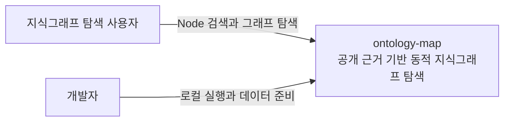
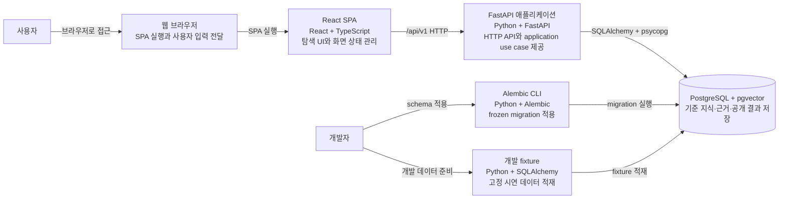
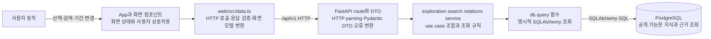
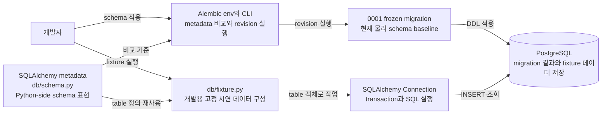

# ontology-map 아키텍처

이 문서는 arc42에서 필요한 절만 사용해 ontology-map의 현재 구현을 설명한다. 미래 운영 topology와 아직 구현되지 않은 Agent·worker 실행 경로는 다이어그램에 포함하지 않는다.

## 목표와 주요 사용자

ontology-map은 공개 자료의 원문 근거를 지식그래프로 축적하고, 사용자가 선택한 Node를 중심으로 관련 Node와 근거를 탐색하게 한다. 현재 주요 사용자는 웹에서 지식그래프를 탐색하는 사용자와 migration·개발 fixture로 로컬 환경을 준비하는 개발자다.

## 제약과 품질 목표

- 브라우저와 PostgreSQL 사이의 유일한 제품 경계는 FastAPI HTTP API다.
- frozen logical·physical schema와 Evidence Trace를 보존하며 화면 편의를 위해 DB 의미를 바꾸지 않는다.
- 일반 조회는 공개 가능한 최신 `COMMITTED + READY` 결과만 사용하고 원문 근거까지 추적할 수 있어야 한다.
- loading, empty, error와 ready를 구분하고 키보드 접근이 가능한 의미 있는 HTML 요소를 사용한다.
- 현재 POC에 없는 microservice, queue, 범용 Agent framework와 운영 배포 구조를 미리 만들지 않는다.

## 컨텍스트와 범위

### System Context

현재 구현은 외부 수집 시스템이나 모델 provider와 연결되지 않는다. Agent 계획의 계약 감사는 [#124](https://github.com/studylida/ontology-map/issues/124), 역할과 실행 경계는 [#125](https://github.com/studylida/ontology-map/issues/125)에서 논의한다.

### Container

`compose.yaml`은 PostgreSQL과 FastAPI 컨테이너를 제공한다. React web은 현재 호스트의 Vite 개발 서버에서 실행하며 `/api/v1`을 FastAPI로 proxy한다.

## 해결 전략

- React는 화면 상태와 사용자 상호작용을 소유하고 `web/src/data.ts`에서 HTTP 응답을 검증해 화면 모델로 바꾼다.
- FastAPI route는 HTTP parsing, Pydantic DTO와 오류 변환을 소유하며 같은 프로세스의 application service를 호출한다.
- application service는 탐색·검색·Relation 조회 use case를 조합하고 `db/`의 명시적 SQLAlchemy query를 사용한다.
- PostgreSQL은 frozen schema의 기준 지식, 근거와 공개 파생 결과를 저장한다. 화면 layout과 런타임 부분 graph는 저장하지 않는다.
- Alembic migration이 물리 스키마를 만들고 개발 fixture가 고정된 시연 데이터를 별도 명령으로 적재한다.

## 구성 요소와 책임

### 사용자 읽기 경로

현재 web은 exploration aggregate와 node search를 사용한다. server에는 peripheral, Node Relation 목록과 Relation Evidence Trace endpoint도 구현되어 있으나 해당 web adapter는 아직 없다. route는 ORM row를 그대로 반환하지 않고 응답 DTO로 변환한다.

### migration·metadata·개발 fixture 경로

Alembic은 metadata를 비교 기준으로 사용하고 migration revision을 DB에 적용한다. 개발 fixture는 같은 metadata의 table 객체를 사용하지만 migration을 대신하지 않으며 `development` 환경에서만 실행된다.

## 현재 실행과 배포

| 실행 단위 | 현재 위치 | 상태 |
| --- | --- | --- |
| React web | 호스트의 Vite 개발 서버 | 구현 |
| FastAPI | 호스트 Uvicorn 또는 Compose `api` | 구현 |
| PostgreSQL과 pgvector | Compose `db` | 구현 |
| Alembic | 개발자가 `server/`에서 실행 | 구현 |
| 개발 fixture | 개발자가 `server/`에서 실행 | 구현 |
| Agent·worker | 진입점 없음 | 미구현 |

cloud 배포, production network, scheduler와 별도 worker topology는 승인된 현재 구현이 아니므로 이 문서에서 정하지 않는다. 정확한 버전과 명령은 [구현 스택](../development/implementation-stack.md)과 [DB 운영](../operations/database.md)이 소유한다.

## 횡단 관심사

### 데이터

도메인 의미와 수명주기는 [논리 스키마](../data/logical-schema.md), PostgreSQL 공통 표현은 [물리 스키마](../data/physical-schema.md), 실제 metadata 객체 목록은 [스키마 참고 문서](../data/schema-reference.md)가 각각 소유한다. 저장된 canonical knowledge graph와 화면의 runtime partial graph를 구분하고, Claim은 Observation과 원문으로 이어지는 Evidence Trace를 유지한다.

### 오류

server는 입력 검증 오류와 application 오류를 안정된 HTTP 오류 code로 한 번 변환한다. 설정이나 DB 연결이 잘못되면 시작 단계에서 실패하고, 읽기 요청은 read-only `REPEATABLE READ` transaction을 사용한다. web은 loading, empty, error와 ready를 구분하며 실패를 빈 결과로 바꾸지 않는다.

## 알려진 위험과 열린 결정

- Agent·worker 실행은 아직 없다. frozen schema와의 정합성은 [#124](https://github.com/studylida/ontology-map/issues/124), 구체적인 역할과 지식 정합화 경계는 [#125](https://github.com/studylida/ontology-map/issues/125)에서 먼저 결정한다.
- node embedding과 READY 의존성 변경은 [#121](https://github.com/studylida/ontology-map/issues/121)의 구현 PR에서 별도 ADR 필요성을 판단한다.
- 이 문서는 현재 구현을 설명하므로 구현되지 않은 운영 배포 구조를 추정하지 않는다.

## 관련 문서와 결정

- 공통 용어: [용어집](../glossary.md)
- 데이터 계약: [논리 스키마](../data/logical-schema.md), [물리 스키마](../data/physical-schema.md), [스키마 참고 문서](../data/schema-reference.md)
- 수용된 결정: [ADR 색인](decisions/README.md)
- 제품과 화면: [제품 설계](../product/design.md)
- 실행과 코드: [구현 스택](../development/implementation-stack.md), [코드 규칙](../development/code-conventions.md), [DB 운영](../operations/database.md)
