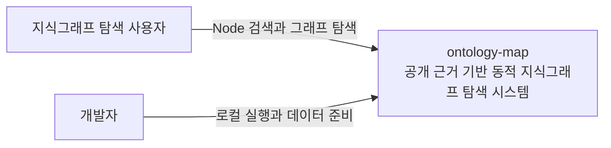
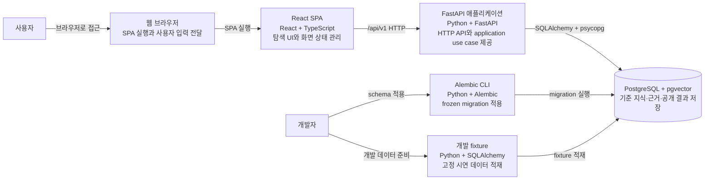
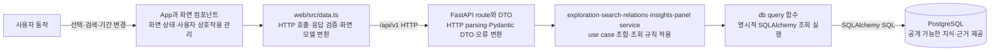
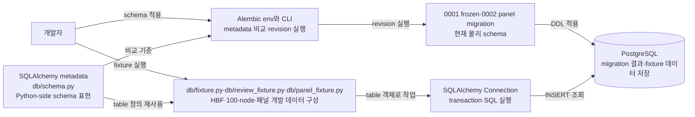

# ontology-map 아키텍처

이 문서는 arc42에서 필요한 절만 사용해 ontology-map의 현재 구현을 설명한다. 미래 운영 topology와 아직 구현되지 않은 Agent·worker 실행 경로는 다이어그램에 포함하지 않는다.

## 목표와 주요 사용자

ontology-map은 공개 자료의 원문 근거를 지식그래프로 축적하고, 사용자가 선택한 Node를 중심으로 관련 Node와 근거를 탐색하게 한다. 현재 주요 사용자는 웹에서 지식그래프를 탐색하는 사용자와 migration·개발 fixture로 로컬 환경을 준비하는 개발자다.

## 제약과 품질 목표

- 브라우저와 PostgreSQL 사이의 유일한 제품 경계는 FastAPI HTTP API다.
- frozen logical·physical schema와 Evidence Trace를 보존하며 화면 편의를 위해 DB 의미를 바꾸지 않는다.
- 일반 조회는 공개 가능한 최신 `COMMITTED + READY` 결과만 사용하고 원문 근거까지 추적할 수 있어야 한다.
- loading, empty, error와 ready를 구분하고 키보드 접근이 가능한 의미 있는 HTML 요소를 사용한다.
- 현재 POC에 없는 microservice, queue, 범용 Agent framework와 운영 배포 구조를 미리 만들지 않는다.

## 컨텍스트와 범위

### System Context

현재 제품 구현은 외부 수집 시스템이나 모델 provider와 연결되지 않는다. 별도 모델 시험을 제품 연결로 해석하지 않는다. 승인된 역할·일반 코드의 책임·모델 시험 구성은 [구현 스택](../development/implementation-stack.md#에이전트-역할과-모델), frozen schema와의 정합성 감사는 [#124](https://github.com/studylida/ontology-map/issues/124)에서 확인한다.

### Container

`compose.yaml`은 PostgreSQL과 FastAPI 컨테이너를 제공한다. React web은 현재 호스트의 Vite 개발 서버에서 실행하며 `/api/v1`을 FastAPI로 proxy한다.

## 해결 전략

- React는 화면 상태와 사용자 상호작용을 소유하고 `web/src/data.ts`에서 HTTP 응답을 검증해 화면 모델로 바꾼다.
- FastAPI route는 HTTP parsing, Pydantic DTO와 오류 변환을 소유하며 같은 프로세스의 application service를 호출한다.
- application service는 탐색·검색·Relation·인사이트 조회 use case를 조합하고 `db/`의 명시적 SQLAlchemy query를 사용한다.
- PostgreSQL은 frozen schema의 기준 지식, 근거와 공개 파생 결과를 저장한다. 화면 layout과 런타임 부분 graph는 저장하지 않는다.
- Alembic migration이 물리 스키마를 만들고 개발 fixture가 고정된 시연 데이터를 별도 명령으로 적재한다.

## 구성 요소와 책임

### 사용자 읽기 경로

현재 web은 exploration aggregate, node search, peripheral, Node Relation 목록, Relation Evidence Trace와 저장 인사이트 목록·상세 endpoint를 사용한다. route는 ORM row를 그대로 반환하지 않고 응답 DTO로 변환한다.

### migration·metadata·개발 fixture 경로

Alembic은 metadata를 비교 기준으로 사용하고 migration revision을 DB에 적용한다. 개발 fixture는 같은 metadata의 table 객체를 사용하지만 migration을 대신하지 않으며 `development` 환경에서만 실행된다.

### Entity Resolution 함수와 promotion 결합 경계

[#128의 상세 승인](https://github.com/studylida/ontology-map/issues/128#issuecomment-5630696046)을 구현하는 독립 함수는 `server/src/ontology_map/entity_resolution.py`에 있고, 기존 identity 테이블 조회와 transaction 내부 쓰기는 `db/entity_resolution.py`에 있다. 이 함수의 존재는 #127 추출 worker, 영속 `model_task` 관리, provider 설정이나 publication 전체 실행이 연결됐다는 뜻이 아니다. 현재 HTTP API와 개발 fixture는 이 함수를 호출하지 않는다.

`resolve_mention`은 불변 원문의 Unicode 범위와 SHA-256을 검증하고, 신뢰된 준비 메타데이터의 외부 식별자, exact alias, 동일 유형 alias FTS 순서로 저장된 Node를 조회한다. 공개 검색 문서나 READY 필터는 사용하지 않는다. 활성 redirect를 읽어 canonical Node로 중복을 제거한 뒤 최대 5개를 제공하고 6번째 후보로 잘림을 확인한다. 조회 실패나 잘못된 redirect는 정상적인 빈 결과가 아니다.

단일 외부 식별 대상의 실제 Node type과 재사용 가능 상태를 검사한 뒤 코드만으로 SAME을 확정할 수 있다. 다른 경우에는 작업별 Structured Output 호출 함수를 `propose`로 전달받아 SAME, NEW, UNRESOLVED를 검증한다. Agent 입력은 후보의 저장된 식별 필드와 이번 mention의 검증된 원문 context로 제한하며 reasoning을 요청하거나 저장하지 않는다. 후보 0개도 이번 구현에서는 특정 대상인지 판정하는 호출을 거친다. 이는 #128이 허용한 선택이며, 빈 조회만으로 새 대상을 확정하지 않는다.

`EntityMention.approved_topic_name`은 #126·#127에서 이미 선택·검증한 승인 Topic 이름을 받는 선택 필드다. 원문 표현인 `text`와 구별해 후보를 찾는 데만 사용하고 resolver가 Topic 이름을 생성하거나 새 Topic Node를 만들지 않는다. 일반 표현 차단 목록은 결정적인 부적격 사례를 거르는 보조 검사이며, 특정 대상임을 입증하는 의미 검증을 대체하지 않는다.

`select_resolvable_knowledge`는 상위 추출·의미 검증을 통과한 의미상 분리 불가능한 단위별 mention 의존성을 받는다. unresolved mention에 의존하는 단위를 제외하되 다른 독립 단위는 유지한다. 이 함수가 binding 하나를 임의로 빼고 Claim 의미가 보존됐다고 판정하지는 않는다.

`resolved_nodes_for_promotion`은 호출자가 이미 연 짧은 promotion transaction에 참여한다. 호출자는 최종 저장 가능한 지식에 필요한 mention만 전달하고, context body에서 반환된 Node·Observation ID로 검증된 Claim·Relation·attribute·event를 저장한다. 새 Node와 alias를 먼저 별도로 commit하지 않는다. 함수는 저장 전 원문·후보·외부 식별자 snapshot과 활성 유형을 재확인하고, 종료 전에 새 Node의 실제 Claim·Observation·의미 연결이 남았는지 검사한다. 이 연결 검사는 #110 lint나 #127의 의미·ontology 검증 전체를 대체하지 않는다.

context body에서 모델 호출, commit 또는 오류를 삼키는 처리를 하지 않는다. 예외는 transaction 소유자까지 전달해 현재 승격 전체를 rollback하고, 소유자는 context가 정상 종료된 뒤에만 COMMITTED로 전환한다. 이 함수는 promotion/publication 상태, 영속 작업 상태, 외부 식별자 또는 node_merge를 쓰지 않는다. alias는 검증된 원문 표현만 연결하며 기존 alias·redirect 계열의 alias를 재사용하고 대표 이름을 바꾸지 않는다.

검증은 `server/tests/test_entity_resolution.py`의 provider 없는 단위 테스트와 `test_entity_resolution_postgres.py`의 실제 schema 대상 테스트로 구분한다. PostgreSQL 테스트는 `ONTOLOGY_MAP_ER_TEST_DATABASE_URL`이 지정된 경우에만 실행하며, migration이 적용된 loopback의 별도 `_er128_test` DB만 허용한다. 이 테스트의 합성 자료는 rollback하고 기존 schema나 fixture를 초기화하지 않는다. 모델 의미 품질과 전체 Agent → DB → READY 실행은 이 테스트의 검증 대상이 아니다.

## 현재 실행과 배포

| 실행 단위 | 현재 위치 | 상태 |
| --- | --- | --- |
| React web | 호스트의 Vite 개발 서버 | 구현 |
| FastAPI | 호스트 Uvicorn 또는 Compose `api` | 구현 |
| PostgreSQL과 pgvector | Compose `db` | 구현 |
| Alembic | 개발자가 `server/`에서 실행 | 구현 |
| 개발 fixture | 개발자가 `server/`에서 실행 | 구현 |
| Entity Resolution | 후보 조회·판정 함수와 promotion 결합 경계 | 구현, 상위 호출자 연결 필요 |
| Agent·worker | 전체 실행 진입점 없음 | 미구현 |

cloud 배포, production network, scheduler와 별도 worker topology는 승인된 현재 구현이 아니므로 이 문서에서 정하지 않는다. 정확한 버전과 명령은 [구현 스택](../development/implementation-stack.md)과 [DB 운영](../operations/database.md)이 소유한다.

## 횡단 관심사

### 데이터

도메인 의미와 수명주기는 [논리 스키마](../data/logical-schema.md), PostgreSQL 공통 표현은 [물리 스키마](../data/physical-schema.md), 실제 metadata 객체 목록은 [스키마 참고 문서](../data/schema-reference.md)가 각각 소유한다. 저장된 canonical knowledge graph와 화면의 runtime partial graph를 구분하고, Claim은 Observation과 원문으로 이어지는 Evidence Trace를 유지한다.

### 오류

server는 입력 검증 오류와 application 오류를 안정된 HTTP 오류 code로 한 번 변환한다. 설정이나 DB 연결이 잘못되면 시작 단계에서 실패하고, 읽기 요청은 read-only `REPEATABLE READ` transaction을 사용한다. web은 loading, empty, error와 ready를 구분하며 실패를 빈 결과로 바꾸지 않는다.

## 알려진 위험과 열린 결정

- Agent·worker 실행은 아직 없다. [#125](https://github.com/studylida/ontology-map/issues/125)의 승인된 역할·지식 정합화 방향과 남은 상세 계약을 구별한다. 모델 시험의 역할 분리가 제품 프로세스 분리를 뜻하지 않는다.
- node embedding과 READY 의존성 변경은 [#121](https://github.com/studylida/ontology-map/issues/121)의 구현 PR에서 별도 ADR 필요성을 판단한다.
- 이 문서는 현재 구현을 설명하므로 구현되지 않은 운영 배포 구조를 추정하지 않는다.

## 관련 문서와 결정

- 공통 용어: [용어집](../glossary.md)
- 데이터 계약: [논리 스키마](../data/logical-schema.md), [물리 스키마](../data/physical-schema.md), [스키마 참고 문서](../data/schema-reference.md)
- 수용된 결정: [ADR 색인](decisions/README.md)
- 제품과 화면: [제품 설계](../product/design.md)
- 실행과 코드: [구현 스택](../development/implementation-stack.md), [코드 규칙](../development/code-conventions.md), [DB 운영](../operations/database.md)
