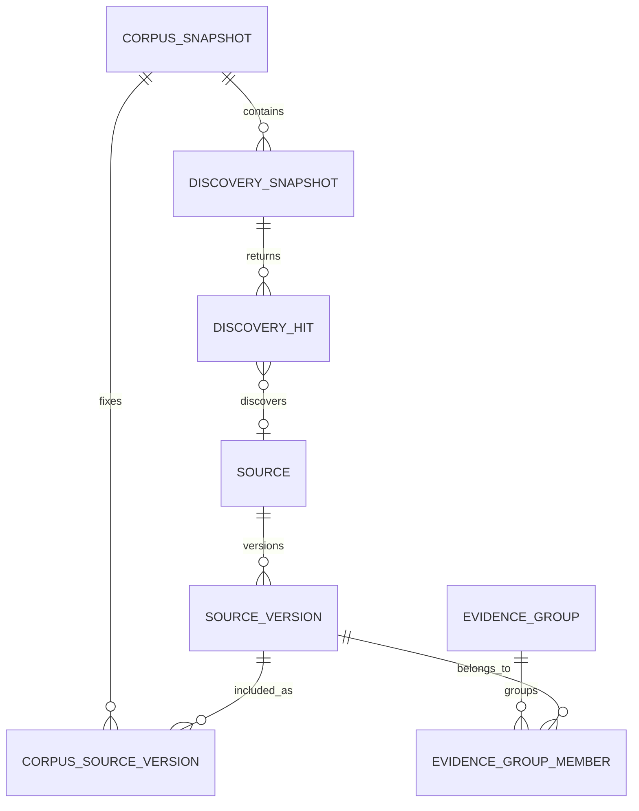
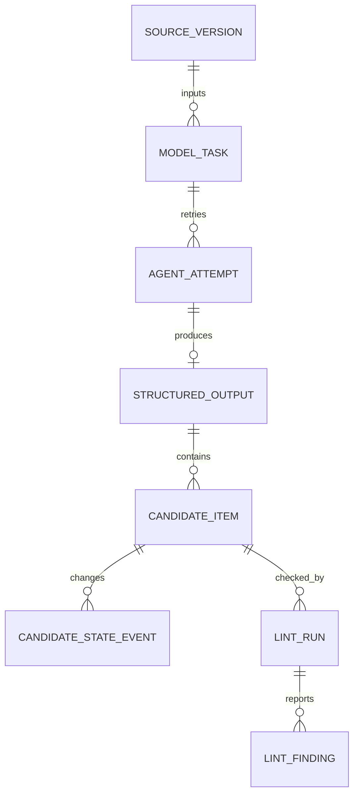
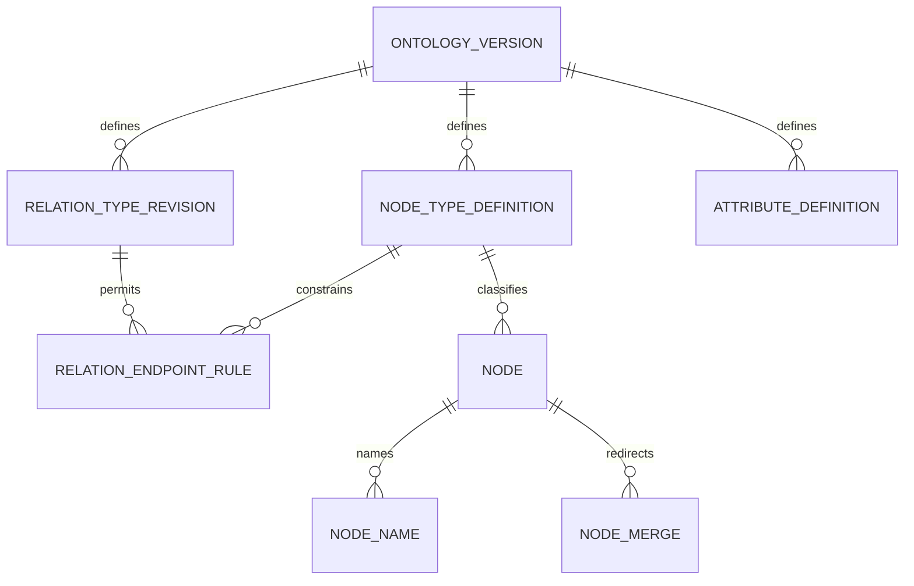
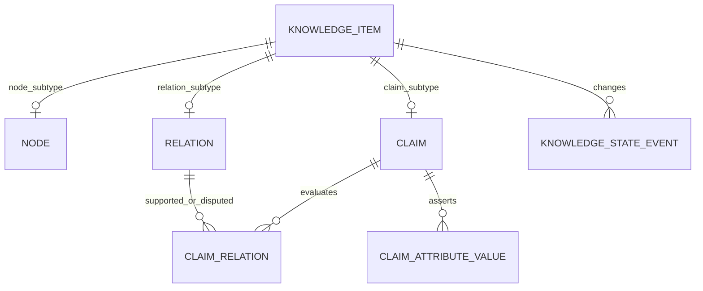
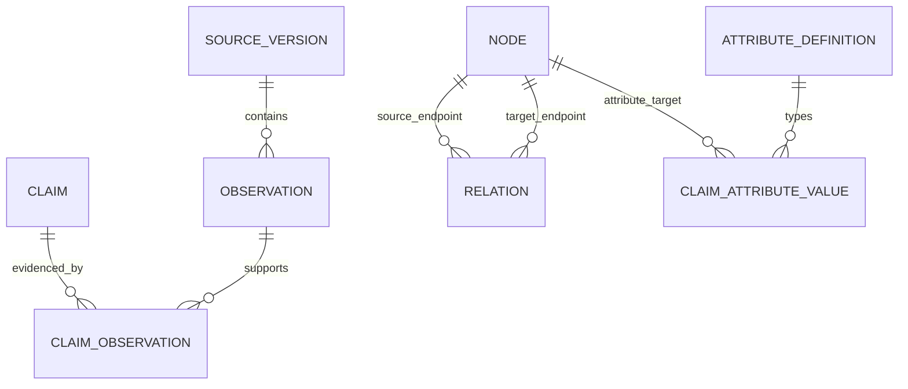
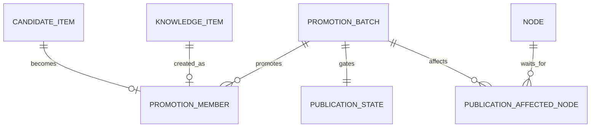
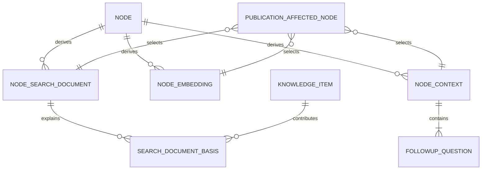

# People Intelligence 논리 데이터 스키마

> 상태: 논리 설계안
>
> 기준: 요구사항 워크숍에서 확정한 HBF 공개 자료 POC
>
> 범위: 불변 정규화 원문부터 지식 후보, 기준 지식그래프, 파생 데이터, 동적 지도 공개까지

## 1. 문서의 목적과 결정 경계

이 문서는 확정된 제품 요구사항을 구현 가능한 논리 데이터 모델로 옮긴다. 엔터티 이름과 관계, 데이터의 책임, 키와 카디널리티, 상태 전이, 무결성 규칙, 트랜잭션 경계를 정의한다.

요구사항에서 확정된 제품 의미는 이 문서에서도 `확정`으로 취급한다. 이 문서가 처음 제안하는 엔터티명과 필드명은 논리 모델 승인 전까지 `제안 중`이다.

이번 문서에서는 PostgreSQL의 실제 자료형, DDL, migration, API 계약, 벡터 차원, 인덱스 표현식, 그래프 라이브러리와 화면 좌표를 정하지 않는다. 이 항목들은 논리 모델 승인 뒤 물리 스키마와 API 설계에서 결정한다.

## 2. 전체 컨셉

이 데이터 모델은 그래프 테이블 몇 개가 아니라 근거 있는 지식이 만들어지고 공개되는 컴파일 파이프라인을 표현한다.

```text
GDELT 기사 발견
→ HTML을 일시적으로 수신하고 정규화
→ 불변 정규화 본문과 출처 버전 저장
→ Agent 구조화 출력과 지식 후보 저장
→ lint·동일 대상·중복·온톨로지 검사
→ 짧은 트랜잭션으로 기준 지식그래프 승격
→ 검색 문서·임베딩·한국어 맥락·후속 질문 생성
→ 영향받은 묶음의 공개 준비 완료
→ 다음 검색·노드 클릭·시간 범위 변경부터 동적 부분 그래프 조회
```

핵심 원칙은 다음과 같다.

- HTML은 정규화 입력으로만 일시 사용하고 저장하지 않는다. 보존하는 원문은 정규화된 텍스트와 메타데이터다.
- Agent 출력은 후보일 뿐이다. 내부 식별자, 동일 대상 병합, 허용 유형, 승격, 상태와 무결성은 일반 코드와 DB가 결정한다.
- 기준 지식의 의미를 덮어쓰지 않는다. 의미가 달라지면 새 기록을 만들고 기존 기록의 상태와 이력을 보존한다.
- 출처, 출처 버전, 관측, Claim, 관계의 연결을 따라가면 모든 공개 지식의 Evidence Trace를 재현할 수 있어야 한다.
- 지도는 기준 데이터가 아니다. 공개 준비된 지식에서 중심 노드의 직접 이웃과 중요한 2단계 이웃을 매번 계산하고, 브라우저가 3D처럼 보이는 좌표를 배치한다.
- 공개 준비가 실패한 변경 묶음은 기준 그래프에 남지만 일반 검색과 지도에는 나타나지 않는다. 이전 공개 결과는 계속 제공한다.
- 사람이 거절한 지식은 공개 준비 상태와 관계없이 지도와 일반 검색에서 즉시 제외하지만 DB에서는 삭제하지 않는다.

## 3. JSON의 역할

구조화 출력 JSON은 Agent와 애플리케이션 사이의 신뢰 경계다. 기준 지식그래프의 저장 형식이나 HTML 보관 형식이 아니다.

Agent는 다음과 같은 버전 있는 계약으로만 결과를 반환한다.

```json
{
  "schema_version": "candidate-v1",
  "source_version_id": "source-version-id",
  "nodes": [],
  "events": [],
  "relations": [],
  "claims": [],
  "observations": [],
  "identity_candidates": []
}
```

계약 검증을 통과한 JSON 전체는 `structured_output`에 보존한다. 모델 제공자의 원시 HTTP 응답은 저장하지 않는다. 모델명, 프롬프트 버전, 출력 스키마 버전, 입력 해시, 응답 식별자, 토큰 사용량과 오류는 실행 메타데이터에 따로 저장한다.

JSON 안의 각 후보는 `candidate_item` 행으로 꺼내 개별 상태를 관리한다. 구체적인 후보 값은 JSON에 남기고, 후보 종류·JSON Pointer·fingerprint·상태·검사 결과·승격 결과만 공통 열로 관리한다. 검증을 통과한 후보만 강한 관계형 제약을 가진 기준 그래프 엔터티로 변환한다.

이 구조는 후보 테이블을 기준 그래프와 똑같이 두 벌 만드는 일을 피하면서도 후보 하나만 보류하거나 거절하고 나머지를 승격할 수 있게 한다.

## 4. 공통 표준

### 4.1 식별자

- 모든 기준 엔터티는 이름과 무관한 변경 불가능한 내부 식별자를 가진다.
- 병합된 노드의 식별자를 재사용하거나 삭제하지 않는다. 병합 대상에서 기준 노드로 가는 리디렉션 이력을 남긴다.
- 외부 식별자는 `외부 체계 + 값`으로 고유성을 판정하며 내부 식별자를 대신하지 않는다.
- 정확한 물리 식별자 형식은 물리 스키마 단계에서 정한다.

### 4.2 텍스트와 Evidence Trace

- 정규화 본문은 UTF-8, Unicode NFC, LF 줄바꿈을 사용한다.
- 관측 범위는 Unicode 문자 기준의 반열린 구간 `[start, end)`로 저장한다. byte 위치나 UTF-16 code unit 위치를 섞지 않는다.
- 관측에는 범위뿐 아니라 인용문과 인용문 해시를 함께 저장한다.
- 저장된 범위에서 잘라낸 문자열, 인용문, 인용문 해시가 일치하지 않으면 차단 lint로 처리한다.
- 기존 관측을 새 출처 버전으로 자동 이동하지 않는다.

### 4.3 시간

| 시간 | 의미 | 활동량 계산 사용 여부 |
|---|---|---|
| `published_at` | 출처가 자료를 처음 게시한 시점 | 사용 |
| `source_modified_at` | 출처가 해당 버전까지 자료를 수정한 시점 | 사용하지 않음 |
| `retrieved_at` | 시스템이 해당 출처 버전을 수집한 시점 | 사용하지 않음 |
| `observed_at` | 시스템이 원문 위치에서 Claim을 발견한 시점 | 사용하지 않음 |
| 사건 시작·종료 | 실제 사건이 발생한 시점이나 기간 | 지도 관심도와 분리 |
| 관계 유효 시작·종료 | 관계가 유효하다고 주장되는 기간 | 지도 관심도와 분리 |

시간값에는 `정확한 시각`, `날짜`, `월`, `연도`, `미상` 중 하나의 정밀도를 함께 저장한다. 게시 시점을 확인할 수 없는 출처는 상세 패널에는 사용할 수 있지만 기간별 활동량에서는 제외한다.

### 4.4 언어

- Claim 문장과 인용문은 출처 언어를 보존한다.
- 한국어 맥락 설명, 후속 질문, 번역과 검색 보강 문구는 별도의 파생 결과로 저장하고 입력·모델·프롬프트 계보를 남긴다.
- 기사 작성자와 매체는 우선 출처 메타데이터로 저장한다. 독립적인 노드 생성 기준을 충족할 때만 사람·회사 후보가 된다.

### 4.5 POC 보존

HBF POC 동안 출처, 출처 버전, 기준 지식, 후보, 상태·거절 이력, 계보, 실패 기록과 파생 결과를 자동 삭제하지 않는다. POC 이후 실제 저장량과 재생성 비용을 측정한 뒤 사용되지 않는 파생 결과에만 정리 정책을 검토한다. 기준 지식, Evidence Trace와 거절 이력은 자동 정리 대상에서 제외한다.

## 5. 논리 ER 구조

Mermaid 그림은 논리 엔터티와 카디널리티만 보여준다. 필드와 제약은 뒤의 데이터 사전이 기준이며, 그림의 배치는 제품 지도 배치와 무관하다.

### 5.1 출처와 독립 근거



### 5.2 Agent 실행과 지식 후보



### 5.3 온톨로지와 노드 정체성




### 5.4 기준 지식그래프와 Evidence Trace





### 5.5 승격, 파생 결과와 공개 준비





## 6. 데이터 사전

### 6.1 수집 범위와 출처

#### `corpus_snapshot`

재현 가능한 고정 seed snapshot의 범위를 나타낸다.

| 필드 | 의미와 규칙 |
|---|---|
| `corpus_snapshot_id` | 불변 내부 식별자 |
| `name` | 예: `HBF POC 1-year seed` |
| `scope_query` | HBF 중심 수집 조건의 정규화된 표현 |
| `range_start`, `range_end` | 포함할 출처 게시 시점의 1년 범위 |
| `manifest_hash` | 포함된 출처 버전과 발견 기록의 재현성 검증값 |
| `created_at` | snapshot 고정 시점 |

하나의 출처 버전이 snapshot에 포함됐다는 사실은 별도의 snapshot 구성 관계로 관리한다. 이는 애플리케이션 코드 곳곳에 SQL 값을 넣는 하드코딩이 아니라 동일한 seed를 다시 적재하기 위한 고정 manifest다.

#### `corpus_source_version`

고정 seed snapshot과 포함된 출처 버전을 연결한다. 같은 snapshot 안에서 같은 출처 버전은 한 번만 포함되며, 포함 순서와 선정 이유를 기록해 seed 적재와 검증을 재현한다.

#### `discovery_snapshot`

GDELT 기사 발견 요청과 응답을 기록한다. GDELT는 상세 Claim의 근거가 아니라 기사 발견 수단이다.

| 필드 | 의미와 규칙 |
|---|---|
| `discovery_snapshot_id` | 발견 요청 식별자 |
| `corpus_snapshot_id` | 어느 seed 수집에 속하는지 표시 |
| `query_parameters` | 정규화된 GDELT 질의 조건 |
| `requested_at` | 요청 시점 |
| `protocol` | `https` 또는 POC 예외인 `http` |
| `https_failure_reason` | HTTP 예외를 사용한 경우 재현 가능한 HTTPS 실패 이유 |
| `response_body` | 검증을 통과한 GDELT 응답 |
| `response_hash` | 응답 무결성 검증값 |
| `schema_validation_status` | 응답 계약 검사 결과 |

HTTP는 GDELT API와 HTTPS 통신이 재현 가능하게 실패한 요청에만 허용한다. 자격 증명과 쿠키를 HTTP로 보내지 않는다. 발견된 실제 기사는 HTTPS로 가져오며 HTTP fallback을 적용하지 않는다.

#### `discovery_hit`

GDELT 응답에서 발견한 기사 후보 한 건이다. 기사 URL과 GDELT 메타데이터를 보존하되 이 레코드 자체는 Claim 근거가 아니다.

#### `source`

같은 논리 출처의 정체성을 나타낸다.

| 필드 | 의미와 규칙 |
|---|---|
| `source_id` | 불변 내부 식별자 |
| `canonical_url` | 추적용 매개변수 등을 정리한 대표 URL |
| `publisher_name` | 매체 메타데이터 |
| `author_text` | 작성자 메타데이터 원문 |
| `original_language` | 출처 본문의 언어 |
| `created_at` | 최초 등록 시점 |

#### `source_version`

같은 URL의 본문이 바뀔 때마다 추가하는 불변 버전이다. 기존 버전을 덮어쓰지 않는다.

| 필드 | 의미와 규칙 |
|---|---|
| `source_version_id` | 불변 버전 식별자 |
| `source_id` | 논리 출처 |
| `title` | 해당 버전에서 관측한 제목 |
| `normalized_body` | 보존 대상인 정규화 본문 |
| `body_hash` | 정규화 본문 해시 |
| `published_at` | 출처의 최초 게시 시점 |
| `source_modified_at` | 출처가 표시한 수정 시점 |
| `retrieved_at` | 이 버전을 수집한 시점 |
| `normalization_rule_version` | 동일 본문을 재현하기 위한 정규화 규칙 버전 |
| `fetch_status` | 정상 수집, 접근 실패, 본문 없음 등의 결과 |

같은 `source_id + body_hash + normalization_rule_version` 조합은 중복 버전을 만들지 않는다. 기사에 접근하지 못하고 메타데이터만 있는 경우 상세 Claim과 관측의 근거로 사용할 수 없다.

#### `evidence_group`과 `evidence_group_member`

독립 근거 묶음은 기사 수가 아니라 원문 계보 기준으로 근거의 독립성을 계산하는 단위다.

- 같은 출처 버전의 여러 원문 위치, 동일 본문 해시의 복제 기사, 명시적 재게시, 확인된 번역·재전송은 하나의 묶음으로 본다.
- 정확히 같은 본문 해시는 일반 코드가 자동으로 묶는다.
- 보도자료 재게시처럼 모호한 계보는 Agent가 후보만 제안하고 사람이 최종 병합한다.
- `evidence_group_member`에는 할당 방식, 판단 이유, 처리 주체와 시점을 남긴다.
- 관계선 굵기와 노드 활동량은 해당 기간의 지지 Claim에서 도달 가능한 서로 다른 `evidence_group_id` 수를 기준으로 계산한다.

### 6.2 Agent 실행과 후보

#### `model_task`

하나의 모델 작업과 그 재시도·캐시 경계를 나타낸다.

| 필드 | 의미와 규칙 |
|---|---|
| `model_task_id` | 작업 식별자 |
| `task_kind` | 추출, 동일 대상 후보, 근거 계보 후보, 충돌 정리, 맥락 설명, 후속 질문, 임베딩 등 |
| `source_version_id` | 원문 추출 작업일 때 입력 출처 버전 |
| `input_hash` | 실제 입력 내용 해시 |
| `output_schema_version` | 기대하는 구조화 출력 계약 버전 |
| `model_version`, `prompt_version` | 실행 계보 |
| `cache_key` | `입력 해시 + 작업 종류 + 출력 스키마 버전 + 모델·프롬프트 버전`의 결정적 키 |
| `status` | 대기, 실행, 성공, 재시도 대기, 최종 실패 |

같은 cache key의 성공 결과는 재사용한다. 재시도 정책은 모델 작업마다 독립적으로 적용한다.

#### `agent_attempt`

최초 호출과 개별 재시도 한 번을 나타낸다. 최초 호출 뒤 즉시 자동 재시도 1회를 허용하고, 일시적 모델 장애가 계속되면 1시간·2시간·4시간 뒤 최대 세 번 더 시도한다. 영구적인 인증 오류나 잘못된 요청에는 시간 기반 재시도를 적용하지 않는다. 구조화 출력 계약 위반은 한 번의 수정 요청 뒤에도 실패하면 보류한다.

#### `structured_output`

출력 계약 검증을 통과한 제공자 독립 JSON을 보존한다. `agent_attempt`마다 최대 한 건이며 JSON 자체는 수정하지 않는다.

#### `candidate_item`

구조화 출력 JSON 안의 개별 후보를 관리한다.

| 필드 | 의미와 규칙 |
|---|---|
| `candidate_item_id` | 후보 식별자 |
| `structured_output_id` | 원본 계약 JSON |
| `candidate_kind` | 노드, 사건, 관계, Claim, 관측, 동일 대상, 근거 계보 후보 |
| `json_pointer` | JSON 안의 정확한 후보 위치 |
| `fingerprint` | 후보 의미의 결정적 정규화 해시 |
| `current_state` | 제안됨, 검사 중, 차단됨, 보류, 거절, 승격 |
| `hold_or_reject_reason` | 보류·거절 이유 |
| `promoted_item_id` | 승격 성공 시 생성된 기준 지식 식별자 |

동일한 출처 버전에서 동일 fingerprint로 거절된 후보는 반복 생성과 모델 비용을 억제한다. 새로운 출처 버전이나 새로운 근거가 있으면 같은 의미에 대한 새 후보를 만들 수 있다.

#### `candidate_state_event`

후보의 이전 상태, 새 상태, 이유, 처리 주체, 처리 시점을 append-only로 기록한다. 현재 상태는 빠른 조회를 위해 후보 행에도 중복 저장한다.

### 6.3 온톨로지

#### `ontology_version`

노드 유형, 관계 유형과 속성 정의가 함께 적용되는 사람이 승인한 버전이다. 과거 지식은 생성 당시 온톨로지 버전을 계속 가리킨다.

#### `node_type_definition`

POC에서 허용하는 노드 유형은 사람, 회사, 기술, 주제, 사건 다섯 가지다.

| 유형 | 생성 기준 |
|---|---|
| 사람 | 이름과 소속·직책 등 동일 대상을 구분할 근거가 있어야 하며 모호하면 보류한다. |
| 회사 | 독립된 조직으로 식별할 이름과 구분 정보가 있어야 하며 임시 조직명이나 일반 명사는 제외한다. |
| 기술 | 제품, 표준, 규격, 아키텍처, 기술군처럼 반복해 같은 대상을 가리키는 고유 명칭이나 승인된 별칭이 있어야 한다. 설명 문구는 Claim이나 검색어로만 사용한다. |
| 주제 | 허용된 주제 목록에 있거나 사람이 새 주제로 승인해야 한다. Agent가 발견한 모든 키워드를 자동 승격하지 않는다. |
| 사건 | 특정 시점이나 기간, 발생 내용, 최소 한 명의 참여자 또는 대상이 근거로 확인되어야 한다. |

모든 노드는 허용 유형, 출처와 정확한 원문 위치, 동일 대상 검사 가능성, 이름·유형·별칭 등 최소 식별 정보를 가져야 한다. 나머지 세부 사실은 Claim으로 저장한다.

#### `relation_type_revision`과 `relation_endpoint_rule`

관계 유형은 자유 문자열이나 변경되는 DB enum이 아니라 온톨로지 안의 버전 있는 정의다.

| 필드 | 의미와 규칙 |
|---|---|
| `relation_type_revision_id` | 과거 의미를 보존하는 불변 revision 식별자 |
| `relation_code`, `display_name` | 기계용 코드와 화면 표시 이름 |
| `is_directed`, `is_symmetric` | 방향과 대칭 여부 |
| `inverse_relation_type_revision_id` | 반대 방향 의미가 있을 때 참조 |
| `requires_event_context` | 사건 노드를 거쳐야 하는 관계인지 표시 |
| `requires_valid_period` | 유효 기간이 필수인지 표시 |
| `lifecycle_state` | 활성 또는 폐기 |

`relation_endpoint_rule`은 관계 revision마다 허용하는 시작·도착 노드 유형 쌍을 저장한다. Agent는 활성 규칙에 맞는 관계만 제안할 수 있고 일반 코드와 DB가 다시 검사한다.

#### `attribute_definition`

구조화된 속성 Claim이 사용할 속성 코드, 표시 이름, 허용 대상 노드 유형, 허용 값 유형, 단위 규칙과 온톨로지 버전을 관리한다. 원문에 없는 값을 Agent가 만들어서는 안 된다.

### 6.4 노드 정체성

#### `node`

변경 불가능한 내부 식별자와 노드 유형만 공통 관리한다. 사람·회사·기술·주제의 프로필 전용 열이나 자유 JSON 속성을 두지 않는다. 사건 시간만 별도 구조화하고 나머지 세부 사실은 Claim으로 표현한다.

#### `node_name`

대표 이름과 별칭을 이력으로 보존한다.

| 필드 | 의미와 규칙 |
|---|---|
| `node_name_id` | 이름 기록 식별자 |
| `node_id` | 대상 노드 |
| `name_text`, `language` | 이름과 언어 |
| `name_kind` | 대표 이름 또는 별칭 |
| `valid_from`, `valid_to` | 이름이 적용된 것으로 알려진 기간 |
| `is_current_preferred` | 현재 화면 대표 이름 여부 |

노드마다 현재 대표 이름은 하나만 허용한다. 대표 이름 변경은 기존 기록을 삭제하지 않고 적용 기간을 닫은 뒤 새 기록을 추가한다. `node_name_evidence`는 이름 기록과 하나 이상의 관측을 연결한다.

#### `external_identifier`

외부 식별 체계, 값, 적용 기간과 근거를 저장한다. 같은 외부 체계 안의 같은 값이 서로 다른 활성 노드에 동시에 연결되지 않도록 한다.

#### `node_merge`

병합되는 기존 노드와 기준 노드, 병합 이유, 처리한 사람, 처리 시점을 저장한다. 다음 규칙을 적용한다.

- 병합 원본과 기준 노드는 같을 수 없다.
- 병합 리디렉션은 순환할 수 없다.
- 이미 병합된 노드는 최종 기준 노드로 해석한다.
- 모호한 동일 대상 병합은 Agent가 후보만 제안하고 사람이 결정한다.
- 병합 뒤에도 이전 식별자, 이름, Claim과 Evidence Trace를 조회할 수 있다.

#### `event_temporal_extent`

사건 노드에만 최대 한 건을 두고 사건 시작·종료, 각 시간 정밀도, 미상 여부와 이 범위를 직접 뒷받침하는 기준 Claim을 저장한다. 종료가 시작보다 이를 수 없다. 서로 다른 시간이 주장되면 기존 Claim을 덮어쓰지 않고 충돌 묶음으로 관리하며, 사건 식별 범위로 채택할 값은 일반 코드의 명확한 규칙이나 사람의 판단이 있어야 바뀐다. 사건 참여자와 발표 기술은 고정 열이 아니라 허용 관계로 연결한다.

### 6.5 기준 지식그래프

#### `knowledge_item`

노드, 관계, Claim의 공통 상태와 생성 계보를 가진 상위 엔터티다.

| 필드 | 의미와 규칙 |
|---|---|
| `knowledge_item_id` | 불변 식별자 |
| `item_kind` | 노드, 관계, Claim |
| `current_state` | 근거 확인됨, 사람 확인됨, 보류, 거절 |
| `origin_candidate_item_id` | 어떤 후보에서 승격됐는지 표시 |
| `promotion_batch_id` | 어떤 짧은 트랜잭션에서 생성됐는지 표시 |
| `created_at` | 기준 그래프 생성 시점 |

각 `knowledge_item`은 정확히 하나의 노드·관계·Claim 하위 레코드를 가져야 한다. Agent는 기준 지식 상태를 직접 만들지 못한다.

`근거 확인됨`은 사실로 확정됐다는 뜻이 아니다. 출처 버전과 원문 위치가 존재하고, 인용 범위가 Claim을 실제로 뒷받침하며, 노드·관계 유형과 시간·동일 대상 검사를 통과하고, 모든 차단 lint를 통과했으며, 동일한 거절 후보의 반복이 아님을 뜻한다.

#### `knowledge_state_event`

기준 지식의 상태 이력을 append-only로 보존한다. 이전 상태, 새 상태, 이유, 처리 주체, 처리 시점을 기록한다. 현재 상태는 빠른 조회를 위해 `knowledge_item`에도 저장한다.

#### `relation`

허용된 관계 유형으로 두 노드를 연결하는 검증 가능한 기준 연결이다.

| 필드 | 의미와 규칙 |
|---|---|
| `relation_id` | `knowledge_item_id`와 일대일인 관계 식별자 |
| `source_node_id`, `target_node_id` | 시작·도착 노드 |
| `relation_type_revision_id` | 생성 당시 관계 유형 revision |
| `event_context_node_id` | 관련 사건이 있을 때 사건 노드 참조 |
| `valid_from`, `valid_to` | 관계가 유효하다고 주장되는 기간 |
| `time_precision` | 관계 시간의 정밀도 |

같은 관계는 `시작 노드 + 관계 유형 revision + 도착 노드 + 관련 사건 + 관계 유효 기간`이 모두 같을 때 하나로 집계한다. 기간이 끊어져 있으면 별도 관계로 둔다. 기간이 겹치거나 한쪽만 알려져 자동 판정이 어려우면 Agent가 병합 후보를 제안하고 사람이 결정한다. 대칭 관계는 두 내부 식별자를 일정한 순서로 정규화해 방향만 바꾼 중복을 막는다.

#### `claim`

하나의 판단 단위로 분리된 원문 언어의 주장이다.

| 필드 | 의미와 규칙 |
|---|---|
| `claim_id` | `knowledge_item_id`와 일대일인 Claim 식별자 |
| `statement_text` | 사람이 읽는 원자적 Claim 문장 |
| `language` | Claim 언어 |
| `modality` | 사실 주장, 계획·목표, 예측·추정, 의견·평가 |
| `asserted_from`, `asserted_to` | 원문이 주장하는 시간이나 기간 |
| `time_precision` | 주장 시간의 정밀도 |

출처 문장 하나가 여러 사실을 담으면 독립적으로 판단할 수 있는 Claim으로 분리한다. 여러 Claim이 같은 관측 범위를 공유할 수 있다. Claim은 승격이 끝날 때 최소 하나의 관계 또는 속성값과 연결되어야 한다.

#### `claim_relation`

Claim과 관계의 다대다 연결이다. `stance`는 `지지` 또는 `반박`이며 같은 Claim과 관계 조합은 한 번만 저장한다. 지지 Claim과 반박 Claim이 함께 있어도 반박 수를 선 굵기에서 빼지 않는다.

#### `claim_attribute_value`

Claim이 노드 속성에 관해 주장하는 구조화된 값을 저장한다.

| 필드 | 의미와 규칙 |
|---|---|
| `claim_attribute_value_id` | 속성 주장 식별자 |
| `claim_id`, `target_node_id` | Claim과 대상 노드 |
| `attribute_definition_id` | 온톨로지 속성 정의 |
| `value_kind` | 문자열, 숫자와 단위, 날짜·기간, 참·거짓, 다른 노드 참조 |
| `string_value` | 문자열 값 |
| `number_value`, `unit_code` | 숫자와 단위 값 |
| `date_from`, `date_to`, `date_precision` | 날짜 또는 기간 값 |
| `boolean_value` | 참·거짓 값 |
| `node_value_id` | 다른 노드 참조 값 |

DB 제약은 `value_kind`에 해당하는 값 열만 정확히 하나의 값 묶음으로 채우게 한다. 숫자의 값과 단위, 기간의 시작과 종료는 하나의 값 묶음으로 본다. Claim의 표현 성격은 `claim.modality`에 남기므로 `2027년 상용화 목표`를 확정된 상용화 시점으로 표시하지 않는다.

#### `observation`

특정 출처 버전의 정확한 원문 위치에서 근거를 발견했다는 기록이다.

| 필드 | 의미와 규칙 |
|---|---|
| `observation_id` | 관측 식별자 |
| `source_version_id` | 불변 정규화 본문 버전 |
| `start_char`, `end_char` | Unicode 문자 기준 `[start, end)` |
| `quote_text`, `quote_hash` | 해당 범위의 인용문과 검증 해시 |
| `paragraph_number` | 필요할 때 보조 위치 정보 |
| `observed_at` | 시스템이 이 근거를 발견한 시점 |

#### `claim_observation`

Claim과 관측의 다대다 연결이다. Claim마다 하나 이상의 관측이 있어야 하며, 관측 하나는 같은 문장에서 분리된 여러 Claim을 뒷받침할 수 있다.

### 6.6 lint와 충돌

#### `lint_run`과 `lint_finding`

lint 실행은 후보, 승격 묶음 또는 기준 지식을 대상으로 한다. finding은 규칙 코드, 심각도, 대상 후보 또는 기준 지식, 설명, 증거, 해결 상태와 발생 시점을 저장한다.

하나의 finding은 후보와 기준 지식을 동시에 가리킬 수 없다. 차단 finding이 하나라도 미해결이면 후보를 승격할 수 없다. 경고 finding은 승격을 막지 않지만 상세 검토와 그래프 건강도에 사용한다.

#### `conflict_set`, `conflict_member`, `conflict_summary`

충돌 묶음은 비교 가능한 Claim 사이에서 Agent가 발견한 엇갈림을 관리한다.

| 엔터티 | 핵심 내용 |
|---|---|
| `conflict_set` | 비교 대상 관계 또는 속성, 비교 기간, 표현 성격, 현재 상태 `Agent 제안·사람 확인·거절` |
| `conflict_member` | 묶음에 참여하는 Claim과 그 관점 역할 |
| `conflict_summary` | 공통으로 확인되는 내용, 각 관점 정리, 입력 해시, 모델·프롬프트 버전 |

일반 코드는 공개 전에 양쪽 Claim의 현재 상태가 `근거 확인됨` 또는 `사람 확인됨`인지, 비교 대상과 시간 범위·표현 성격을 비교할 수 있는지, 출처와 원문 위치가 있는지 검사한다. 통과한 Agent 제안은 사람 확인 전에도 `Agent가 발견한 엇갈림`으로 표시한다. 사람 확인 뒤에는 문구만 바뀌고 호박색 점선은 유지한다. 충돌 제안을 거절하면 점선만 해제하며 원래 Claim을 거절하거나 삭제하지 않는다.

### 6.7 승격과 공개 준비

#### `promotion_batch`과 `promotion_member`

검증된 후보 묶음을 기준 지식그래프로 승격하는 짧은 트랜잭션 단위다.

| 필드 | 의미와 규칙 |
|---|---|
| `promotion_batch_id` | 승격 묶음 식별자 |
| `ontology_version_id` | 승격 검사에 사용한 온톨로지 버전 |
| `status` | 준비, 커밋, 롤백 |
| `started_at`, `committed_at` | 트랜잭션 이력 |
| `failure_reason` | 원자 승격 실패 이유 |

`promotion_member`는 후보와 생성된 `knowledge_item`을 연결한다. 외부 수집, Agent 호출과 lint는 이 트랜잭션 밖에서 끝낸다. 트랜잭션 안에서는 식별자 발급, 최종 중복·제약 검사, 기준 레코드와 상태 이력 생성, 후보의 승격 표시만 수행한다. 일부만 성공할 수 없으며 실패하면 전체 묶음을 롤백한다.

#### `derivation_run`

기준 그래프 승격 뒤 검색 문서, 임베딩, 한국어 맥락 설명, 후속 질문을 만드는 작업 계보다. 대상 노드, 파생 종류, 입력 해시, 출력 스키마 버전, 모델·프롬프트 버전, 상태, 재시도 정보와 생성 결과 식별자를 저장한다. 모델을 사용하는 실행은 하나의 `model_task`를 참조한다. 같은 입력과 버전의 성공 결과는 재사용한다.

모델 작업별 재시도 정책은 독립적이다. 한 작업의 실패가 다른 작업의 재시도 횟수를 소비하지 않는다.

#### `publication_state`와 `publication_affected_node`

`publication_state`는 하나의 승격 묶음이 일반 검색과 지도에 포함될 준비가 되었는지 관리한다.

| 상태 | 의미 |
|---|---|
| `preparing` | 기준 그래프 승격은 성공했지만 영향받은 노드의 파생 결과가 아직 완성되지 않음 |
| `ready` | 필요한 파생 결과와 상세 자료가 모두 준비되어 다음 탐색부터 공개 가능 |
| `failed` | 파생 준비가 끝내 실패해 기존 공개 결과를 유지하며 별도 재시도 필요 |

`publication_affected_node`는 이번 변경 때문에 갱신해야 하는 노드와 선택된 검색 문서·임베딩·맥락 설명 식별자를 기록한다. 후속 질문은 선택된 맥락 설명에 정확히 두 건이 있어야 한다. 이 목록은 공개 준비 검사용 영향 범위이며 지도 구성원 목록이 아니다.

다음 조건을 모두 만족해야 `ready`로 바꿀 수 있다.

- 승격 트랜잭션이 커밋됐다.
- 영향받은 모든 노드에 검색 문서, 임베딩, 한국어 맥락 설명과 후속 질문 두 개가 준비됐다.
- 상세 패널에서 공개할 `근거 확인됨` 또는 `사람 확인됨` 관계·Claim·출처와 Evidence Trace를 모두 조회할 수 있다.
- 새 관계가 존재하면 현재 지도 규칙에 해당하는 관계선을 노드와 함께 조회할 수 있다.
- 관계가 없는 노드라면 위 파생 결과와 상세 자료가 모두 준비됐고 가짜 관계를 만들지 않는다.
- 이번 묶음이 참조하는 다른 승격 묶음도 이미 `ready` 상태다.
- 공개 차단 lint가 없다.

기준 그래프 승격은 파생 결과 실패와 무관하게 유지한다. 실패한 것은 지식 승격이 아니라 그 승격 묶음의 공개 준비다.

### 6.8 검색과 한국어 파생 결과

#### `node_search_document`

공개 가능한 노드 한 개를 키워드 검색과 벡터 검색의 공통 대상으로 만드는 버전 있는 문서다.

검색 문서에는 대표 이름과 별칭, 노드 유형, 공개 가능한 주요 Claim, 연결된 사건과 주변 노드 이름, 한국어 맥락 설명을 포함한다. 원문 기사 전체는 넣지 않는다. 이름과 별칭은 높은 검색 가중치를, Claim과 맥락 설명은 낮은 가중치를 갖도록 물리 검색 단계에서 정한다.

`search_document_basis`는 검색 문서 작성에 기여한 Claim·관계 등 `knowledge_item`과 기여 종류를 연결한다. 검색 결과는 사람·회사·기술·주제·사건 노드만 반환하지만, 이 연결을 통해 Claim과 출처를 검색 이유로 설명할 수 있다.

#### `node_embedding`

검색 문서에서 만든 임베딩을 버전별로 저장한다. 대상 노드, 검색 문서, 입력 해시, 임베딩 모델과 차원, 벡터, 생성 시점을 가진다. 실제 PostgreSQL에서는 pgvector 사용을 우선 검증하지만 논리 모델은 벡터 저장 방식에 종속되지 않는다.

#### `node_context`

노드별 한국어 맥락 설명을 버전별로 저장한다. 입력 지식 범위와 해시, 생성 모델·프롬프트·출력 스키마 버전, 본문과 생성 시점을 가진다. 노드를 클릭할 때 LLM을 호출하지 않고 공개 준비된 현재 결과를 읽는다.

#### `followup_question`

선택된 `node_context`마다 한국어 후속 질문을 정확히 두 개 저장한다. `slot`은 1과 2만 허용하며 같은 맥락 설명 안에서 고유하다. 질문은 탐색을 이어갈 제안이며 챗봇 대화를 시작하는 데이터가 아니다.

## 7. 키와 카디널리티

| 관계 | 카디널리티와 핵심 제약 |
|---|---|
| corpus_snapshot → corpus_source_version ← source_version | N:M, 고정 seed 안에서 같은 출처 버전은 한 번만 포함됨 |
| source → source_version | 1:N, 본문 변경은 새 버전이며 이전 버전을 덮어쓰지 않음 |
| source_version ↔ evidence_group | N:1, 하나의 버전은 현재 하나의 독립 근거 묶음에 속함 |
| model_task → agent_attempt | 1:N, 시도 순서가 작업 안에서 고유함 |
| agent_attempt → structured_output | 1:0..1, 계약 검증 성공 시에만 존재함 |
| structured_output → candidate_item | 1:N, JSON Pointer가 출력 안에서 고유함 |
| ontology_version → 정의 | 1:N, 과거 정의는 불변이며 새 의미는 새 version 또는 revision으로 만듦 |
| node → node_name | 1:N, 현재 대표 이름은 노드와 언어별 최대 하나 |
| node_name → node_name_evidence ← observation | N:M, 이름마다 하나 이상의 정확한 원문 근거를 연결할 수 있음 |
| node → event_temporal_extent | 1:0..1, 사건 유형 노드에만 허용 |
| knowledge_item → node/relation/claim | 1:정확히 하나, `item_kind`와 하위 유형이 일치해야 함 |
| relation → claim_relation ← claim | N:M, Claim은 관계를 지지하거나 반박함 |
| claim → claim_attribute_value | 1:N, 관계 연결이 없다면 최소 하나가 필요함 |
| claim → claim_observation ← observation | N:M, Claim마다 최소 한 관측 필요 |
| source_version → observation | 1:N, 관측 범위는 해당 버전 본문에서만 검증함 |
| promotion_batch → promotion_member | 1:N, 한 후보는 최대 한 기준 지식으로 승격됨 |
| promotion_batch → publication_state | 1:1, 승격 커밋 뒤 공개 준비 상태 관리 |
| model_task → derivation_run | 1:0..1, 모델을 쓰는 파생 실행만 모델 작업을 참조함 |
| node → 파생 결과 | 1:N, 결과를 덮어쓰지 않고 입력과 계보별 버전으로 추가함 |
| node_context → followup_question | 1:정확히 2, 공개 선택된 맥락 설명에 적용 |

## 8. 상태 수명주기

### 8.1 지식 후보

```text
제안됨 → 검사 중 → 승격
              ├→ 차단됨
              ├→ 보류
              └→ 거절
```

- Agent는 `제안됨` 후보만 만들 수 있다.
- 일반 코드는 검사 시작, 차단과 승격 가능 여부를 결정한다.
- 차단 lint에 실패한 후보는 자동 거절하지 않고 `차단됨`으로 남기며 공개하지 않는다.
- 사람은 모호한 동일 대상과 정책 판단을 보류하거나 거절할 수 있다.
- 동일 payload를 고쳐 쓰지 않는다. 의미가 바뀌면 새 structured output과 후보를 만든다.

### 8.2 기준 지식

```text
근거 확인됨 → 사람 확인됨
           ├→ 보류
           └→ 거절
사람 확인됨 → 보류 또는 거절
보류 → 근거 확인됨, 사람 확인됨 또는 거절
```

- `근거 확인됨`은 출처가 주장을 뒷받침한다는 검증 상태이지 세계의 사실 확정 상태가 아니다.
- 사람만 `사람 확인됨`, `보류`, `거절`을 결정한다.
- `거절`은 해당 기준 기록의 종료 상태다. 새 근거가 들어오면 기존 기록을 되살리지 않고 새 후보와 새 기록으로 검토한다.
- 보류와 거절은 지도와 일반 검색에서 제외한다.
- 사람의 거절은 다음 공개 묶음을 기다리지 않고 즉시 필터링한다.

### 8.3 공개 준비

```text
preparing → ready
         └→ failed
failed → 별도 derivation 재시도 → ready 또는 failed
```

공개 준비 실패가 기준 지식 승격을 되돌리지는 않는다. 현재 열린 지도는 자동으로 바꾸지 않고 다음 검색·노드 클릭·시간 범위 변경에서 새롭게 `ready`가 된 묶음을 반영한다.

## 9. 무결성 규칙

### 9.1 DB에서 반드시 막을 규칙

- 모든 내부 식별자와 버전 식별자는 변경하지 않는다.
- relation endpoint와 관계 유형 revision의 허용 노드 유형이 일치해야 한다.
- 대칭 관계의 endpoint 순서는 결정적으로 정규화한다.
- relation의 종료 시점은 시작 시점보다 이를 수 없다.
- event temporal extent의 종료 시점은 시작 시점보다 이를 수 없다.
- `claim_attribute_value`는 선언한 값 유형에 해당하는 값 묶음만 정확히 하나 가진다.
- observation의 시작 위치는 0 이상이고 종료 위치보다 작으며 종료 위치는 본문 문자 길이를 넘을 수 없다.
- Claim은 승격 묶음 커밋 시점에 최소 하나의 관계 또는 속성값과 최소 하나의 관측을 가져야 한다.
- 노드의 현재 대표 이름과 외부 식별자 활성 연결은 허용된 범위에서 유일해야 한다.
- node merge는 자기 참조와 순환을 허용하지 않는다.
- knowledge item의 공통 유형과 실제 하위 엔터티가 정확히 하나로 일치해야 한다.
- 공개 선택된 node context에는 후속 질문 1번과 2번이 정확히 하나씩 있어야 한다.
- `ready` 공개 묶음은 영향받은 모든 노드의 필수 파생 결과를 참조해야 한다.

서로 다른 엔터티 집합을 세어야 하는 조건처럼 단일 행 CHECK로 표현할 수 없는 규칙은 짧은 승격 트랜잭션 안의 검증 코드와 지연 가능한 DB 제약으로 함께 막는다. 구체적인 PostgreSQL 구현은 물리 스키마 단계에서 정한다.

### 9.2 일반 코드가 결정할 규칙

- URL 정규화와 본문 정규화
- 인용 범위와 인용문의 실제 일치 검사
- 정확히 같은 본문 해시의 독립 근거 묶음 자동 배정
- 명확한 외부 식별자와 승인된 별칭을 이용한 동일 대상 판정
- 관계 identity와 대칭 endpoint 정규화
- 후보 fingerprint와 반복 거절 억제
- 선택 기간의 활동량, 관계선 굵기와 2단계 이웃 중요도 계산
- 공개 준비 상태 전환 전 완결성 검사

### 9.3 Agent가 제안만 할 수 있는 규칙

- 원문에서 노드·사건·관계·Claim·관측 후보 추출
- 모호한 동일 대상과 관계 병합 후보
- 재게시·번역 등 모호한 독립 근거 계보 후보
- 충돌 후보와 공통점·관점 정리
- 한국어 맥락 설명과 후속 질문

## 10. lint 설계

| 구분 | 검사 예시 | 결과 |
|---|---|---|
| 차단 | 출처 버전 또는 정확한 원문 위치 없음 | 승격 금지 |
| 차단 | 저장 범위, 인용문과 본문이 불일치 | 승격 금지 |
| 차단 | 허용되지 않은 노드·관계 유형 또는 endpoint | 승격 금지 |
| 차단 | 관계·사건 기간이 역전되거나 필수 시간이 없음 | 승격 금지 |
| 차단 | Claim의 관계·속성 또는 관측 연결이 없음 | 승격 금지 |
| 차단 | 모호한 동일 대상인데 확인된 식별자로 가장함 | 승격 금지 |
| 차단 | 같은 출처 버전의 동일 거절 fingerprint 반복 | 승격 금지, 재호출 억제 |
| 차단 | 파생 결과가 누락된 변경 묶음을 ready로 전환 | 공개 금지 |
| 경고 | 비교 가능한 지지·반박 Claim이 함께 존재 | 충돌 후보 생성과 호박색 점선 표시 |
| 경고 | 독립 출처 계보가 하나뿐임 | 상세 패널에 근거 다양성 정보 제공 |
| 경고 | 고립 노드이지만 공개 필수 파생 결과는 준비됨 | 공개 허용, 가짜 관계 생성 금지 |
| 경고 | 관계 기간 겹침으로 자동 병합이 모호함 | Agent 후보와 사람 검토 |
| 경고 | 오래된 관계 또는 게시 시점 미상 | 기본 지도 제외 가능, 상세 패널 유지 |

## 11. ingest·승격·공개 흐름

### 11.1 ingest

1. 고정 `corpus_snapshot` 범위로 GDELT를 조회하고 발견 응답과 해시를 저장한다.
2. 발견 URL에서 기사 HTML을 HTTPS로 일시 수신한다.
3. 본문을 정규화한 뒤 `source`와 새 `source_version`을 저장하고 HTML은 버린다.
4. 같은 본문과 정규화 규칙 버전이면 기존 출처 버전을 재사용한다.
5. 본문 해시와 확인된 원문 계보로 독립 근거 묶음을 배정한다.
6. cache key를 확인하고 성공한 동일 모델 작업이 없을 때만 Agent 추출을 실행한다.
7. 계약 JSON과 후보 항목을 저장하고 후보별 lint, 온톨로지, 동일 대상, 중복 검사를 수행한다.

Agent 호출이 모두 실패하면 `source_version`, 모델 작업과 실패 이력만 남는다. 기준 지식그래프는 바뀌지 않는다.

### 11.2 승격

1. 함께 공개되어야 의미가 맞는 검증 완료 후보를 `promotion_batch`로 묶는다.
2. 짧은 DB 트랜잭션을 시작한다.
3. 최종 중복과 제약을 다시 검사하고 필요한 내부 식별자를 발급한다.
4. 노드·관계·Claim·관측과 연결, 공통 상태와 상태 이력을 생성한다.
5. 모든 레코드가 성공하면 후보를 승격으로 표시하고 커밋한다.
6. 하나라도 실패하면 전체 묶음을 롤백하고 기존 기준 그래프를 유지한다.

### 11.3 파생 결과와 공개

1. 승격으로 영향받은 노드 집합을 계산한다.
2. 현재 공개된 지식과 이번 승격 묶음만 입력으로 검색 문서, 임베딩, 한국어 맥락 설명과 후속 질문을 생성한다. 다른 미공개 실패 묶음은 입력에서 제외한다.
3. 관계가 있으면 공개 지도 규칙에서 노드와 관계가 함께 조회되는지 확인한다.
4. 관계가 없으면 필수 파생 결과와 상세 자료가 모두 준비됐는지 확인한다.
5. 모든 영향 노드가 준비되면 `publication_state`를 `ready`로 원자 변경한다.
6. 실패하면 `failed`로 남기고 기존 공개 결과를 계속 제공한다.
7. 재시도 성공 뒤 사용자의 다음 탐색부터 새 지식과 새 파생 결과를 함께 사용한다.

## 12. 동적 지도 조회 계약

지도 요청은 최소한 다음 논리 입력을 받는다.

```text
center_node_id
time_window: recent_90_days | full_1_year
public_ready_cutoff
display_rule_version
```

조회 결과는 공개 가능한 중심 노드, 직접 이웃, 중요도가 높은 2단계 이웃, 공개 가능한 관계, 각 노드·관계의 시각 지표와 상세 패널 참조를 반환한다. 전체 데이터베이스나 저장된 지도 버전을 반환하지 않는다.

### 12.1 포함 규칙

- 검색하거나 클릭한 중심 노드는 항상 표시한다.
- 기본 지도는 최근 90일 안에 게시된 출처가 뒷받침하는 관계만 주변에 표시한다.
- 전체 기록 보기는 최근 1년 안에 게시된 출처가 뒷받침하는 관계까지 추가한다.
- 선택 기간 밖의 `근거 확인됨` 또는 `사람 확인됨` 관계·Claim·출처는 상세 패널에서 전체 기록으로 탐색할 수 있다.
- 사람·회사·기술·주제·사건 다섯 유형은 모두 새 중심 노드가 될 수 있다.
- 관계가 전혀 없는 노드도 공개 필수 파생 결과와 상세 자료가 모두 준비되면 중심 노드로 표시한다.
- 관계가 존재하지만 아직 함께 공개할 준비가 안 됐다면 노드만 먼저 보여주지 않는다.

### 12.2 시각 지표

| 표현 | 계산 의미 |
|---|---|
| 노드 크기·밝기 | 선택 기간에 게시된 출처가 뒷받침하는 `근거 확인됨` 또는 `사람 확인됨` Claim의 독립 근거 묶음 수 |
| 관계선 굵기 | 관계를 지지하는 독립 근거 묶음 수 |
| 관계선 점선·호박색 | 일반 코드의 비교 가능성 검사를 통과한 충돌 후보 또는 확인된 충돌 |
| 오래된 정보 투명도 | 1년 보기에서 게시 시점이 오래될수록 낮아지는 별도 시간 감쇠 함수 |
| 노드 거리 | 관련 노드를 대략 묶는 브라우저 레이아웃 결과이며 사실이나 강도 수치가 아님 |

반박 근거는 관계선 굵기에서 빼지 않는다. 충돌 여부는 선의 형태와 상세 패널의 엇갈리는 관점으로 별도 표현한다. 시간 감쇠 상수와 2단계 이웃 중요도 공식은 데이터로 계산 가능해야 하지만 정확한 값은 시각 POC 검증에서 정한다.

노드 활동량에서 `노드와 연결된 Claim`은 `claim_relation`이 가리키는 관계의 시작·도착·사건 맥락 노드이거나 `claim_attribute_value`의 대상·노드 참조값인 경우로 한정한다. 같은 Claim과 같은 독립 근거 묶음이 여러 경로로 같은 노드에 도달해도 한 번만 센다.

지도 좌표, 현재 카메라 위치, 중심 노드별 구성원과 force layout 결과는 기준 데이터로 저장하지 않는다. 같은 데이터도 세션마다 약간 다르게 배치될 수 있다.

## 13. 하이브리드 검색 계약

- 키워드 검색과 벡터 검색은 모두 노드 검색 문서를 대상으로 하고 최종 결과를 다섯 노드 유형으로 제한한다.
- Claim과 출처는 순위 계산과 검색 이유 설명에 사용하지만 메인 검색 결과로 직접 반환하지 않는다.
- 키워드 또는 벡터 한쪽이 실패해도 다른 쪽이 성공하면 결과를 보여주고 실패한 검색 방식은 결과 영역에서 안내한다.
- 두 방식이 모두 실패하거나 3D 지도를 표시할 수 없으면 목록형 대체 화면을 제공하지 않는다.
- PostgreSQL 전문 검색과 pgvector를 POC 기본 후보로 삼되 정확한 rank 결합식, 언어별 사전, vector 차원과 인덱스는 물리 설계에서 검증한다.

## 14. HBF 예시 데이터 흐름

다음 원문을 예로 든다.

> SK하이닉스와 SanDisk는 행사에서 HBF를 발표했고, 2027년 상용화를 목표로 밝혔다.

Agent는 이 문장을 최소한 다음 원자적 Claim 후보로 나눈다.

1. SK하이닉스가 HBF 발표 사건에 참여했다.
2. SanDisk가 HBF 발표 사건에 참여했다.
3. HBF가 해당 사건에서 발표되었다.
4. 관계자들이 2027년 HBF 상용화를 목표로 밝혔다.

네 Claim은 같은 `observation`을 공유할 수 있다. 1~3번은 허용된 사건 중심 관계와 연결하고, 4번은 HBF의 `상용화 목표 시점` 속성에 값 `2027`, 값 유형 `연도`, 표현 성격 `계획·목표`로 연결한다. 원문이 확정된 상용화를 말하지 않았으므로 사실 주장으로 바꿀 수 없다.

여러 기사가 같은 보도자료를 재게시했다면 각 출처 버전과 관측은 보존하지만 하나의 `evidence_group`으로 묶는다. 따라서 기사 수가 여러 개여도 관계선 굵기는 독립 근거 하나만큼 증가한다.

SK하이닉스를 중심으로 검색하면 공개 준비된 90일 근거에서 직접 이웃과 중요한 2단계 이웃을 계산한다. HBF 발표 사건을 클릭하면 같은 기준 그래프에서 사건 노드를 새 중심으로 다시 조회하고 브라우저가 좌표를 재배치한다.

## 15. 논리 모델 검증 시나리오

| 번호 | 시나리오 | 통과 조건 |
|---|---|---|
| 1 | 같은 URL의 본문이 수정됨 | 새 `source_version`이 생기고 기존 관측은 이전 버전과 위치를 유지함 |
| 2 | 인용 문자 범위가 틀리거나 허용되지 않은 관계가 제안됨 | 차단 lint가 생기고 후보가 승격되지 않음 |
| 3 | 동일 보도자료의 복제 기사 여러 건이 수집됨 | 출처와 관측은 모두 남지만 독립 근거 수는 한 번만 증가함 |
| 4 | Agent 추출이 모든 재시도에서 실패함 | 정규화 원문과 실패 이력만 남고 기준 그래프는 바뀌지 않음 |
| 5 | 승격 뒤 임베딩이나 맥락 설명 생성이 실패함 | 기준 지식은 유지되지만 변경 묶음은 공개되지 않고 이전 결과가 계속 제공됨 |
| 6 | 파생 작업 재시도가 성공함 | 다음 탐색부터 새 관계와 설명·질문이 함께 나타남 |
| 7 | 근거 있는 관계가 없는 노드의 파생 자료가 모두 준비됨 | 가짜 이웃 없이 검색과 중심 지도에 공개됨 |
| 8 | 비교 가능한 지지·반박 Claim을 Agent가 발견함 | 호박색 점선과 `Agent가 발견한 엇갈림`이 표시되고, 충돌 거절 시 Claim은 남고 점선만 해제됨 |
| 9 | 노드 병합이나 회사 대표 이름 변경이 일어남 | 과거 식별자·이름·Claim·근거를 모두 추적할 수 있음 |
| 10 | 같은 중심 노드를 90일과 1년 범위로 조회함 | `published_at` 기준으로 이웃과 투명도가 달라지고 사건 발생 시점은 섞이지 않음 |
| 11 | 공개된 지식을 사람이 거절함 | 지도와 일반 검색에서 즉시 사라지지만 DB와 거절 이유는 남음 |
| 12 | 승격 트랜잭션 중 한 관계가 제약을 위반함 | 묶음 전체가 롤백되고 일부 노드나 Claim도 기준 그래프에 남지 않음 |

## 16. 물리 스키마 단계로 넘길 항목

논리 모델이 승인되면 다음 항목을 PostgreSQL 물리 설계로 옮긴다.

- 내부 식별자의 실제 자료형과 생성 방식
- 시간 정밀도와 불완전 날짜의 실제 표현
- 상태, modality와 값 유형의 CHECK 또는 참조 테이블 선택
- 상위 `knowledge_item`과 하위 엔터티의 배타적 일대일 제약 구현
- 관계 identity, 대칭 endpoint와 열린 기간의 고유성 구현
- Claim의 최소 연결 수와 후속 질문 정확히 두 건을 보장하는 지연 제약 또는 트랜잭션 검증
- 정규화 본문 문자 길이와 인용문 일치를 검증하는 함수 경계
- 전문 검색의 `tsvector`, GIN, `ts_rank`, `ts_rank_cd` 구성
- pgvector 차원, 거리 함수와 인덱스 선택
- 공개 가능한 데이터만 사용하는 부분 그래프와 상세 패널 조회
- seed snapshot 적재의 멱등성과 manifest 검증

물리 설계는 새 dependency나 별도 검색 DB를 먼저 추가하지 않고 PostgreSQL 기본 기능과 pgvector가 POC 품질을 충족하는지부터 검증한다.

## 17. 제외 범위

- 원본 HTML 저장
- GDELT 레코드를 Claim 근거로 직접 사용
- Agent의 내부 식별자 발급, 자동 최종 병합, 온톨로지 변경과 상태 확정
- 노드 클릭마다 LLM 호출
- 전체 그래프 또는 전역 지도 버전과 지도 구성원 저장
- 중심 노드별 x·y·z 좌표 저장
- 화면상 거리나 노드 밀도를 사실·영업 활동·관계 강도로 해석
- Claim과 출처를 메인 검색 결과로 반환
- POC 자동 삭제와 보존 정리 작업
- PostgreSQL DDL, migration, API와 화면 구현
