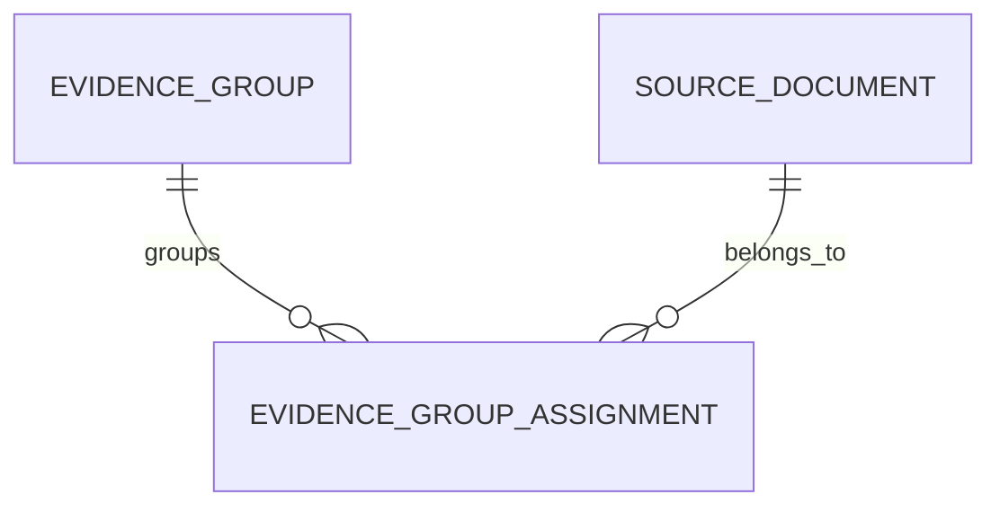
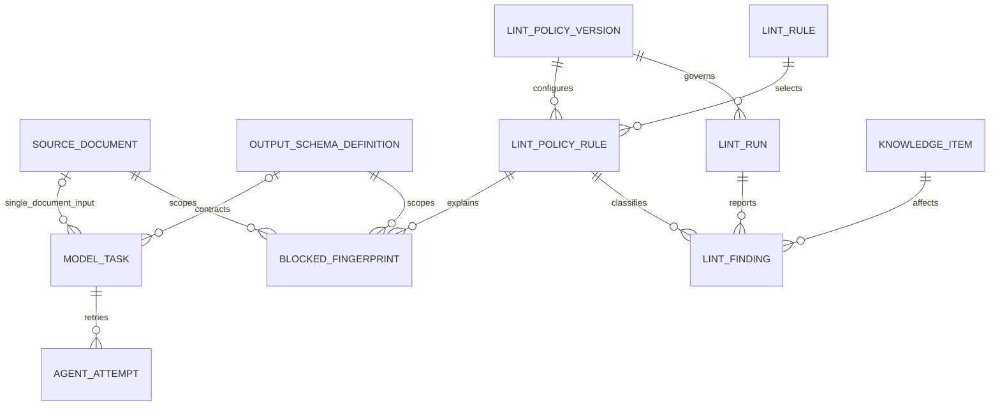
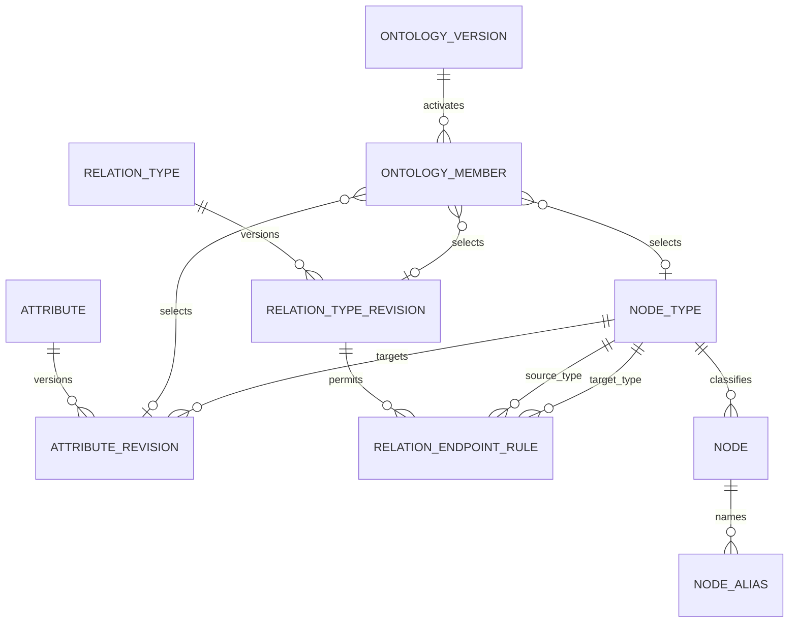
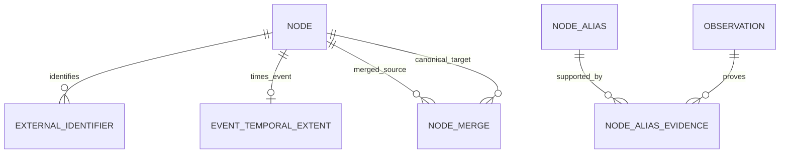
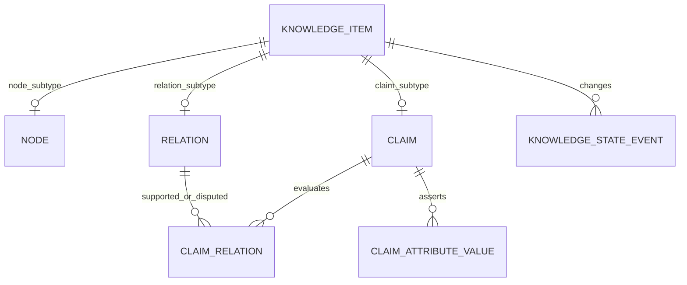
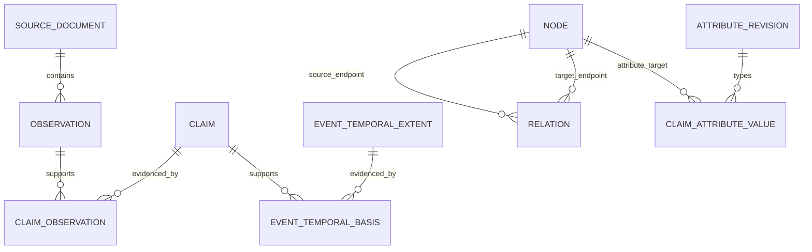
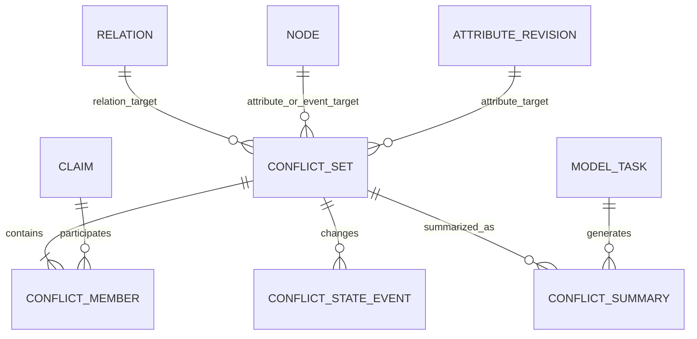
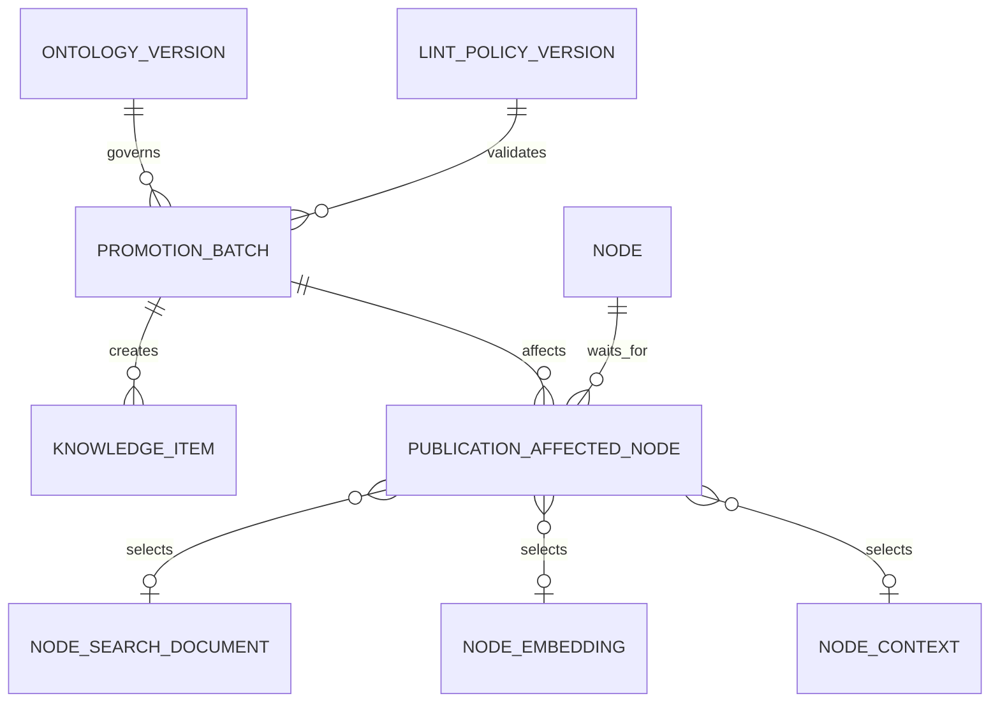
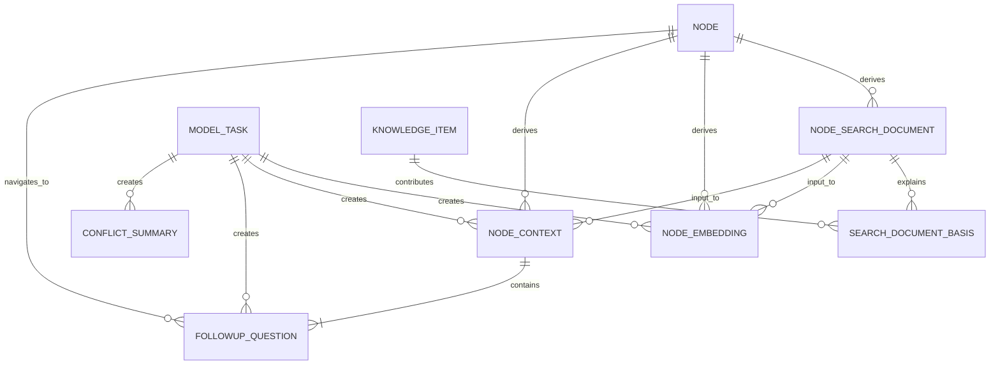

# ontology-map 논리 데이터 스키마

> 상태: Logical Schema v1 — Frozen · 동결일: 2026-09-01
>
> 기준: 요구사항 워크숍에서 확정한 HBF 공개 자료 POC
>
> 범위: 미리 준비된 불변 정규화 문서부터 모델 실행, 메모리 검증, 기준 지식그래프, 파생 데이터, 동적 지도 공개까지

## 1. 문서의 목적과 결정 경계

이 문서는 확정된 제품 요구사항을 구현 가능한 논리 데이터 모델로 옮긴다. 엔터티 이름과 관계, 데이터의 책임, 키와 카디널리티, 상태 전이, 무결성 규칙, 트랜잭션 경계를 정의한다.

이 문서의 제품 의미, 엔터티명, 필드명과 논리 제약은 Logical Schema v1으로 동결한다. 이후 변경은 승인된 요구사항과 별도 논리 모델 변경 절차가 있을 때만 반영한다.

이번 문서에서는 PostgreSQL의 실제 자료형, DDL, migration, API 계약, 벡터 차원, 인덱스 표현식, 그래프 라이브러리와 화면 좌표를 정하지 않는다. 이 항목들은 논리 모델 승인 뒤 물리 스키마와 API 설계에서 결정한다.

## 2. 전체 컨셉

이 데이터 모델은 그래프 테이블 몇 개가 아니라 근거 있는 지식이 만들어지고 공개되는 컴파일 파이프라인을 표현한다.

```text
자료 준비·오케스트레이션 레이어가 구성한 정규화 문서 입력
→ 문서 내용과 메타데이터 검사
→ 불변 문서 버전 저장
→ 버전이 고정된 출력 계약으로 Agent 호출
→ 응답과 후보를 저장하지 않고 메모리에서 계약·lint·동일 대상·중복·온톨로지 검사
→ 반복 차단 대상은 payload 없이 fingerprint와 정형화된 규칙만 기록
→ 짧은 트랜잭션으로 기준 지식그래프 승격
→ 검색 문서·임베딩·한국어 맥락·후속 질문 생성
→ 영향받은 묶음의 공개 준비 완료
→ 다음 검색·노드 클릭·시간 범위 변경부터 동적 부분 그래프 조회
```

핵심 원칙은 다음과 같다.

- 자료 발견, 크롤링과 HTML 정규화는 제품 DB 바깥의 준비 과정이다. 제품은 준비된 정규화 텍스트와 메타데이터만 입력받는다.
- Agent 출력은 후보일 뿐이다. 내부 식별자, 동일 대상 병합, 허용 유형, 승격, 상태와 무결성은 일반 코드와 DB가 결정한다.
- 기준 지식의 의미를 덮어쓰지 않는다. 의미가 달라지면 새 기록을 만들고 기존 기록의 상태와 이력을 보존한다.
- 준비된 문서 버전, 관측, Claim과 관계의 연결을 따라가면 모든 공개 지식의 Evidence Trace를 재현할 수 있어야 한다.
- 지도는 기준 데이터가 아니다. 공개 준비된 지식에서 중심 노드의 직접 이웃과 중요한 2단계 이웃을 매번 계산하고, 브라우저가 3D처럼 보이는 좌표를 배치한다.
- 공개 준비가 실패한 변경 묶음은 기준 그래프에 남지만 일반 검색과 지도에는 나타나지 않는다. 이전 공개 결과는 계속 제공한다.
- 사람이 거절한 지식은 공개 준비 상태와 관계없이 지도와 일반 검색에서 즉시 제외하지만 DB에서는 삭제하지 않는다.
- 의미가 섞인 단일 `confidence` 값은 두지 않는다. 추출 성공 여부는 모델 작업 상태, 원문 충실성은 관측 일치·lint·지식 상태, 근거 강도는 독립 근거 묶음 수로 각각 표현한다.

## 3. Structured Output 계약과 JSON의 역할

구조화 출력 JSON은 Agent와 애플리케이션 사이의 일시적인 신뢰 경계다. 기준 지식그래프의 저장 형식이나 HTML 보관 형식이 아니며 DB 보존 대상도 아니다.

`output_schema_definition`은 다음과 같은 응답 구조를 JSON Schema로 버전 관리한다. Agent는 일반 코드가 선택한 정확한 계약으로만 결과를 반환한다.

```json
{
  "schema_version": "candidate-v1",
  "source_document_id": "source-document-id",
  "nodes": [],
  "events": [],
  "relations": [],
  "claims": [],
  "observations": [],
  "identity_candidates": []
}
```

사건은 `events`의 정식 노드 후보로 내보내고 사건 맥락 관계는 그 사건을 시작 또는 도착 endpoint로 사용하는 `relations` 후보로 내보낸다. 관계 후보에는 숨은 사건 맥락이나 관계 유효 기간을 넣지 않으며, 원문이 주장한 시간은 Claim 후보와 정확한 관측 위치에 둔다.

애플리케이션은 응답 JSON을 메모리에서 계약 검증하고 후보별 승격 전 검사를 수행한다. 모델 제공자의 원시 HTTP 응답, Agent 응답 JSON, 탈락한 후보 payload는 저장하지 않는다. 계약을 통과하고 승격 전 검증에도 통과한 결과만 강한 관계형 제약을 가진 기준 그래프나 모델 기반 파생 결과에 기록한다.

계약은 작업 종류와 버전별로 재사용하되 이미 `model_task`가 참조한 행은 수정하지 않는다. 형식을 바꾸려면 새 계약 버전을 추가한다. `EMBEDDING`은 JSON Structured Output이 아니므로 계약 참조 없이 벡터 타입과 설정된 차원으로 검사한다.

후보 일부가 차단되어도 통과한 후보는 같은 짧은 트랜잭션에서 승격할 수 있다. 차단된 후보는 payload 대신 검증 관련 모든 필드를 정규화한 fingerprint와 정확한 문서·계약·정책 규칙 범위만 `blocked_fingerprint`에 남긴다.

구조화 출력의 Claim 후보는 원자적 문장, 정확한 관측 참조와 함께 관계 후보, 구조화된 속성값 후보, 사건 시간 후보 가운데 최소 하나를 의미 대상으로 가리켜야 한다. 기본 출력은 Claim 하나에 주 의미 대상 하나이며, 독립적으로 판단할 수 있는 내용은 별도 Claim으로 나눈다. 분리하면 원문 명제의 의미가 달라지거나 사라지는 경우에만 여러 의미 대상 참조를 허용하고 비차단 lint 경고로 원자성을 다시 확인한다. 다른 노드를 값으로 넣는 속성 후보는 허용하지 않으며 노드 사이 사실은 관계 후보로 출력한다.

## 4. 공통 표준

### 4.1 식별자

- 모든 기준 엔터티는 이름과 무관한 변경 불가능한 내부 식별자를 가진다.
- 병합된 노드의 식별자를 재사용하거나 삭제하지 않는다. 병합 대상에서 기준 노드로 가는 리디렉션 이력을 남긴다.
- 외부 식별자는 `외부 체계 + 값`으로 고유성을 판정하며 내부 식별자를 대신하지 않는다.
- 정확한 물리 식별자 형식은 물리 스키마 단계에서 정한다.

### 4.2 텍스트와 Evidence Trace

- 정규화 본문은 UTF-8, Unicode NFC, LF 줄바꿈을 사용한다.
- 관측 범위는 Unicode 문자 기준의 반열린 구간 `[start, end)`로 저장한다. byte 위치나 UTF-16 code unit 위치를 섞지 않는다.
- 관측에는 범위뿐 아니라 인용문과 인용문 해시를 함께 저장한다.
- 저장된 범위에서 잘라낸 문자열, 인용문, 인용문 해시가 일치하지 않으면 차단 lint로 처리한다.
- 기존 관측을 새 문서 버전으로 자동 이동하지 않는다.

### 4.3 시간

| 시간 | 의미 | 활동량 계산 사용 여부 |
|---|---|---|
| `published_at` | 출처가 자료를 처음 게시한 시점 | 사용 |
| `source_modified_at` | 출처가 해당 버전까지 자료를 수정한 시점 | 사용하지 않음 |
| `last_checked_at` | 준비된 문서가 마지막으로 같은 내용인지 확인된 시점 | 사용하지 않음 |
| `observed_at` | 시스템이 원문 위치에서 Claim을 발견한 시점 | 사용하지 않음 |
| 사건 시작·종료 | 실제 사건이 발생한 시점이나 기간 | 지도 관심도와 분리 |
| Claim 주장 시작·종료 | 출처가 Claim에서 명시한 시점이나 기간 | 지도 관심도와 분리 |

시간 범위의 시작과 종료에는 각각 `정확한 시각`, `날짜`, `월`, `연도`, `미상` 중 하나의 정밀도를 저장한다. 한쪽 경계만 아는 기간은 모르는 경계를 명시적으로 비워 둔다. 게시 시점을 확인할 수 없는 출처는 상세 패널에는 사용할 수 있지만 기간별 활동량에서는 제외한다.

### 4.4 언어

- Claim 문장과 인용문은 출처 언어를 보존한다.
- 한국어 맥락 설명, 후속 질문, 번역과 검색 보강 문구는 별도의 파생 결과로 저장하고 입력·모델·프롬프트 계보를 남긴다.
- 기사 작성자와 매체는 우선 출처 메타데이터로 저장한다. 독립적인 노드 생성 기준을 충족할 때만 사람·회사 후보가 된다.

### 4.5 POC 보존

HBF POC 동안 문서 버전, 기준 지식, 사람 검토 이력, 실행·lint·차단 기록, 계보와 파생 결과를 자동 삭제하지 않는다. Agent 응답 JSON과 후보 payload는 처음부터 저장하지 않는다. POC 이후 실제 저장량과 재생성 비용을 측정한 뒤 사용되지 않는 파생 결과에만 정리 정책을 검토한다. 기준 지식, Evidence Trace와 사람 검토 이력은 자동 정리 대상에서 제외한다.

## 5. 논리 ER 구조

Mermaid 그림은 논리 엔터티와 카디널리티만 보여준다. 필드와 제약은 뒤의 데이터 사전이 기준이며, 그림의 배치는 제품 지도 배치와 무관하다.

### 5.1 준비된 문서와 독립 근거



### 5.2 모델 실행, 승격 전 검증과 기준 그래프 lint



### 5.3 온톨로지와 노드 정체성





### 5.4 기준 지식그래프와 Evidence Trace







`conflict_set`은 관계의 `relation_id`, 속성값의 `target_node_id + attribute_revision_id`, 사건 시간의 `event_node_id` 가운데 정확히 한 대상 형태만 가진다. Mermaid 관계선은 nullable 참조를 모두 표시하지만 세 형태를 동시에 채우거나 모두 비우는 것은 허용하지 않는다.

### 5.5 승격, 파생 결과와 공개 준비





## 6. 데이터 사전

### 6.1 준비된 문서와 독립 근거

#### `source_document`

제품 밖에서 미리 정규화된 문서 한 버전을 저장한다. 같은 자료의 내용이나 버전 메타데이터가 달라지면 기존 행을 덮어쓰지 않고 `version_no`를 올린 새 행에 본문 전체를 다시 저장한다.

| 필드 | 의미와 규칙 |
|---|---|
| `source_document_id` | 이 문서 버전의 불변 내부 식별자 |
| `source_key` | 같은 논리 자료의 여러 버전을 묶는 안정된 키 |
| `version_no` | 같은 `source_key` 안에서 1부터 증가하는 버전 번호 |
| `canonical_url` | 준비된 자료가 가리키는 대표 URL |
| `publisher_name` | 매체 메타데이터 |
| `title` | 해당 버전의 제목 |
| `author_text` | 해당 버전의 작성자 원문 |
| `original_language` | 해당 버전 본문의 언어 |
| `normalized_body` | 보존 대상인 정규화 본문 |
| `body_hash` | 정규화 본문 비교와 복제 문서 판정에 사용하는 해시 |
| `published_at`, `source_modified_at` | 게시 시점과 출처가 표시한 수정 시점 |
| `published_precision`, `modified_precision` | 게시·수정 시점의 정밀도 |
| `last_checked_at` | 같은 자료를 마지막으로 확인한 시점 |
| `last_check_status` | 마지막 확인의 성공 또는 실패 상태 |
| `created_at` | 이 버전 행을 저장한 시점 |

`source_key + version_no`는 고유해야 한다. 준비된 자료를 다시 확인했을 때 본문 해시와 버전 메타데이터가 같으면 새 행을 만들지 않고 현재 버전의 `last_checked_at`과 `last_check_status`만 갱신한다. 본문, 제목, 작성자, 게시·수정 시점처럼 Evidence Trace의 의미에 영향을 주는 값이 달라지면 다음 버전 번호로 새 행을 만든다. 수집 방법, GDELT 응답, 검색 순위, HTTP 통신과 개별 재시도는 제품 DB에서 관리하지 않는다.

#### `evidence_group`과 `evidence_group_assignment`

독립 근거 묶음은 기사 수가 아니라 원문 계보 기준으로 근거의 독립성을 계산하는 단위다.

- 같은 문서 버전의 여러 원문 위치, 동일 본문 해시의 복제 기사, 명시적 재게시, 확인된 번역·재전송은 하나의 묶음으로 본다.
- 정확히 같은 본문 해시는 일반 코드가 자동으로 묶는다.
- 보도자료 재게시처럼 모호한 계보는 Agent가 후보만 제안하고 사람이 최종 병합한다.
- `evidence_group_assignment`에는 문서 버전과 근거 묶음, 할당 방식, 판단 이유, 처리 주체, 적용 시작·종료 시점을 남긴다. 재할당할 때 이전 행의 적용 기간을 닫고 새 행을 추가하여 과거 판정을 덮어쓰지 않는다.
- 관계선 굵기와 노드 활동량은 해당 기간의 지지 Claim에서 도달 가능한 서로 다른 `evidence_group_id` 수를 기준으로 계산한다.

### 6.2 모델 실행과 승격 전 검증

#### `output_schema_definition`

모델 작업이 반환해야 하는 JSON 구조를 작업 종류와 버전별로 보존하는 불변 계약이다. 응답 인스턴스나 제공자 payload를 보관하는 테이블이 아니다.

| 필드 | 의미와 규칙 |
|---|---|
| `output_schema_definition_id` | 출력 계약 식별자 |
| `task_kind` | 이 계약을 사용할 모델 작업 종류 |
| `version_no` | 같은 작업 종류 안에서 증가하는 계약 버전 |
| `schema_json` | JSON Schema 계약 정의 |
| `created_at` | 계약을 등록한 시점 |
| `is_active` | 새 작업에 선택할 수 있는 현재 계약인지 표시 |

`task_kind + version_no`는 고유하다. `model_task`가 한 번이라도 참조한 계약의 작업 종류, 버전과 스키마 본문은 수정하지 않으며 변경이 필요하면 새 버전을 추가한다. 모델 작업과 계약의 `task_kind`는 같아야 한다.

#### `model_task`

하나의 결정적 모델 작업, 실행 lease, 기술 재시도와 캐시 경계를 나타낸다.

| 필드 | 의미와 규칙 |
|---|---|
| `model_task_id` | 작업 식별자 |
| `task_kind` | `KNOWLEDGE_EXTRACTION`, `ENTITY_RESOLUTION_PROPOSAL`, `EVIDENCE_LINEAGE_PROPOSAL`, `CONFLICT_SUMMARY`, `NODE_CONTEXT`, `FOLLOWUP_QUESTIONS`, `EMBEDDING` 중 하나 |
| `source_document_id` | 단일 문서 기반 작업의 정확한 불변 입력 문서 버전이며 다중 문서 작업과 그 밖의 작업에서는 비울 수 있음 |
| `input_hash` | 자료 준비·오케스트레이션 레이어가 구성하여 실제로 전달한 입력 전체의 결정적 해시 |
| `output_schema_definition_id` | 정확한 출력 계약이며 `EMBEDDING` 작업에서만 비움 |
| `model_version`, `prompt_version` | 실행 계보 |
| `cache_key` | 작업 종류, 입력 해시, 출력 계약 식별자, 모델·프롬프트 버전으로 계산한 결정적 고유 키 |
| `status` | `PENDING`, `RUNNING`, `SUCCESS`, `RETRY_WAIT`, `VALIDATION_BLOCKED`, `FINAL_FAILED` 중 하나 |
| `attempt_count`, `next_attempt_at` | 실제 모델 호출 횟수와 다음 호출 가능 시점 |
| `lease_owner`, `lease_expires_at` | 같은 작업의 동시 실행을 막는 짧은 lease |
| `created_at`, `finished_at` | 작업 생성 시점과 종료 상태에 도달한 시점 |

`task_kind`는 일반 코드가 입력 구성, 성공 출력 검사와 결과 반영 위치를 선택하는 허용 코드다. 작업별 경로는 다음과 같이 고정한다.

| `task_kind` | 입력 | 성공 출력 검사 | 결과 위치와 `model_task` 연결 |
|---|---|---|---|
| `KNOWLEDGE_EXTRACTION` | 정규화된 문서 본문 | 작업 종류가 일치하는 출력 계약을 검사한 뒤 후보별 승격 전 차단 규칙과 승격 트랜잭션 무결성을 검사함 | 통과한 결과를 `promotion_batch`를 거쳐 기준 지식그래프와 Evidence Trace에 반영함. 기준 지식은 `model_task_id`를 직접 참조하지 않음 |
| `ENTITY_RESOLUTION_PROPOSAL` | 기존 노드와 새 대상 정보 | 작업 종류가 일치하는 출력 계약과 동일 대상 식별 규칙을 검사하며 Agent가 자동 병합하지 못하게 함 | 유효한 후보는 메모리에서 병합 검토로 넘기고 저장하지 않음. 사람이 확정한 병합만 `node_merge`에 기록하며 `model_task_id`를 직접 연결하지 않음 |
| `EVIDENCE_LINEAGE_PROPOSAL` | 자료 준비·오케스트레이션 레이어가 선택·정리한 여러 문서의 본문·작성자·출처 | 작업 종류가 일치하는 출력 계약과 본문 해시·확인된 원문 계보 규칙을 검사함 | 확정된 계보를 `evidence_group`과 `evidence_group_assignment`에 반영하며 `model_task_id`를 직접 연결하지 않음 |
| `CONFLICT_SUMMARY` | 충돌하는 Claim과 근거 | 작업 종류가 일치하는 출력 계약과 입력 Claim의 충돌 묶음·근거 연결을 검사함 | `conflict_summary`가 생성한 `model_task_id`를 직접 참조함 |
| `NODE_CONTEXT` | 정확한 노드 검색 문서 | 작업 종류가 일치하는 출력 계약과 검색 문서·노드 일치를 검사함 | `node_context`가 생성한 `model_task_id`와 입력 `node_search_document_id`를 직접 참조함 |
| `FOLLOWUP_QUESTIONS` | 노드 맥락과 결정적으로 정렬된 탐색 후보 노드 | 작업 종류가 일치하는 출력 계약, 질문 slot 1·2의 유일성과 대상의 후보 포함 여부·공개 자격을 검사함 | 두 `followup_question`이 입력 `node_context`와 생성한 `model_task_id`를 직접 참조함 |
| `EMBEDDING` | `node_search_document` 텍스트 | JSON 계약 대신 벡터 타입과 설정된 차원을 검사함 | `node_embedding`이 입력 `node_search_document`와 생성한 `model_task_id`를 직접 참조함 |

계약과 작업별 검사를 통과한 관련 결과가 없으면 결과 행을 만들지 않고 정상 `SUCCESS`로 끝낸다. 결과가 있으면 표의 위치에 영속 반영하고 필요한 연결을 만든 뒤에만 `SUCCESS`로 바꾼다.

`EMBEDDING` cache key는 출력 계약 위치에 고정된 빈 표지를 넣으며 벡터 타입과 설정된 차원으로 결과를 검사한다. 같은 cache key에는 영속 작업 행 하나만 두고 `SUCCESS`, `VALIDATION_BLOCKED`, `FINAL_FAILED`를 종료 상태로 취급한다. 캐시 적중은 새 시도 행이나 호출 횟수를 만들지 않는다. 다중 문서 모델 입력의 선택·정리 책임과 정확한 목록 계보는 제품 DB 밖에 두며, 제품 DB에는 결정적 `input_hash`만 남기고 `model_task_input_document` 같은 관계를 추가하지 않는다.

`SUCCESS`는 하나 이상의 결과가 영속 저장소에 반영됐거나 유효한 응답에 관련 후보가 없다는 뜻이다. 일부 후보만 승격되고 나머지가 차단된 작업도 `SUCCESS`다. 관련 후보가 있었지만 모두 차단됐을 때만 `VALIDATION_BLOCKED`를 사용한다. 모델 호출이나 출력 계약 자체의 기술 실패는 재시도 가능성에 따라 `RETRY_WAIT` 또는 `FINAL_FAILED`로 간다.

worker는 모델 제공자 호출 전에 작업 lease와 실행 상태를 짧은 트랜잭션으로 먼저 커밋한다. 호출과 메모리 검사가 끝나면 새 짧은 트랜잭션에서 작업 행을 잠그고 이미 종료됐는지 다시 확인한 뒤 시도 기록, 승격 결과 또는 차단 fingerprint, 호출 횟수와 작업 상태를 원자적으로 반영한다.

#### `agent_attempt`

실제 모델 호출 한 번의 최소 이력이다.

| 필드 | 의미와 규칙 |
|---|---|
| `agent_attempt_id` | 시도 식별자 |
| `model_task_id`, `attempt_no` | 작업과 1부터 증가하는 호출 순서 |
| `outcome` | 호출 또는 계약 검증 결과 |
| `failure_reason` | 실패했을 때의 정형화된 이유 |
| `attempted_at` | 호출 시점 |

`model_task_id + attempt_no`는 고유하며 `attempt_count`와 실제 행 수는 일치해야 한다. 응답 식별자, 토큰·비용 집계, 모델 제공자 원문, 중복된 모델·프롬프트·계약 버전은 저장하지 않는다. 최초 호출 뒤 즉시 한 번 더 시도할 수 있고 계속되는 일시 장애에는 1시간, 2시간, 4시간 뒤 각각 한 번씩 시도하여 최대 다섯 번 호출한다. 시간 초과와 일시적인 모델 제공자 장애만 `RETRY_WAIT` 대상으로 삼고 인증 실패, 잘못된 요청과 소진된 재시도는 `FINAL_FAILED`로 닫는다.

#### 메모리 검증과 `blocked_fingerprint`

애플리케이션은 계약에 맞는 응답을 후보 단위로 분리하고 인용 범위, 온톨로지, 동일 대상, 중복과 승격 무결성을 메모리에서 검사한다. 응답 JSON, 후보 payload, 승격 전 finding 인스턴스와 후보 상태 이력은 저장하지 않는다.

| 필드 | 의미와 규칙 |
|---|---|
| `blocked_fingerprint_id` | 반복 차단 기록 식별자 |
| `fingerprint` | 검증에 영향을 주는 후보 필드를 정규화한 결정적 해시 |
| `source_document_id` | 후보를 만든 정확한 불변 문서 버전 |
| `output_schema_definition_id` | 후보가 통과한 정확한 출력 계약 |
| `lint_policy_rule_id` | 실패한 정확한 `BLOCKING` 승격 전 규칙 |
| `first_blocked_at`, `last_blocked_at`, `blocked_count` | 최초·최근 차단 시점과 반복 횟수 |

`fingerprint + source_document_id + output_schema_definition_id + lint_policy_rule_id`는 고유하다. 계약을 통과한 후보가 `PRE_PROMOTION` 또는 `BOTH` 범위의 `BLOCKING` 규칙에 실패했을 때만 이 행을 생성하거나 반복 횟수를 갱신한다. 계약 위반, 모델 장애, `WARNING`과 자유 서술형 payload는 기록하지 않는다. 작업 스케줄러는 `model_task.status`, `attempt_count`, `next_attempt_at`만으로 기술 재시도를 결정하고, `blocked_fingerprint`는 계약 유효 응답 안의 같은 차단 후보를 다시 검증하거나 승격하지 않는 데만 사용한다.

### 6.3 온톨로지

#### `ontology_version`

노드 유형, 관계 유형 revision과 속성 revision을 함께 활성화하는 사람이 승인한 버전이다. `ontology_member`의 한 행은 안정된 `node_type_id`, `relation_type_revision_id`, `attribute_revision_id` 가운데 정확히 하나만 가리킨다. 과거 관계와 속성값은 생성 당시 사용한 revision을 계속 가리킨다.

#### `node_type`

`node_type`은 안정된 노드 유형의 코드, 표시 이름, 생성 규칙과 수명주기 상태를 관리한다. POC에서 허용하는 노드 유형은 사람, 회사, 기술, 주제, 사건 다섯 가지뿐이다. 의미가 달라진 범주가 필요하면 기존 행을 개정하지 않고 새 유형 코드와 행을 추가한다.

| 필드 | 의미와 규칙 |
|---|---|
| `node_type_id` | 노드 유형의 불변 내부 식별자 |
| `node_type_code` | `PERSON`, `COMPANY`, `TECHNOLOGY`, `TOPIC`, `EVENT` 가운데 하나인 고유하고 안정된 코드 |
| `display_name` | 화면에 표시할 유형 이름 |
| `creation_rule` | 해당 유형의 노드를 만들 수 있는 근거 기준 |
| `lifecycle_state` | 활성 또는 폐기 |

| 유형 | 생성 기준 |
|---|---|
| 사람 | 이름과 소속·직책 등 동일 대상을 구분할 근거가 있어야 하며 모호하면 보류한다. |
| 회사 | 독립된 조직으로 식별할 이름과 구분 정보가 있어야 하며 임시 조직명이나 일반 명사는 제외한다. |
| 기술 | 제품, 표준, 규격, 아키텍처, 기술군처럼 반복해 같은 대상을 가리키는 고유 명칭이나 승인된 별칭이 있어야 한다. 설명 문구는 Claim이나 검색어로만 사용한다. |
| 주제 | 허용된 주제 목록에 있거나 사람이 새 주제로 승인해야 한다. Agent가 발견한 모든 키워드를 자동 승격하지 않는다. |
| 사건 | 특정 시점이나 기간, 발생 내용, 최소 한 명의 참여자 또는 대상이 근거로 확인되어야 한다. |

모든 노드는 허용 유형, 출처와 정확한 원문 위치, 동일 대상 검사 가능성, 유형과 alias 등 최소 식별 정보를 가져야 한다. 나머지 세부 사실은 Claim으로 저장한다.

#### `relation_type`, `relation_type_revision`과 `relation_endpoint_rule`

`relation_type`은 바뀌지 않는 관계 코드의 정체성을 관리하고 `relation_type_revision`은 같은 관계 의미에 적용하는 표시 이름과 검증 규칙의 버전을 관리한다. 관계 유형은 자유 문자열이나 변경되는 DB enum이 아니다. 관계의 근본 의미가 바뀌면 새 `relation_code`를 가진 관계 유형을 추가하고, 같은 의미의 규칙만 바뀌면 새 revision을 추가한다.

`relation_type`의 필드는 다음과 같다.

| 필드 | 의미와 규칙 |
|---|---|
| `relation_type_id` | 관계 유형의 불변 내부 식별자 |
| `relation_code` | 애플리케이션과 Agent가 관계 의미를 식별하는 불변 고유 코드이며 `relation_type`에 저장 |

`relation_type_revision`의 필드는 다음과 같다.

| 필드 | 의미와 규칙 |
|---|---|
| `relation_type_revision_id` | 과거 의미를 보존하는 불변 revision 식별자 |
| `relation_type_id` | 이 revision이 속한 안정된 관계 유형 |
| `display_name` | 화면 표시 이름 |
| `directionality` | `DIRECTED` 또는 `SYMMETRIC` |
| `inverse_relation_type_revision_id` | 반대 방향 의미가 있을 때 참조 |
| `lifecycle_state` | 활성 또는 폐기 |

`relation_endpoint_rule`은 관계 revision마다 `relation_type_revision_id`, `source_node_type_id`, `target_node_type_id`를 저장한다. 두 endpoint 유형은 모두 안정된 `node_type_id`를 참조한다. Agent는 활성 규칙에 맞는 관계만 제안할 수 있고 일반 코드와 DB가 다시 검사한다.

역관계는 `DIRECTED` revision에만 지정할 수 있으며 `inverse_relation_type_revision_id`를 따라 조회할 때 계산한다. `SYMMETRIC` revision에는 역관계를 지정할 수 없고 endpoint를 노드 식별자 순서로 정규화하여 반대 방향 중복 행을 만들지 않는다.

#### `attribute`와 `attribute_revision`

`attribute`는 바뀌지 않는 고유 속성 코드를 관리하고 `attribute_revision`은 표시 이름, 정확히 하나의 `target_node_type_id`, 허용 값 유형, 단위 규칙과 수명주기 상태의 버전을 관리한다. POC에는 여러 대상 유형을 위한 `attribute_target_rule`을 두지 않는다. 실제 속성이 둘 이상의 노드 유형을 대상으로 해야 할 때만 별도 이슈에서 구조를 다시 설계한다. 원문에 없는 값을 Agent가 만들어서는 안 된다.

| 엔터티 | 필드와 규칙 |
|---|---|
| `attribute` | 불변 `attribute_id`와 고유한 `attribute_code` |
| `attribute_revision` | 불변 `attribute_revision_id`, 안정된 `attribute_id`, `display_name`, 정확히 하나의 `target_node_type_id`, `allowed_value_kind`, `unit_rule`, `lifecycle_state` |

POC의 허용 값 유형은 `STRING`, 단위가 있는 `NUMBER`, `DATE`, `PERIOD`, `BOOLEAN`이다. 날짜와 기간을 합친 값 유형이나 노드 참조 값 유형은 사용하지 않는다. `BOOLEAN`은 다른 노드나 의미 객체 없이 대상 노드 하나만으로 뜻이 완성되는 사람이 승인한 단항 속성에만 허용한다. 속성 코드에 다른 노드의 정체성을 넣어 관계 endpoint 검사를 우회해서는 안 된다. Relation으로 표현할 수 없는 승인된 사용 사례가 실제로 생길 때만 별도 설계 이슈에서 노드 값 속성을 다시 검토한다.

### 6.4 노드 정체성

#### `node`

변경 불가능한 내부 식별자와 안정된 `node_type_id`만 공통 관리한다. 사람·회사·기술·주제의 프로필 전용 열이나 자유 JSON 속성을 두지 않는다. 사건 시간만 별도 구조화하고 나머지 세부 사실은 Claim으로 표현한다.

| 필드 | 의미와 규칙 |
|---|---|
| `node_id` | `knowledge_item_id`와 일대일인 불변 노드 식별자 |
| `node_type_id` | 사람·회사·기술·주제·사건 가운데 안정된 유형 참조 |

#### `node_alias`

대표 alias와 검색 alias를 불변 노드 식별자에 연결한다. 같은 alias 문자열이 서로 다른 노드를 가리킬 수 있으며 동일 대상 판정은 문자열의 전역 고유성이 아니라 노드 정체성과 근거를 사용한다.

| 필드 | 의미와 규칙 |
|---|---|
| `node_alias_id` | alias 기록 식별자 |
| `node_id` | 대상 노드 |
| `alias_text`, `language` | 검색할 alias 문자열과 언어 |
| `is_preferred` | 현재 화면 대표 alias로 사용할지 여부 |

한 노드에 `is_preferred = true`인 행은 최대 하나만 허용하고, 공개 가능한 노드는 정확히 하나를 가져야 한다. 검색은 모든 alias를 대상으로 수행한 뒤 활성 `node_merge`를 따라 최종 기준 노드를 찾고 그 노드의 대표 alias만 표시한다. 과거 명칭이 사용된 기간이 중요하면 alias에 기간 메타데이터를 추가하지 않고 시간 정보가 있는 Claim으로 표현한다. `node_alias_evidence`는 alias와 이를 뒷받침하는 관측을 다대다로 연결한다.

#### `external_identifier`

외부 식별 체계와 값을 노드에 연결한다. POC에서는 KRX 종목코드, Wikidata ID, ORCID, LEI처럼 신뢰된 자료 준비 레이어가 제공한 구조화 메타데이터만 저장하고 같은 체계의 같은 값을 서로 다른 노드에 연결하지 않는다. 일반 문서 본문에서 Agent가 발견한 후보는 검증 없이 승격하지 않으며, Claim·Observation 기반 Evidence Trace와 분리하여 별도의 observation 근거 연결을 요구하지 않는다.

#### `node_merge`

`node_alias`와 별도로 병합되는 기존 노드와 기준 노드 사이의 내부 식별자 리디렉션을 저장한다.

| 필드 | 의미와 규칙 |
|---|---|
| `node_merge_id` | 병합 이력의 불변 식별자 |
| `source_node_id`, `canonical_node_id` | 병합 원본과 기준 노드 |
| `merge_reason`, `merged_by`, `merged_at` | 병합 이유, 처리자와 처리 시점 |
| `reversed_reason`, `reversed_by`, `reversed_at` | 잘못된 병합을 취소한 이유, 처리자와 처리 시점이며 활성 병합에서는 `NULL` |

다음 규칙을 적용한다.

- 병합 원본과 기준 노드는 같을 수 없다.
- `reversed_at IS NULL`인 병합만 활성으로 해석하며 원본 노드마다 활성 병합은 최대 하나다.
- 활성 병합 리디렉션은 순환할 수 없고 연쇄를 따라가면 하나의 최종 기준 노드가 결정되어야 한다.
- 모호한 동일 대상 병합은 Agent가 후보만 제안하고 사람이 결정한다.
- 병합 뒤에도 이전 식별자, alias, Claim, 관계와 Evidence Trace를 원본 노드에 그대로 보존한다.
- 병합을 취소하면 행을 삭제하지 않고 취소 정보를 채운다. 같은 원본을 다시 병합할 때는 기존 행을 재사용하지 않고 새 행을 추가한다.

#### `event_temporal_extent`

사건 노드에만 최대 한 건을 두고 사건의 `event_node_id`를 공유 기본 키이자 `node.node_id` 외래 키로 사용한다. `start_at`, `end_at`, `start_precision`, `end_precision`을 저장하며 별도의 시작·종료 미상 Boolean은 두지 않는다. 알 수 없는 경계는 값 `NULL`과 정밀도 `UNKNOWN`으로 저장하고, 값이 있으면 정밀도는 `UNKNOWN`일 수 없다. 월만 알면 해당 월의 첫날과 `MONTH`, 연도만 알면 해당 연도의 첫날과 `YEAR`를 저장하지만, 화면과 시간 필터는 정규화한 1일을 정확한 주장 날짜로 해석하지 않고 정밀도에 맞는 범위로 처리한다.

| 알려진 경계 | 저장 값 | 정밀도 | 표시와 필터 의미 |
|---|---|---|---|
| 2025년 2월 20일 | `2025-02-20` | `DAY` | 해당 날짜 |
| 2025년 2월 | `2025-02-01` | `MONTH` | 2025년 2월 전체 |
| 2025년 | `2025-01-01` | `YEAR` | 2025년 전체 |
| 미상 | `NULL` | `UNKNOWN` | 알려진 경계 없음 |

`event_temporal_basis`는 `event_node_id`와 `claim_id`를 복합 기본 키로 사용하여 이 시간 범위와 이를 직접 뒷받침하는 기준 Claim을 다대다로 연결한다. 시작과 종료를 모두 알 때 종료가 시작보다 이를 수 없다. 서로 다른 시간이 주장되면 기존 Claim을 덮어쓰지 않고 충돌 묶음으로 관리하며, 사건 식별 범위로 채택할 값은 일반 코드의 명확한 규칙이나 사람의 판단이 있어야 바뀐다. 사건 참여자와 발표 기술은 고정 열이 아니라 허용 관계로 연결한다.

### 6.5 기준 지식그래프

#### `knowledge_item`

노드, 관계, Claim의 공통 상태와 생성 계보를 가진 상위 엔터티다.

| 필드 | 의미와 규칙 |
|---|---|
| `knowledge_item_id` | 불변 식별자 |
| `item_kind` | 노드, 관계, Claim |
| `current_state` | 근거 확인됨, 사람 확인됨, 보류, 거절 |
| `promotion_batch_id` | 어떤 짧은 트랜잭션에서 생성됐는지 표시 |
| `created_at` | 기준 그래프 생성 시점 |

각 `knowledge_item`은 정확히 하나의 노드·관계·Claim 하위 레코드를 가져야 한다. Agent는 기준 지식 상태를 직접 만들지 못한다.

`근거 확인됨`은 사실로 확정됐다는 뜻이 아니다. 문서 버전과 원문 위치가 존재하고, 인용 범위가 Claim을 실제로 뒷받침하며, 노드·관계 유형과 시간·동일 대상 검사를 포함한 모든 승격 차단 규칙을 통과했다는 뜻이다.

#### `knowledge_state_event`

사람이 기준 지식의 상태를 바꾼 이력만 append-only로 보존한다. `knowledge_state_event_id`, `knowledge_item_id`, `from_state`, `to_state`, 필수 `reason`, 논리적인 처리자 참조, `changed_at`을 기록하며 처리 주체 종류 열은 두지 않는다. 처리자 참조의 실제 이름·자료형·FK와 인증 계약은 관리자 기능을 구현할 때 결정한다. 최초 승격으로 생기는 `근거 확인됨` 상태는 사람의 변경이 아니므로 이벤트를 만들지 않는다.

허용 전이는 `근거 확인됨 → 사람 확인됨·보류·거절`, `사람 확인됨 → 보류·거절`, `보류 → 근거 확인됨·사람 확인됨·거절`뿐이다. `거절`은 종료 상태다. 이벤트 추가와 `knowledge_item.current_state` 갱신은 같은 트랜잭션에서 수행하며 이전 상태는 잠근 현재 상태와 일치해야 한다. Agent와 일반 코드가 사람 상태 이벤트를 생성할 수 없다.

#### `relation`

허용된 관계 유형으로 두 노드를 연결하는 검증 가능한 기준 연결이다.

| 필드 | 의미와 규칙 |
|---|---|
| `relation_id` | `knowledge_item_id`와 일대일인 관계 식별자 |
| `source_node_id`, `target_node_id` | 시작·도착 노드 |
| `relation_type_revision_id` | 생성 당시 관계 유형 revision |
| `relation_identity_key` | 정규화된 endpoint와 정확한 관계 revision의 결정적 키 |

같은 관계는 `정규화된 시작 노드 + 정확한 관계 유형 revision + 정규화된 도착 노드`가 모두 같을 때 하나로 집계한다. `DIRECTED` 관계는 허용된 방향을 유지하고 `SYMMETRIC` 관계는 두 내부 식별자를 일정한 순서로 정규화해 방향만 바꾼 중복을 막는다. 역관계 표시는 조회 시점에 계산하며 반대 방향 행을 추가하지 않는다.

사건 맥락은 숨은 컬럼이 아니라 사건 노드를 명시적인 endpoint로 사용하는 관계 경로로 표현한다. `회사·사람 → 사건 → 기술·주제` 경로는 중요한 2단계 이웃으로 조회한다. 사건 경로만을 근거로 비사건 노드 사이의 직접 관계를 추론하거나 저장하지 않으며, 직접 관계는 이를 명시적으로 지지하는 별도의 Claim과 정확한 관측이 있을 때만 저장한다.

POC 관계에는 유효 기간을 저장하지 않는다. 사건 발생 시간은 `event_temporal_extent`에, 출처가 주장한 시간은 `claim.asserted_from`, `claim.asserted_to`와 각 정밀도에 보존한다. 검색 결과 부재, 언급 감소나 경과 시간은 관계 종료 근거가 아니다. 재직·계약·제휴처럼 관계 기간을 이용한 현재·과거 필터가 승인되거나 특정 관계 유형에 기간이 필요해질 때 별도 설계 이슈를 열어 관계 컬럼과 Claim 기반 시간 범위 가운데 물리 형태를 결정한다.

관계가 `근거 확인됨` 상태로 승격되려면 이 관계를 지지하는 Claim이 하나 이상 있어야 하고, 그 Claim에는 정확한 관측이 하나 이상 연결되어야 한다. 반박 Claim만 있는 관계는 기준 관계로 승격하지 않는다.

#### `claim`

하나의 판단 단위로 분리된 원문 언어의 주장이다.

| 필드 | 의미와 규칙 |
|---|---|
| `claim_id` | `knowledge_item_id`와 일대일인 Claim 식별자 |
| `statement_text` | 사람이 읽는 원자적 Claim 문장 |
| `language` | Claim 언어 |
| `modality` | 사실 주장, 계획·목표, 예측·추정, 의견·평가 |
| `asserted_from`, `asserted_to` | 원문이 주장하는 시간이나 기간 |
| `asserted_from_precision`, `asserted_to_precision` | 각 주장 시간 경계의 정밀도 |

출처 문장 하나가 여러 사실을 담으면 독립적으로 판단할 수 있는 Claim으로 분리한다. 여러 Claim이 같은 관측 범위를 공유할 수 있다. Claim은 승격이 끝날 때 `claim_relation`, `claim_attribute_value`, `event_temporal_basis` 가운데 최소 하나와 연결되어야 한다. 기본 형태는 관계 하나, 구조화된 속성값 하나 또는 사건 시간 하나를 주 의미 대상으로 삼는 것이다. 분리하면 원문 명제의 의미가 달라지거나 사라질 때만 여러 의미 연결을 허용하며, 임의의 최대 연결 수나 여러 연결만을 이유로 한 사람의 필수 승인은 두지 않는다. 여러 의미 연결이 있는 Claim은 비차단 lint 경고를 남기고 원자성을 검토한다. 모든 Claim에는 의미 대상과 별개로 정확한 관측이 최소 하나 있어야 한다.

#### `claim_relation`

Claim과 관계의 다대다 연결이다. `stance`는 `지지` 또는 `반박`이며 같은 Claim과 관계 조합은 한 번만 저장한다. 노드와 노드 사이의 사실은 이 연결과 정확한 관측을 통해 Relation의 근거로 표현한다. 같은 사실을 구조화된 속성값으로도 저장하지 않는다. 지지 Claim과 반박 Claim이 함께 있어도 반박 수를 선 굵기에서 빼지 않는다.

#### `claim_attribute_value`

Claim이 노드 속성에 관해 주장하는 구조화된 값을 저장한다.

| 필드 | 의미와 규칙 |
|---|---|
| `claim_attribute_value_id` | 속성 주장 식별자 |
| `claim_id`, `target_node_id` | Claim과 대상 노드 |
| `attribute_revision_id` | 생성 당시 온톨로지 속성 revision |
| `value_kind` | `STRING`, `NUMBER`, `DATE`, `PERIOD`, `BOOLEAN` 가운데 하나 |
| `string_value` | 문자열 값 |
| `number_value`, `unit_code` | 숫자와 단위 값 |
| `date_from`, `date_to`, `date_from_precision`, `date_to_precision` | `DATE` 또는 `PERIOD` 값과 각 경계의 정밀도 |
| `boolean_value` | 참·거짓 값 |

`value_kind`는 행 안의 값 묶음을 검사하기 위한 의도적인 제약 중복이다. `(attribute_revision_id, value_kind)`는 `attribute_revision`의 `(attribute_revision_id, allowed_value_kind)`를 참조하고, 참조 대상 쌍은 고유해야 한다. 따라서 값 행의 종류는 정확한 속성 revision이 허용한 종류와 달라질 수 없다.

DB 제약은 `value_kind`가 선택한 값 묶음만 채우고 다른 모든 값 묶음은 비우게 한다. `STRING`은 `string_value`, `NUMBER`는 `number_value + unit_code`, `BOOLEAN`은 `boolean_value`만 사용한다. `BOOLEAN = false`는 근거가 있는 명시적 부정이며 속성값 행이 없는 미상 상태와 다르다.

`DATE`는 `date_from`과 `UNKNOWN`이 아닌 시작 정밀도가 필요하며 `date_to`는 `NULL`, 종료 정밀도는 `UNKNOWN`이어야 한다. `PERIOD`는 `date_from`과 `UNKNOWN`이 아닌 시작 정밀도가 필요하다. 종료를 모르는 `PERIOD`는 `date_to IS NULL`과 종료 정밀도 `UNKNOWN`을 함께 사용한다. 종료가 있으면 종료 정밀도도 `UNKNOWN`이 아니어야 하며 종료는 시작보다 이를 수 없다. 연도나 월만 아는 경계는 정규화한 날짜와 정밀도를 함께 보존한다. Claim의 표현 성격은 `claim.modality`에 남기므로 `2027년 상용화 목표`를 확정된 상용화 시점으로 표시하지 않는다.

#### `event_temporal_basis`

사건의 채택 시간을 직접 뒷받침하는 Claim을 사건 노드에 연결한다. `(event_node_id, claim_id)` 조합은 한 번만 저장하며, 연결된 Claim은 정확한 관측을 최소 하나 가져야 한다. 이 연결만 가진 사건 시간 Claim도 유효한 의미 대상이므로 Relation이나 일반 속성값을 추가하지 않는다. 채택 시간과 다른 Claim은 이 표에 반박 표시를 넣지 않고 사건 시간 대상의 별도 충돌 묶음으로 보존한다.

속성값의 `target_node_id`가 가리키는 노드 유형은 해당 `attribute_revision.target_node_type_id`와 반드시 같아야 한다. `claim_attribute_value`는 값을 해석할 때 사용한 정확한 속성 revision을 계속 참조하며, POC에서는 한 revision을 여러 노드 유형에 적용하지 않는다.

#### `observation`

특정 문서 버전의 정확한 원문 위치에서 근거를 발견했다는 기록이다.

| 필드 | 의미와 규칙 |
|---|---|
| `observation_id` | 관측 식별자 |
| `source_document_id` | 불변 정규화 문서 버전 |
| `start_char`, `end_char` | Unicode 문자 기준 `[start, end)` |
| `quote_text`, `quote_hash` | 해당 범위의 인용문과 검증 해시 |
| `paragraph_number` | 필요할 때 보조 위치 정보 |
| `observed_at` | 시스템이 이 근거를 발견한 시점 |

#### `claim_observation`

Claim과 관측의 다대다 연결이다. Claim마다 하나 이상의 관측이 있어야 하며, 관측 하나는 같은 문장에서 분리된 여러 Claim을 뒷받침할 수 있다.

### 6.6 lint와 충돌

#### `lint_rule`, `lint_policy_version`과 `lint_policy_rule`

`lint_rule`은 안정된 규칙 식별자, 코드, 표시 이름, 설명과 평가 범위 `PRE_PROMOTION`, `PERSISTED_GRAPH`, `BOTH`를 가진다. `lint_policy_version`은 적용 시점이 고정된 정책 버전이며 `lint_policy_rule`은 정책과 규칙을 연결하고 심각도 `BLOCKING` 또는 `WARNING`을 정한다. 규칙 구현과 정책별 심각도를 분리하여 같은 검사를 정책마다 다르게 적용할 수 있게 한다.

승격 전 검사는 현재 정책의 `PRE_PROMOTION`과 `BOTH` 규칙을 메모리에서 실행한다. 이 단계는 후보 payload나 finding 인스턴스를 저장하지 않으며, 계약 유효 후보의 차단 결과만 `blocked_fingerprint`로 집계한다.

#### `lint_run`과 `lint_finding`

`lint_run`은 이미 저장된 기준 그래프만 검사하며 정확한 정책 버전, 실행 상태, 시작·완료 시점과 검사 범위를 기록한다. 새 정책 버전을 활성화할 때 이전 정책과 결과가 달라질 수 있을 때만 전체 그래프 run 하나를 자동 생성한다. 실패하거나 불완전한 run은 finding을 해결하지 않는다.

`lint_finding`은 저장된 지식의 문제 인스턴스다. 결정적 `finding_key`, 영향받은 `knowledge_item_id`, 정확한 `lint_policy_rule_id`, 최초·최근 발견 run과 시점, 발견 횟수, 메시지와 정형 상세, `resolved_by_run_id`, `resolved_at`, `resolution_reason`을 가진다. `resolution_reason`은 성공한 적용 가능 run이 해당 문제를 더 이상 발견하지 않아 해결로 판정한 이유를 남긴다. 같은 열린 `finding_key`가 다시 발견되면 최근 run·시점과 횟수만 갱신한다. 성공한 run에서 적용 범위에 포함됐지만 다시 발견되지 않은 finding만 해결하며, 해결된 문제가 재발하면 새 finding으로 남긴다.

현재 상태가 `근거 확인됨` 또는 `사람 확인됨`이고 공개 준비가 끝났으며 열린 `BLOCKING` `lint_finding`이 없는 지식만 일반 검색과 지도에 포함한다. 열린 차단 finding은 즉시 공개 대상에서 제외하지만 지식 상태를 사람의 `거절`로 바꾸지는 않는다. `WARNING`은 공개를 막지 않는다.

#### `conflict_set`, `conflict_member`, `conflict_summary`

충돌 묶음은 비교 가능한 Claim 사이에서 Agent가 발견한 엇갈림을 관리한다.

| `conflict_set` 필드 | 의미와 규칙 |
|---|---|
| `conflict_set_id` | 충돌 묶음 식별자 |
| `relation_id` | 관계 충돌일 때만 채우는 대상 관계 |
| `target_node_id`, `attribute_revision_id` | 구조화된 속성값 충돌일 때만 함께 채우는 대상 노드와 속성 revision |
| `event_node_id` | 사건 시간 충돌일 때만 채우는 사건 노드 |
| `modality` | 비교하는 Claim의 표현 성격 |
| `current_state` | `Agent 제안`, `사람 확인`, `거절` 가운데 현재 상태 |
| `created_at` | 충돌 묶음 생성 시점 |

`conflict_member`는 `conflict_set_id`, `claim_id`, 같은 관점을 묶는 `position_key`를 저장하며 `(conflict_set_id, claim_id)` 조합은 한 번만 허용한다. 충돌 대상, `modality`, 구성 Claim과 `position_key`는 생성 후 변경하지 않는다. `conflict_state_event`는 `conflict_state_event_id`, `conflict_set_id`, `from_state`, `to_state`, 필수 `reason`, 논리적인 처리자 참조, `changed_at`을 append-only 이력으로 저장한다. 처리자 참조의 물리 계약은 관리자 기능과 함께 결정한다. 일반 코드가 검증된 충돌 묶음을 최초 `Agent 제안` 상태로 만들 때는 사람 상태 이벤트를 만들지 않는다. 이후 `Agent 제안 → 사람 확인·거절` 전이만 사람이 기록하며 현재 상태 갱신과 이벤트 추가는 같은 트랜잭션에서 수행한다.

| `conflict_summary` 필드 | 의미와 규칙 |
|---|---|
| `conflict_summary_id` | 생성된 요약 식별자 |
| `conflict_set_id` | 요약 대상 충돌 묶음 |
| `model_task_id` | 이 요약을 생성한 성공 상태의 충돌 요약 모델 작업 |
| `common_ground_text` | 관점 사이에서 공통으로 확인되는 내용 |
| `viewpoint_summary_text` | 관점별 차이를 정리한 내용 |
| `created_at` | 요약 생성 시점 |

관계, 속성값, 사건 시간의 엇갈림은 원문 한 문장에 함께 나타나더라도 서로 다른 원자적 충돌 묶음으로 나눈다. `conflict_set`에 비교 시간과 정밀도를 복사하지 않는다. 관계 충돌의 비교 시간은 구성원 Claim의 `asserted_from/to`에서 읽고, 구조화된 날짜·기간 충돌은 구성원의 `claim_attribute_value` 값과 정밀도에서 읽는다. 사건 시간 충돌도 해당 사건을 대상으로 하는 구성원 Claim과 채택 시간을 함께 검사한다.

`conflict_summary`에는 `input_hash`, 모델 버전, 프롬프트 버전과 출력 계약 버전을 반복 저장하지 않는다. 이 계보와 작업 상태·재시도 정보는 성공 상태의 충돌 요약 `model_task_id`를 따라가서 읽으며, 실제 생성 결과인 공통점과 관점 요약 본문만 요약 행에 둔다. Claim의 추가·제거, `position_key`, 충돌 대상 또는 `modality`가 바뀌면 기존 묶음을 수정하지 않고 새 `conflict_set`, 전체 `conflict_member`, 새 `model_task`와 `conflict_summary`를 만든다. Claim 집합과 position이 같고 모델이나 프롬프트만 바뀌면 기존 `conflict_set`에 새 요약을 추가할 수 있으며 과거 묶음·구성원·요약은 모두 보존한다.

일반 코드는 공개 전에 모든 구성원 Claim의 현재 상태가 `근거 확인됨` 또는 `사람 확인됨`인지, 같은 단일 의미 대상을 비교하는지, 시간과 표현 성격을 비교할 수 있는지, 출처와 원문 위치가 있는지 검사한다. 통과한 Agent 제안은 사람 확인 전에도 `Agent가 발견한 엇갈림`으로 표시한다. 사람 확인 뒤에는 문구만 바뀌고 호박색 점선은 유지한다. 충돌 제안을 거절하면 점선과 충돌 표현만 해제하며 원래 Claim의 상태를 바꾸거나 삭제하지 않는다.

### 6.7 승격과 공개 준비

#### `promotion_batch`

메모리 검증을 통과한 결과 묶음을 기준 지식그래프로 승격하고 그 결과의 공개 준비 상태를 관리한다. 승격 결과와 공개 결과는 같은 행에 두되 서로 다른 수명주기이므로 상태 컬럼을 합치지 않는다.

| 필드 | 의미와 규칙 |
|---|---|
| `promotion_batch_id` | 승격 묶음 식별자 |
| `ontology_version_id` | 승격 검사에 사용한 온톨로지 버전 |
| `lint_policy_version_id` | 승격 전 검증에 사용한 lint 정책 버전 |
| `promotion_status` | `PENDING`, `COMMITTED`, `FAILED` 가운데 하나인 기준 그래프 저장 상태 |
| `publication_status` | `NOT_STARTED`, `PREPARING`, `READY`, `FAILED` 가운데 하나인 검색·지도 공개 준비 상태 |
| `started_at` | 승격 묶음을 만들고 승격을 시작한 시점 |
| `committed_at` | 기준 지식그래프 승격을 커밋한 시점이며 승격 실패 시 비어 있음 |
| `ready_at` | 필수 공개 결과 검증을 마치고 `READY`가 된 시점이며 그 전에는 비어 있음 |
| `promotion_failure_reason` | 승격이 실패한 이유이며 승격 성공 시 비어 있음 |
| `publication_failure_reason` | 공개 준비가 실패한 이유이며 준비 전이나 준비 성공 시 비어 있음 |

승격 묶음 행은 짧은 그래프 트랜잭션을 시작하기 전에 `PENDING + NOT_STARTED`로 만든다. 승격이 성공하면 모든 기준 지식을 원자적으로 커밋하고 `promotion_status = COMMITTED`와 `committed_at`을 기록한다. 승격이 실패하면 지식 쓰기를 모두 롤백한 뒤 롤백된 트랜잭션 밖에서 `promotion_status = FAILED`, `promotion_failure_reason`을 기록하고 공개 준비를 시작하지 않는다. `FAILED + NOT_STARTED`, `COMMITTED + PREPARING`, `COMMITTED + FAILED`, `COMMITTED + READY`를 구분하며 `promotion_status = FAILED`인 묶음의 `publication_status`는 `NOT_STARTED`여야 한다.

새 `knowledge_item`은 `promotion_batch_id`를 직접 참조한다. 관측·alias·사건 시간 같은 종속 레코드는 소유하는 Claim이나 노드를 따라 묶음까지 도달한다. 문서 준비, 모델 호출과 승격 전 검증은 승격 트랜잭션 밖에서 끝낸다.

#### `publication_affected_node`

한 승격 묶음 때문에 공개 결과를 다시 준비해야 하는 노드와 그 묶음이 선택한 정확한 결과 버전을 저장한다.

| 필드 | 의미와 규칙 |
|---|---|
| `promotion_batch_id`, `node_id` | 복합 기본 키이며 한 묶음에서 한 노드는 한 번만 준비함 |
| `node_search_document_id` | 선택한 결정적 검색 문서 버전이며 준비 중에는 비어 있을 수 있음 |
| `node_embedding_id` | 선택한 임베딩 버전이며 준비 중에는 비어 있을 수 있음 |
| `node_context_id` | 선택한 한국어 맥락 설명 버전이며 준비 중에는 비어 있을 수 있음 |

후속 질문 식별자는 중복 저장하지 않고 선택된 `node_context_id`로 슬롯 1과 2를 조회한다. `publication_status = READY`로 바꾸기 전에는 모든 영향 노드의 세 결과 참조가 채워져 있고 같은 검색 문서 버전과 영향 노드를 가리켜야 한다. 이를 위해 검색 문서 선택은 `(node_search_document_id, node_id)`, 임베딩 선택은 `(node_embedding_id, node_search_document_id, node_id)`, 맥락 설명 선택은 `(node_context_id, node_search_document_id, node_id)` 복합 외래 키로 각 결과의 고유 참조 키를 가리킨다.

이 엔터티는 공개 완결성을 검사하는 영향 범위일 뿐 지도 구성원, 좌표, 레이아웃이나 전체 공개 그래프 버전을 저장하지 않는다.

다음 조건을 모두 만족해야 `publication_status = READY`로 바꿀 수 있다.

- `promotion_status = COMMITTED`다.
- 공개할 각 노드에 대표 alias가 정확히 하나 있다.
- 공개할 기준 지식의 현재 상태가 `근거 확인됨` 또는 `사람 확인됨`이다.
- 영향받은 모든 노드에 검색 문서, 호환되는 임베딩, 한국어 맥락 설명과 슬롯 1·2 후속 질문이 준비됐다.
- 선택된 임베딩과 맥락 설명이 각각 성공한 해당 종류의 `model_task`를 참조한다.
- 두 후속 질문이 성공한 후속 질문 작업을 참조하고 필수 `target_node_id`가 6.8의 후보 규칙을 통과한 공개 가능한 노드다. 대상은 이전 `READY` 노드이거나 같은 배치에서 후속 질문 이외의 모든 공개 조건을 충족한 노드여야 하며, 같은 배치에 속한 대상은 출발 노드와 함께 원자적으로 `READY`가 되어야 한다.
- 상세 패널에 필요한 관계·Claim·출처와 Evidence Trace를 조회할 수 있고 표시할 관계가 있다면 양 끝 노드도 함께 반환할 수 있다.
- 관계가 없는 노드는 검색 후보 규칙으로 후속 질문 두 개를 완성하고 나머지 필수 결과와 상세 자료도 완전하면 공개한다. 검색으로 선택한 대상이나 자기 자신을 위한 가짜 관계는 만들지 않는다.
- 공개를 막는 미해결 lint finding이 없다.

공개 준비가 실패하면 `promotion_status = COMMITTED`를 유지하고 `publication_status = FAILED`와 `publication_failure_reason`만 기록한다. 실패한 모델 작업을 재시도할 때 공개 상태는 `FAILED`에서 `PREPARING`으로 돌아갈 수 있으며 세부 시도 이력은 `model_task`와 `agent_attempt`에만 남긴다. 새 묶음이 `PREPARING` 또는 `FAILED`인 동안 검색과 지도는 그 묶음의 지식이나 결과를 선택하지 않고 노드별로 가장 최근에 `READY`가 된 묶음의 선택 결과를 계속 사용한다. 사람이 거절한 지식은 과거 `READY` 묶음에 속해 있어도 즉시 필터링한다.

### 6.8 검색과 한국어 파생 결과

#### `node_search_document`와 `search_document_basis`

`node_search_document`는 공개 가능한 노드 한 개를 키워드 검색과 벡터 검색의 공통 대상으로 만드는 불변 버전이다. 모델 호출 없이 이전 `READY` 기준 지식과 이번 `COMMITTED` 묶음에서 공개 자격을 갖춘 지식을 입력으로 일반 코드가 결정적으로 생성한다.

| 필드 | 의미와 규칙 |
|---|---|
| `node_search_document_id` | 검색 문서 버전의 불변 식별자 |
| `node_id` | 검색 결과가 반환할 노드 |
| `identity_text` | 현재 대표 alias와 검색 가능한 모든 alias를 결정적 순서로 조합한 텍스트 |
| `knowledge_text` | 공개 가능한 노드 유형, Claim, 관계, 사건과 주변 노드 이름을 결정적 순서로 조합한 텍스트 |
| `input_hash` | 검색 문서 생성에 사용한 공개 그래프 입력의 해시 |
| `generator_version` | 텍스트 선택·정렬·조합 규칙 버전 |
| `created_at` | 이 불변 버전을 생성한 시점 |

`(node_id, input_hash, generator_version)` 조합은 고유하다. 키워드 검색은 `identity_text`에 `knowledge_text`보다 높은 가중치를 적용할 수 있어야 한다. 임베딩 입력은 두 필드를 생성 규칙에 고정된 순서로 연결한다. `node_context.context_text`는 `identity_text`나 `knowledge_text`에 복사하지 않으므로 생성 방향은 `기준 지식 → 검색 문서 → 맥락 설명`으로만 흐른다.

`search_document_basis`는 `node_search_document_id`와 `knowledge_item_id`만 저장하고 두 필드를 복합 기본 키로 사용한다. `knowledge_item.item_kind`에서 노드·관계·Claim 종류를 알 수 있으므로 기여 종류를 중복 저장하지 않는다. alias 일치 설명은 `node_alias`에서 직접 얻고, 관련 근거가 필요하면 선택한 basis 지식에서 Claim·관측·출처 문서까지 따라간다. 이 계보는 관련 지식과 Evidence Trace를 찾는 내부 경로이며 특정 문장이 벡터 점수에 정확히 얼마나 기여했는지 증명하지 않는다.

노드나 관계 basis에서 근거를 요청하면 그 지식을 대상으로 하거나 지지하는 Claim을 거쳐 `claim_observation`, `observation`, `source_document`까지 이동한다. basis 자체를 사용자 콘텐츠로 노출하지 않는다.

#### `node_embedding`

검색 문서의 두 텍스트를 고정 순서로 연결한 입력에서 만든 불변 임베딩 버전이다.

| 필드 | 의미와 규칙 |
|---|---|
| `node_embedding_id` | 임베딩 버전의 불변 식별자 |
| `node_id` | 벡터 검색 결과를 바로 노드로 변환하기 위한 식별자 |
| `node_search_document_id` | 벡터로 변환한 정확한 검색 문서 버전 |
| `model_task_id` | 임베딩 입력 해시, 모델 버전, 작업 상태와 재시도 이력을 소유한 작업 |
| `embedding_vector` | 호환되는 임베딩 공간의 벡터 |
| `created_at` | 이 불변 버전을 생성한 시점 |

행마다 입력 해시, 모델명이나 벡터 차원을 다시 저장하지 않는다. 검색 문서 생성 입력은 `node_search_document.input_hash`, 실제 모델 입력과 모델 버전은 `model_task`, POC 차원은 물리 스키마의 `vector(n)`에서 확인한다. `node_search_document`에는 `(node_search_document_id, node_id)` 고유 참조 키를 두고 `node_embedding`의 같은 두 필드가 이를 복합 외래 키로 참조하게 한다. 결과가 내구성 있게 연결된 뒤에만 해당 임베딩 작업을 성공으로 확정하며, 새 입력이나 모델 버전은 기존 벡터를 덮어쓰지 않고 새 작업과 새 행을 만든다. 벡터 검색은 공개가 선택한 임베딩 중 현재 질의 벡터와 호환되는 활성 모델의 결과만 비교한다.

#### `node_context`

검색 문서에서 미리 생성한 사용자용 한국어 맥락 설명의 불변 버전이다.

| 필드 | 의미와 규칙 |
|---|---|
| `node_context_id` | 맥락 설명 버전의 불변 식별자 |
| `node_id` | 설명 대상 노드 |
| `node_search_document_id` | 설명 입력이 된 정확한 검색 문서 버전 |
| `model_task_id` | 맥락 설명 입력 해시, 모델·프롬프트·출력 계약, 상태와 재시도 이력을 소유한 작업 |
| `language` | 공개 설명 언어이며 HBF POC에서는 한국어 |
| `context_text` | 상세 패널에 표시할 설명 본문 |
| `created_at` | 이 불변 버전을 생성한 시점 |

`node_context`도 `(node_search_document_id, node_id)` 복합 외래 키로 검색 문서와 대상 노드의 일치를 보장한다. 결과가 내구성 있게 연결된 뒤에만 해당 맥락 설명 작업을 성공으로 확정한다. 맥락 설명은 검색 입력으로 되돌아가지 않으며 노드를 클릭할 때 새로 생성하지 않고 공개가 선택한 결과를 읽는다. 설명과 관련된 Evidence Trace는 입력 검색 문서의 basis 지식에서 Claim·관측·출처로 따라간다.

#### `followup_question`

선택된 맥락 설명에서 다음 지도 탐색으로 이어지는 한국어 질문을 정확히 두 개 저장한다.

| 필드 | 의미와 규칙 |
|---|---|
| `followup_question_id` | 질문 버전의 불변 식별자 |
| `node_context_id` | 질문이 속한 맥락 설명 버전 |
| `model_task_id` | 질문 입력 해시, 모델·프롬프트·출력 계약, 상태와 시도 이력을 소유한 작업 |
| `slot` | 표시 순서이며 1 또는 2만 허용함 |
| `question_text` | 사용자에게 표시할 한국어 질문 |
| `target_node_id` | 질문을 더 탐색하기 위해 사용할 필수 공개 대상 노드. 이전 `READY` 노드 또는 같은 배치에서 후속 질문 이외의 공개 조건을 모두 충족한 노드이며, 적격한 외부 후보가 하나도 없을 때만 `node_context.node_id` 자체를 허용함 |
| `created_at` | 이 불변 질문을 생성한 시점 |

`node_context_id + slot` 조합은 고유하며 공개가 선택한 맥락 설명에는 슬롯 1과 2가 각각 정확히 하나 있어야 한다. 하나의 성공한 후속 질문 작업이 두 행을 함께 만들 수 있으므로 두 행은 같은 `model_task_id`를 참조할 수 있다. 후속 질문은 정확히 두 개이고 두 `target_node_id`는 모두 필수다. 적격한 외부 후보가 하나뿐이면 두 질문이 같은 노드를 대상으로 삼을 수 있다.

일반 코드는 먼저 공개 가능한 직접 이웃 최대 12개와 중요한 2단계 이웃 최대 18개를 기존 결정적 정렬로 제공한다. 이 그래프 후보가 비어 있으면 출발 노드의 검색 입력으로 공개 가능한 다른 노드를 키워드와 벡터 검색에서 각각 상위 50개까지 조회한다. 한 검색 분기에만 결과가 있어도 그 결과를 사용하고, 두 분기에 결과가 있으면 기존 `k = 60` RRF로 합친 뒤 최대 30개를 제공한다. 일반적인 검색 후보에서는 출발 노드를 제외하며, 성공한 검색 분기의 결과를 합치고 공개 자격을 검사한 뒤에도 외부 후보가 하나도 없을 때만 출발 노드 자체를 유일한 후보로 허용한다. 두 검색 분기가 모두 실행에 실패한 경우에는 외부 후보가 없는 정상 결과로 간주하지 않고 공개 준비를 실패시킨다.

후보 풀에는 노드별 이전 `READY` 공개 결과와 같은 배치에서 후속 질문 이외의 모든 공개 조건을 충족한 노드를 포함할 수 있다. 같은 배치에 속한 대상은 출발 노드와 함께 원자적으로 공개할 수 있어야 한다. 일반 코드는 모델이 고른 대상의 후보 포함 여부, 노드 존재 여부, 공개 자격과 같은 배치의 원자적 준비 상태를 저장 전에 검사한다. 후보 목록은 모델 입력을 위한 일시 데이터이며 별도 테이블에 저장하지 않는다. 결정적으로 정렬한 후보 ID와 검색 입력 버전은 실제 모델 입력 전체와 함께 `model_task.input_hash`에 반영한다.

검색으로 선택한 대상은 탐색 경로일 뿐 그래프 Relation이나 관계 근거가 아니다. 이를 이유로 관계를 만들거나 지도에 관계선을 표시하지 않는다. 외부 대상을 클릭하면 그 노드를 새 중심으로 부분 그래프를 다시 계산하고 상세 패널을 열며, 자기 자신이 대상이면 현재 중심과 상세 패널을 유지한다. 두 경우 모두 클릭 시 모델을 다시 호출하지 않는다.

`target_node_id`는 질문에서 다음으로 탐색할 노드이며 질문의 완전한 답이나 두 노드 사이의 Relation을 뜻하지 않는다. 사람·회사·기술·주제·사건의 공개 가능한 다섯 노드 유형을 모두 대상으로 허용한다.

모델 기반 결과의 `model_task_id`를 따라가면 작업 종류, 입력 해시, 모델·프롬프트·출력 계약, 현재 상태, 재시도 일정과 모든 `agent_attempt`를 확인할 수 있다. 실패한 시도 뒤의 재시도도 같은 논리 작업에 남으며, 결과 행을 내구성 있게 연결한 뒤에만 작업을 성공으로 확정한다. 같은 성공 `cache_key`를 재사용할 때는 결과 행을 복제하지 않고 기존 불변 결과를 `publication_affected_node`에서 선택한다.

### 6.9 지도 표시 규칙

#### `display_rule_version`

지도 조회 결과를 재현할 수 있도록 직접·2단계 이웃 상한, 전체 관계선 상한, 이웃 정렬 기준, 기본·전체 시간 범위, 오래된 정보의 투명도 함수와 규칙 버전을 저장한다. POC 값은 중심 노드 1개, 직접 이웃 최대 12개, 중요한 2단계 이웃 최대 18개와 관계선 최대 60개다. 지도 좌표나 중심별 구성원은 저장하지 않는다.

## 7. 키와 카디널리티

| 관계 | 카디널리티와 핵심 제약 |
|---|---|
| source document의 `source_key` → version | 1:N, 같은 자료의 본문이나 메타데이터 변경은 다음 `version_no` 행으로 추가함 |
| source_document ↔ evidence_group | N:1, 하나의 문서 버전은 한 시점에 하나의 독립 근거 묶음에 속하며 재할당 이력은 보존함 |
| output_schema_definition → model_task | 1:N, 작업은 정확한 불변 계약을 참조하며 `EMBEDDING`만 계약 없이 실행함 |
| model_task → agent_attempt | 1:0..N, 실제 호출이 있을 때만 시도 행이 생기며 순서가 작업 안에서 고유함 |
| source_document·output_schema_definition·lint_policy_rule → blocked_fingerprint | 각 N:1, 네 필드와 fingerprint 조합이 반복 차단 범위를 고정함 |
| lint_policy_version → lint_policy_rule ← lint_rule | 1:N:1, 안정된 검사 정의와 정책별 심각도를 분리함 |
| lint_run → lint_finding → knowledge_item | 1:N:1, 저장된 그래프의 문제 인스턴스만 보존함 |
| ontology_version → ontology_member → node type 또는 revision | 1:N:1, 한 member가 안정된 노드 유형, 관계 revision, 속성 revision 가운데 정확히 하나를 선택함 |
| relation_type → relation_type_revision | 1:N, 안정된 관계 코드는 유형에 두고 관계는 생성 당시의 정확한 revision을 참조함 |
| relation_type_revision → relation_endpoint_rule → node_type | 1:N:2, 각 규칙은 안정된 시작·도착 노드 유형 한 쌍을 허용함 |
| attribute → attribute_revision → node_type | 1:N:1, 각 속성 revision은 대상 노드 유형을 정확히 하나 가짐 |
| node → node_alias | 1:N, 대표 alias는 노드 전체에서 최대 하나이고 공개 가능한 노드에는 정확히 하나가 필요함 |
| node_alias → node_alias_evidence ← observation | N:M, alias마다 하나 이상의 정확한 원문 근거를 연결할 수 있음 |
| node → node_merge | 원본 기준 1:N 이력을 보존하되 `reversed_at IS NULL`인 활성 병합은 최대 하나이며 연쇄는 하나의 최종 기준 노드로 끝남 |
| node → event_temporal_extent | 1:0..1, 사건 유형 노드에만 허용 |
| event_temporal_extent → event_temporal_basis ← claim | N:M, 채택된 사건 시간을 하나 이상의 Claim이 뒷받침함 |
| knowledge_item → node/relation/claim | 1:정확히 하나, `item_kind`와 하위 유형이 일치해야 함 |
| relation → claim_relation ← claim | N:M, Claim은 관계를 지지하거나 반박함 |
| relation identity | 정규화한 시작·도착 endpoint와 정확한 `relation_type_revision_id` 조합이 고유함 |
| attribute_revision → claim_attribute_value | 1:N, 값 행의 `(attribute_revision_id, value_kind)`가 revision의 `(attribute_revision_id, allowed_value_kind)`와 일치해야 함 |
| claim → claim_attribute_value | 1:N, 구조화된 비노드 속성값을 주장하는 Claim의 의미 연결 |
| claim → 의미 연결 | 1:1..N, `claim_relation`, `claim_attribute_value`, `event_temporal_basis` 가운데 하나가 기본이고 분리 불가능할 때만 여러 연결을 허용함 |
| claim → claim_observation ← observation | N:M, Claim마다 최소 한 관측 필요 |
| source_document → observation | 1:N, 관측 범위는 해당 문서 버전 본문에서만 검증함 |
| conflict_set → conflict_member ← claim | 1:N:1, 한 충돌 묶음은 같은 단일 의미 대상의 Claim을 둘 이상 포함하고 `position_key`로 관점을 묶으며 대상·modality·구성 Claim·position은 생성 후 불변임 |
| conflict_set → conflict_state_event | 1:N, 사람의 확인·거절 전이만 append-only로 보존함 |
| conflict_set → conflict_summary | 1:N, 같은 Claim 집합과 position에서 모델·프롬프트가 바뀌면 새 요약을 추가할 수 있고 구성이나 대상이 바뀌면 새 conflict set을 만듦 |
| model_task → conflict_summary | 1:N, 각 요약은 자신을 생성한 정확한 모델 작업 하나를 참조함 |
| promotion_batch → knowledge_item | 1:N, 각 기준 지식은 `promotion_batch_id`로 자신을 만든 승격 묶음을 직접 가리킴 |
| knowledge_item → knowledge_state_event | 1:N, 사람의 상태 변경만 append-only로 보존함 |
| promotion_batch → publication_affected_node ← node | 1:N:1, `(promotion_batch_id, node_id)`가 한 공개 준비 범위의 노드를 식별함 |
| publication_affected_node → 검색 문서·임베딩·맥락 설명 | 각 0..1, 준비 중에는 비어 있을 수 있지만 `READY` 전에는 모두 채워지고 세 결과가 같은 검색 문서 버전과 영향 노드를 가리켜야 함 |
| node → node_search_document | 1:N, `(node_id, input_hash, generator_version)`가 고유한 불변 버전임 |
| node_search_document → search_document_basis ← knowledge_item | N:M, `(node_search_document_id, knowledge_item_id)`가 한 basis 행을 식별함 |
| node_search_document → node_embedding | 1:N, `(node_search_document_id, node_id)` 복합 FK로 같은 노드임을 보장함 |
| node_search_document → node_context | 1:N, `(node_search_document_id, node_id)` 복합 FK로 같은 노드임을 보장함 |
| model_task → node_embedding/node_context/followup_question | 각각 1:N, 모델 기반 결과가 작업·입력·모델·프롬프트·출력 계약·시도 이력을 직접 참조함 |
| node_context → followup_question | 1:정확히 2, `(node_context_id, slot)`은 고유하고 슬롯은 1과 2만 허용함 |
| node → followup_question | 1:N, `target_node_id`는 질문 클릭 뒤 탐색할 공개 가능 노드임. 적격한 외부 후보가 없을 때는 출발 노드와 같을 수 있음 |

### 7.1 Evidence Trace 참조 경로

| 공개 의미 | 기준 지식에서 원문까지의 경로 |
|---|---|
| 관계 | `relation ← claim_relation ← claim → claim_observation → observation → source_document` |
| 구조화된 노드 속성값 | `node ← claim_attribute_value ← claim → claim_observation → observation → source_document` |
| 사건 시간 | `event_temporal_extent ← event_temporal_basis ← claim → claim_observation → observation → source_document` |
| 노드 alias | `node ← node_alias ← node_alias_evidence → observation → source_document` |

`search_document_basis`는 검색 문서가 사용한 기준 지식을 찾는 계보다. 근거를 표시할 때는 basis가 가리키는 노드·관계·Claim에서 위 경로를 끝까지 따라가며, basis 행 자체를 원문 근거로 취급하지 않는다.

## 8. 상태 수명주기

### 8.1 모델 작업

```text
PENDING → RUNNING → SUCCESS
                  ├→ VALIDATION_BLOCKED
                  ├→ RETRY_WAIT → RUNNING
                  └→ FINAL_FAILED
```

- 작업 스케줄러는 `PENDING`과 호출 시각이 지난 `RETRY_WAIT`만 lease로 획득한다.
- `SUCCESS`, `VALIDATION_BLOCKED`, `FINAL_FAILED`는 종료 상태이며 `finished_at`을 채운다.
- `VALIDATION_BLOCKED`는 계약 유효 응답의 관련 후보가 모두 승격 전 차단 규칙에 실패한 경우에만 사용한다.
- 부분 승격은 `SUCCESS`이며 기술 재시도와 차단 fingerprint 판단을 섞지 않는다.

### 8.2 기준 지식

```text
근거 확인됨 → 사람 확인됨
           ├→ 보류
           └→ 거절
사람 확인됨 → 보류 또는 거절
보류 → 근거 확인됨, 사람 확인됨 또는 거절
```

- `근거 확인됨`은 출처가 주장을 뒷받침한다는 검증 상태이지 세계의 사실 확정 상태가 아니다.
- Claim은 `근거 확인됨`으로 들어가기 전에 정확한 관측과 관계·구조화 속성값·사건 시간 가운데 최소 한 의미 연결을 가져야 한다. 의미 연결이 없으면 승격을 차단하며, 분리할 수 없는 여러 의미 연결은 경고를 남기되 사람 확인 없이도 승격할 수 있다.
- 사람만 `knowledge_state_event`를 추가하여 `사람 확인됨`, `보류`, `거절`을 결정하거나 `보류`를 해제할 수 있다.
- `거절`은 해당 기준 기록의 종료 상태다. 새 근거가 들어오면 기존 기록을 되살리지 않고 새 기준 기록으로 검토한다.
- 보류와 거절은 지도와 일반 검색에서 제외한다.
- 사람의 거절은 다음 공개 묶음을 기다리지 않고 즉시 필터링한다.
- 노드가 거절되면 alias 검색도 포함해 완전히 숨긴다.
- Claim이나 관계가 거절되면 영향받은 노드는 새 파생 결과가 공개될 때까지 alias 정확 검색만 허용한다.

### 8.3 승격과 공개 준비

```text
promotion_status:
PENDING → COMMITTED
        └→ FAILED

publication_status:
NOT_STARTED → PREPARING → READY
                         └→ FAILED → PREPARING
```

승격 실패는 모든 기준 지식 쓰기를 롤백하고 `FAILED + NOT_STARTED`로 끝난다. 승격이 커밋된 뒤 공개 준비가 실패하면 `COMMITTED + FAILED`로 남기며 기준 지식을 되돌리지 않는다. 재시도는 공개 상태만 `PREPARING`으로 되돌리고 승격 트랜잭션을 다시 만들지 않는다. 새 묶음이 `READY`가 되기 전에는 노드별 이전 `READY` 결과를 계속 사용하며, 현재 열린 지도는 자동으로 바꾸지 않고 다음 검색·노드 클릭·시간 범위 변경부터 새 결과를 반영한다. 거절 필터는 공개 상태와 무관하게 즉시 적용한다.

### 8.4 노드 병합 리디렉션

```text
활성 병합 (`reversed_at IS NULL`) → 취소된 병합 (`reversed_at IS NOT NULL`)
```

병합 취소는 읽기 리디렉션을 즉시 중단하지만 병합·취소 처리자, 시점과 이유를 같은 행에 남긴다. 취소된 원본 노드를 다시 병합할 때는 새 행을 추가하므로 과거 행을 활성 상태로 되돌리거나 삭제하지 않는다.

### 8.5 충돌 제안

```text
Agent 제안 → 사람 확인
           └→ 거절
```

일반 코드의 대상·근거·비교 가능성 검사를 통과한 `Agent 제안`은 사람 확인을 기다리지 않고 충돌 표현에 사용할 수 있다. 사람 확인은 선택 사항이며, 거절은 충돌 표현만 숨긴다. 어느 전이도 구성원 Claim의 지식 상태를 바꾸지 않는다. Claim 구성·position·대상·modality가 바뀌면 새 `conflict_set`과 전체 구성원을 만들고, 같은 구성에서 모델이나 프롬프트만 바뀌면 기존 묶음에 새 요약을 추가한다.

## 9. 무결성 규칙

### 9.1 DB에서 반드시 막을 규칙

- 모든 내부 식별자와 버전 식별자는 변경하지 않는다.
- 같은 `source_key + version_no`는 하나의 문서 버전만 가질 수 있다.
- ontology member는 안정된 노드 유형, 관계 유형 revision, 속성 revision 가운데 정확히 하나만 가리켜야 한다.
- 노드는 안정된 `node_type_id`를 직접 참조하고 POC의 노드 유형 코드는 `PERSON`, `COMPANY`, `TECHNOLOGY`, `TOPIC`, `EVENT`로 제한한다.
- relation endpoint의 노드 유형은 관계 revision의 `relation_endpoint_rule`에 있는 안정된 `node_type_id` 쌍과 일치해야 한다.
- 관계 revision의 `directionality`는 `DIRECTED` 또는 `SYMMETRIC`이어야 하고, 역관계 revision은 `DIRECTED`에만 허용한다.
- `SYMMETRIC` 관계의 endpoint 순서는 결정적으로 정규화하고 반대 방향 중복을 허용하지 않는다.
- event temporal extent의 각 경계는 값이 `NULL`이면 정밀도가 `UNKNOWN`이고 값이 있으면 정밀도가 `UNKNOWN`이 아니어야 한다. 시작과 종료를 모두 알 때 종료는 시작보다 이를 수 없다.
- `claim_attribute_value.target_node_id`의 노드 유형은 정확한 `attribute_revision.target_node_type_id`와 일치해야 한다.
- `attribute_revision`의 `(attribute_revision_id, allowed_value_kind)`는 고유하고 `claim_attribute_value`의 `(attribute_revision_id, value_kind)`는 이 쌍을 참조해야 한다.
- `claim_attribute_value`는 `STRING`, `NUMBER`, `DATE`, `PERIOD`, `BOOLEAN` 가운데 선언한 값 유형에 해당하는 값 묶음만 정확히 하나 가지며 노드 참조 값은 가질 수 없다.
- `DATE`는 시작값과 유효한 정밀도만 사용하고 종료값은 비우며, `PERIOD`는 시작값과 유효한 정밀도를 사용하고 종료값 유무와 종료 정밀도가 일치해야 한다. 닫힌 기간의 종료는 시작보다 이를 수 없다.
- observation의 시작 위치는 0 이상이고 종료 위치보다 작으며 종료 위치는 본문 문자 길이를 넘을 수 없다.
- Claim은 승격 묶음 커밋 시점에 `claim_relation`, `claim_attribute_value`, `event_temporal_basis` 가운데 최소 하나와 정확한 관측을 최소 하나 가져야 한다.
- `근거 확인됨` 관계는 관측이 연결된 지지 Claim을 최소 하나 가져야 하며 반박 Claim만으로 승격할 수 없다.
- `근거 확인됨` 노드는 관측이 연결된 대표 alias 또는 자신을 대상으로 하는 근거 있는 Claim을 최소 하나 가져야 한다.
- 사건 노드는 사건 시간 범위와 이를 뒷받침하는 Claim, 참여자 또는 대상 관계를 최소 하나씩 가져야 한다.
- 한 노드에는 대표 alias가 최대 하나만 존재해야 하고 공개 가능한 노드는 대표 alias를 정확히 하나 가져야 한다. 외부 식별자의 같은 체계와 값 조합은 하나의 노드에만 연결해야 한다.
- 활성 node merge는 원본 노드마다 최대 하나이고 자기 참조와 순환을 허용하지 않으며, 취소된 행은 삭제하거나 재사용하지 않는다.
- knowledge item의 공통 유형과 실제 하위 엔터티가 정확히 하나로 일치해야 한다.
- 모든 `knowledge_item`은 자신을 만든 `promotion_batch`를 `promotion_batch_id`로 직접 참조해야 한다.
- 모델 작업과 출력 계약의 작업 종류는 같아야 하며 `EMBEDDING`만 출력 계약을 참조하지 않아야 한다.
- 모델 작업의 종료 상태에서는 `finished_at`이 필수이고, 같은 cache key와 같은 작업 안의 시도 번호는 각각 고유해야 한다.
- blocked fingerprint는 정확한 문서·계약·`BLOCKING` 승격 전 정책 규칙을 참조해야 하며 네 범위 필드와 fingerprint 조합은 고유해야 한다.
- 관리자 기능을 구현해 knowledge state event를 기록할 때 처리자와 이유는 필수이고 이전 상태와 잠근 현재 상태가 일치해야 하며 허용 전이만 기록할 수 있다.
- 관리자 기능을 구현해 conflict state event를 기록할 때 처리자와 이유는 필수이고 `Agent 제안 → 사람 확인·거절` 전이만 기록할 수 있으며 최초 Agent 제안 생성은 사람 이벤트로 가장하지 않는다.
- lint finding은 정확한 기준 knowledge item과 정책 규칙을 참조하며 열린 finding key는 한 문제 인스턴스만 가져야 한다.
- conflict set은 `relation_id`, `target_node_id + attribute_revision_id`, `event_node_id` 가운데 정확히 한 대상 형태만 가져야 하며 대상·modality·구성 Claim·position은 생성 후 바꿀 수 없다.
- conflict summary는 정확한 `model_task_id`를 가져야 하며 입력 해시와 모델·프롬프트·출력 계약 버전을 중복 저장하지 않는다.
- 승격 실패 묶음은 `FAILED + NOT_STARTED`여야 하고 `committed_at`, `ready_at`과 공개 결과 선택을 가질 수 없다.
- `READY` 공개 묶음은 `promotion_status = COMMITTED`이며 `committed_at`, `ready_at`과 영향받은 모든 노드의 필수 결과 참조를 가져야 한다.
- 승격 묶음은 검사에 사용한 정확한 `ontology_version_id`와 `lint_policy_version_id`를 참조해야 한다.
- 공개 영향 노드가 선택한 검색 문서·임베딩·맥락 설명은 복합 외래 키로 같은 검색 문서 버전과 영향 노드를 가리켜야 한다.
- 같은 노드, 검색 문서 입력 해시와 생성 규칙 버전 조합은 하나의 검색 문서 버전만 가질 수 있다.
- search document basis의 검색 문서와 지식 항목 조합은 중복될 수 없다.
- 임베딩과 맥락 설명의 `node_id`는 복합 외래 키로 참조한 검색 문서의 노드와 일치해야 한다.
- 공개 선택된 node context에는 슬롯 1과 2의 후속 질문이 정확히 하나씩 있어야 하며 각 질문의 `target_node_id`는 필수다. 대상은 제공된 후보에 포함되고 공개 자격을 갖춰야 하며, 같은 배치에 속한 대상은 출발 노드와 원자적으로 공개되어야 한다.

서로 다른 엔터티 집합을 세어야 하는 조건처럼 단일 행 CHECK로 표현할 수 없는 규칙은 짧은 승격 트랜잭션 안의 검증 코드와 지연 가능한 DB 제약으로 함께 막는다. 구체적인 PostgreSQL 구현은 물리 스키마 단계에서 정한다.

### 9.2 일반 코드가 결정할 규칙

- URL 정규화와 본문 정규화
- 인용 범위와 인용문의 실제 일치 검사
- 정확히 같은 본문 해시의 독립 근거 묶음 자동 배정
- 문서 `source_key`, 다음 `version_no`와 관계 identity key의 결정적 계산
- 신뢰된 자료 준비 레이어의 외부 식별자와 승인된 별칭을 이용한 동일 대상 판정
- 관계 identity와 `SYMMETRIC` endpoint 정규화
- alias 검색 결과에서 활성 node merge 연쇄를 따라 최종 기준 노드를 찾고 그 노드의 대표 alias를 선택
- 월·연도 정밀도의 사건 경계를 실제 범위로 해석하는 표시와 시간 필터 계산
- 출력 계약 검증, 승격 전 후보 fingerprint 계산과 차단 반복 억제
- 모델 작업 cache key, lease, 종료 상태와 기술 재시도 시각 계산
- 저장된 그래프 lint의 결정적 finding key 계산과 성공한 적용 범위의 finding 해결
- 독립적으로 판단할 수 있는 여러 사실의 Claim 분리와 Claim별 의미 연결 검사
- 노드 사이 사실을 속성값이나 노드 정체성을 포함한 동적 속성 코드로 우회하지 못하게 하는 출력·온톨로지 검사
- `DATE`와 `PERIOD`의 경계·정밀도 일치, revision과 값 종류 일치 검사
- 충돌 구성원이 같은 단일 의미 대상을 가리키는지와 Claim·구조화 값에서 읽은 시간의 비교 가능성 검사
- 충돌의 Claim 구성·position·대상·modality가 바뀌었을 때 새 conflict set·전체 member·model task·summary 생성
- 선택 기간의 활동량, 관계선 굵기와 2단계 이웃 중요도 계산
- `identity_text`, `knowledge_text`와 임베딩 입력의 결정적 선택·정렬·조합
- 공개 준비 상태 전환 전 결과 완결성, 모델 작업 성공, 미해결 차단 lint와 Evidence Trace 검사
- 공개 가능한 직접 이웃과 중요한 2단계 이웃 후보 제공, 그래프 후보가 없을 때 키워드·벡터 검색 후보 구성, 후속 질문 대상의 후보 포함 여부·존재·공개 자격·같은 배치 원자성 검사
- 노드별 가장 최근 `READY` 결과 선택과 현재 지식 상태에 따른 사람 거절 즉시 필터링
- 질의 벡터와 공개 임베딩의 활성 모델 호환성 검사

### 9.3 Agent가 제안만 할 수 있는 규칙

- 원문에서 노드·사건·관계·Claim·관측 후보 추출
- 독립 판단 단위별 Claim과 관계·구조화 속성값·사건 시간 의미 연결 후보 제안
- 모호한 동일 대상과 관계 병합 후보
- 준비된 문서에서 Claim 주장 시간의 명시적 근거와 정확한 원문 위치 제안
- 재게시·번역 등 모호한 독립 근거 계보 후보
- 충돌 후보와 공통점·관점 정리
- 한국어 맥락 설명과 제공된 공개 노드 후보 안에서의 후속 질문·대상 제안

## 10. lint 설계

| 구분 | 검사 예시 | 결과 |
|---|---|---|
| 차단 | 문서 버전 또는 정확한 원문 위치 없음 | 승격 금지 |
| 차단 | 저장 범위, 인용문과 본문이 불일치 | 승격 금지 |
| 차단 | 허용되지 않은 노드·관계 유형 또는 endpoint | 승격 금지 |
| 차단 | 관계 directionality·역관계 조합이 잘못되거나 대칭 endpoint가 정규화되지 않음 | 승격 금지 |
| 차단 | 속성값 대상 노드 유형이 속성 revision의 단일 대상 유형과 다름 | 승격 금지 |
| 차단 | 사건 시간 값과 정밀도 조합이 맞지 않거나 알려진 사건 기간이 역전됨 | 승격 금지 |
| 차단 | Claim의 관계·구조화 속성값·사건 시간 의미 연결 가운데 하나도 없거나 관측 연결이 없음 | 승격 금지 |
| 차단 | 속성 revision과 `value_kind`가 다르거나 선택하지 않은 값 묶음이 채워짐 | 승격 금지 |
| 차단 | `DATE`·`PERIOD`의 필수 경계와 정밀도가 맞지 않거나 닫힌 기간이 역전됨 | 승격 금지 |
| 차단 | 노드 사이 사실을 속성값·Boolean·노드 정체성을 넣은 동적 속성 코드로 표현함 | 승격 금지, Relation 후보로 다시 분리 |
| 차단 | 관계에 관측 가능한 지지 Claim이 없거나 반박 Claim만 있음 | 승격 금지 |
| 차단 | 노드의 근거 있는 대표 alias·Claim이 없거나 사건의 시간·참여 관계가 없음 | 승격 금지 |
| 차단 | 공개하려는 노드의 대표 alias가 없거나 둘 이상임 | 공개 금지 |
| 차단 | 활성 node merge가 원본 하나에서 갈라지거나 자기 참조·순환을 만듦 | 병합 반영 금지 |
| 차단 | 사건 근거를 숨은 맥락이나 비사건 직접 관계로 중복 표현함 | 승격 금지 |
| 차단 | 모호한 동일 대상인데 확인된 식별자로 가장함 | 승격 금지 |
| 차단 | 같은 문서·계약·차단 규칙 범위의 동일 fingerprint 반복 | 해당 후보의 재검증·승격 억제, 모델 작업 재시도와 무관 |
| 차단 | 파생 결과가 누락된 변경 묶음을 `READY`로 전환 | 공개 금지 |
| 차단 | 임베딩·맥락 설명의 노드와 검색 문서의 노드가 다르거나 모델 작업이 성공 상태가 아님 | 공개 금지 |
| 차단 | 선택된 맥락 설명에 슬롯 1·2 질문이 정확히 없거나 대상 노드가 비공개·무관함 | 공개 금지 |
| 차단 | 승격과 공개 상태 조합, 필수 시점이나 실패 이유가 서로 모순됨 | 상태 전환 금지 |
| 차단 | 검색 결과 부재, 언급 감소나 경과 시간만으로 관계 종료를 제안함 | 승격 금지 |
| 차단 | 충돌 묶음이 의미 대상을 비우거나 관계·속성값·사건 시간 대상을 둘 이상 채움 | 충돌 제안 저장 금지 |
| 차단 | 충돌 구성원의 의미 대상이나 시간이 비교 불가능하거나 요약의 `model_task_id` 계보가 없음 | 충돌 제안·요약 저장 금지 |
| 경고 | 분리하면 원문 의미가 달라지는 Claim이 여러 의미 연결을 가짐 | 승격 허용, 원자성 검토 |
| 경고 | 비교 가능한 지지·반박 Claim이 함께 존재 | 충돌 후보 생성과 호박색 점선 표시 |
| 경고 | 독립 출처 계보가 하나뿐임 | 상세 패널에 근거 다양성 정보 제공 |
| 경고 | 고립 노드이지만 공개 필수 파생 결과는 준비됨 | 공개 허용, 가짜 관계 생성 금지 |
| 경고 | 오래된 관계 또는 게시 시점 미상 | 기본 지도 제외 가능, 상세 패널 유지 |

표의 지식 생성 검사는 `PRE_PROMOTION` 또는 `BOTH` 정책 규칙으로 응답 메모리에서 실행한다. 공개와 기존 그래프 건강도 검사는 `PERSISTED_GRAPH` 또는 `BOTH` 규칙으로 `lint_run`에 남긴다. 새 정책은 이전 정책과 실제 결과가 달라질 수 있을 때만 전체 그래프 자동 run 하나를 만들며, 실패한 run은 열린 finding을 해결하지 않는다.

## 11. ingest·승격·공개 흐름

### 11.1 ingest

1. 제품 밖에서 준비한 HBF 1년 범위의 정규화 문서와 메타데이터를 입력받는다.
2. 필수 메타데이터와 본문 해시를 검사하고 같은 `source_key`의 현재 버전과 비교한다.
3. 본문과 버전 메타데이터가 같으면 현재 행의 마지막 확인 시점과 상태만 갱신한다. 달라졌다면 다음 `version_no`로 새 `source_document` 행을 추가한다.
4. 본문 해시와 확인된 원문 계보로 독립 근거 묶음을 배정한다.
5. 결정적 cache key를 확인하고 종료된 동일 모델 작업이 없을 때만 작업을 생성하거나 기술 재시도를 예약한다.
6. 정확한 `output_schema_definition`으로 Agent를 호출하고 응답 JSON을 저장하지 않은 채 메모리에서 계약과 후보별 승격 전 검사를 수행한다.
7. 노드는 안정된 `node_type_id`, 관계는 정확한 revision과 endpoint 규칙, 속성값은 revision의 단일 대상 유형과 `value_kind`별 값 묶음으로 검사한다. Claim마다 정확한 관측과 세 의미 연결 중 하나 이상이 있는지, 노드 사이 사실이 Relation으로 표현되었는지도 확인한다. 사건 맥락은 명시적인 사건 endpoint로만 받고 관계 종료는 POC 관계 컬럼으로 승격하지 않는다.
8. 계약 유효 후보가 차단 규칙에 실패하면 payload 없이 `blocked_fingerprint`를 집계하고, 통과한 후보만 승격 입력으로 전달한다.

Agent 호출이 모두 실패하면 준비된 `source_document`, 모델 작업과 실패 이력만 남는다. 기준 지식그래프는 바뀌지 않는다.

### 11.2 승격

1. 메모리 검증을 통과했고 함께 공개되어야 의미가 맞는 결과를 `promotion_batch`로 묶고 `PENDING + NOT_STARTED`, 사용한 온톨로지·lint 정책 버전과 시작 시점을 기록한다.
2. 승격 묶음 행을 만든 뒤 짧은 DB 트랜잭션을 시작한다.
3. 최종 중복과 제약을 다시 검사하고 필요한 내부 식별자를 발급한다.
4. 노드·관계·Claim과 관측·alias·병합·사건 시간·근거 묶음 할당을 만들고 Claim의 세 의미 연결 가운데 하나 이상과 관측을 완성한 뒤 새 `knowledge_item`에 정확한 `promotion_batch_id`를 기록한다.
5. 모든 레코드가 성공하면 기준 지식과 `COMMITTED`, 커밋 시점을 함께 원자적으로 저장한다.
6. 하나라도 실패하면 전체 지식 쓰기를 롤백하고 기존 기준 그래프를 유지한 뒤, 롤백 밖에서 묶음을 `FAILED + NOT_STARTED`로 기록하고 승격 실패 이유를 남긴다.

승격 계보는 `promotion_batch → knowledge_item`과 `Claim → observation → source_document` 경로로 재현한다. 추출 모델 작업이나 일시적인 후보를 기준 지식에 직접 연결하지 않는다.

승격 뒤 충돌 분석은 Claim을 관계, 구조화 속성값, 사건 시간 대상별로 따로 모아 비교한다. 비교 가능한 Claim만 같은 `conflict_set`에 넣고 시간은 구성원 Claim과 구조화 값에서 읽는다. 요약을 생성하면 정확한 `model_task_id`와 결과 본문을 저장한다. Claim 구성·position·대상·modality가 바뀌면 새 `conflict_set`, 전체 member, 새 작업과 요약을 만들며 기존 묶음과 요약은 보존한다.

### 11.3 파생 결과와 공개

1. 승격으로 영향받은 노드 집합을 계산한다.
2. 커밋된 묶음의 `publication_status`를 `PREPARING`으로 바꾸고 각 영향 노드에 대해 이전 `READY` 기준 지식과 이번 `COMMITTED` 묶음에서 공개 자격을 갖춘 지식만 사용하여 결정적 검색 문서를 만든다. 다른 `PREPARING` 또는 `FAILED` 묶음의 지식은 입력에서 제외한다.
3. 검색 문서의 두 텍스트를 고정 순서로 조합하여 임베딩 작업을 실행하고, 같은 검색 문서에서 한국어 맥락 설명 작업을 실행한다. 맥락 설명은 검색 문서로 되돌려 넣지 않는다.
4. 일반 코드는 공개 가능한 직접 이웃과 중요한 2단계 이웃을 우선 후보로 제공한다. 이 후보가 없으면 6.8의 키워드·벡터 검색 규칙을 적용하고, 적격한 외부 후보도 없으면 출발 노드 자체를 제공한다. 후속 질문 작업은 제공된 후보 안에서 슬롯 1·2 질문과 각 대상 노드를 함께 생성한다. 정렬된 후보 ID와 검색 입력 버전을 실제 입력의 `input_hash`에 포함하고, 대상의 후보 포함 여부·존재·공개 자격·같은 배치 원자성을 검증하여 결과를 내구성 있게 연결한 뒤에만 작업을 성공으로 확정한다. 검색 대상을 위한 Relation은 만들지 않는다.
5. 각 `publication_affected_node`에 선택한 검색 문서·임베딩·맥락 설명을 기록하고, 복합 FK 일치, 호환 모델, 질문 두 개와 공개 대상 노드, 상세 자료·Evidence Trace·관계 endpoint와 미해결 차단 lint를 검사한다.
6. 모든 영향 노드가 준비되면 `publication_status = READY`와 `ready_at`을 한 트랜잭션에서 기록한다. 관계가 없는 노드도 필수 결과와 상세 자료가 완전하면 공개한다.
7. 준비가 실패하면 기준 지식과 `promotion_status = COMMITTED`를 유지한 채 `publication_status = FAILED`와 공개 실패 이유를 기록하고, 검색과 지도는 노드별 이전 `READY` 결과를 계속 제공한다.
8. 실패한 모델 작업을 재시도할 때 공개 상태만 `PREPARING`으로 되돌린다. 나중에 준비가 완료되면 사용자의 다음 탐색부터 새 지식과 새 결과를 함께 사용하며, 사람 거절은 이 상태와 무관하게 즉시 필터링한다.

## 12. 동적 지도 조회 계약

지도 요청은 최소한 다음 논리 입력을 받는다.

```text
center_node_id
time_window: recent_90_days | full_1_year
display_rule_version
```

조회는 `publication_status = READY`인 묶음만 사용하고 노드마다 가장 최근에 준비된 선택 결과를 적용한다. 결과는 공개 가능한 중심 노드, 직접 이웃, 중요도가 높은 2단계 이웃, 공개 가능한 관계, 각 노드·관계의 시각 지표와 상세 패널 참조를 반환한다. 전체 데이터베이스나 저장된 지도 버전을 반환하지 않는다.

### 12.1 포함 규칙

- 현재 상태가 `근거 확인됨` 또는 `사람 확인됨`이고 공개 준비가 끝났으며 열린 `BLOCKING` `lint_finding`이 없는 지식만 조회한다.
- 검색하거나 클릭한 공개 가능한 중심 노드는 항상 표시한다.
- 한 응답은 중심 노드 1개, 직접 이웃 최대 12개와 중요한 2단계 이웃 최대 18개로 제한하여 노드가 최대 31개가 되게 한다.
- 직접 이웃과 2단계 이웃은 각각 `지지하는 독립 근거 묶음 수 내림차순 → 선택 기간의 관측 활동량 내림차순 → 불변 노드 식별자 오름차순`으로 정렬한 뒤 상한을 적용한다. 두 값을 하나의 의미가 불분명한 점수로 섞지 않는다.
- 관계선은 최대 60개로 제한한다. 중심 노드와 직접 연결된 선을 먼저 포함하고, 나머지는 지지하는 독립 근거 묶음 수 내림차순과 불변 관계 식별자 오름차순으로 선택한다.
- 기본 지도는 최근 90일 안에 게시된 출처가 뒷받침하는 관계만 주변에 표시한다.
- 전체 기록 보기는 최근 1년 안에 게시된 출처가 뒷받침하는 관계까지 추가한다.
- 선택 기간 밖의 `근거 확인됨` 또는 `사람 확인됨` 관계·Claim·출처는 상세 패널에서 전체 기록으로 탐색할 수 있다.
- 사람·회사·기술·주제·사건 다섯 유형은 모두 새 중심 노드가 될 수 있다.
- 사건 근거는 명시적인 `회사·사람 → 사건 → 기술·주제` 경로로 조회하고 이 경로의 두 번째 endpoint를 중요한 2단계 이웃 후보에 포함한다. 사건 경로만으로 비사건 노드 사이의 직접 관계를 만들지 않는다.
- 관계가 전혀 없는 노드도 공개 필수 파생 결과와 상세 자료가 모두 준비되면 중심 노드로 표시한다.
- 관계가 존재하지만 아직 함께 공개할 준비가 안 됐다면 노드만 먼저 보여주지 않는다.

### 12.2 시각 지표

| 표현 | 계산 의미 |
|---|---|
| 노드 크기·밝기 | 선택 기간에 게시된 출처가 뒷받침하는 `근거 확인됨` 또는 `사람 확인됨` Claim의 독립 근거 묶음 수 |
| 관계선 굵기 | 관계를 지지하는 독립 근거 묶음 수 |
| 관계선 점선·호박색 | 일반 코드의 비교 가능성 검사를 통과한 충돌 후보 또는 확인된 충돌 |
| 오래된 정보 투명도 | 1년 보기에서 게시 시점이 오래될수록 낮아지는 별도 시간 감쇠 함수 |
| 노드 거리 | 관련 노드를 대략 묶는 브라우저 레이아웃 결과이며 사실이나 강도 수치가 아님 |

반박 근거는 관계선 굵기에서 빼지 않는다. 충돌 여부는 선의 형태와 상세 패널의 엇갈리는 관점으로 별도 표현한다. 시간 감쇠 상수는 데이터로 계산 가능해야 하지만 정확한 값은 시각 POC 검증에서 정한다. 이웃 중요도는 위의 결정적 정렬을 사용한다.

관계선의 충돌 표현은 해당 관계만 대상으로 하는 충돌 묶음에서 계산한다. 속성값과 사건 시간 충돌은 대상 노드의 상세 패널에 표시하며 다른 의미 범주의 충돌을 같은 점선에 합치지 않는다. 충돌 제안이 거절되면 이 표현만 숨기고 구성원 Claim은 계속 조회할 수 있다.

노드 활동량에서 `노드와 연결된 Claim`은 `claim_relation`이 가리키는 관계의 시작·도착 노드, `claim_attribute_value`의 대상 노드 또는 `event_temporal_basis`의 사건 노드에 도달하는 경우로 한정한다. 같은 Claim과 같은 독립 근거 묶음이 여러 경로로 같은 노드에 도달해도 한 번만 센다.

지도 좌표, 현재 카메라 위치, 중심 노드별 구성원과 force layout 결과는 기준 데이터로 저장하지 않는다. 같은 데이터도 세션마다 약간 다르게 배치될 수 있다.

## 13. 하이브리드 검색 계약

- 키워드 검색은 모든 `node_alias.alias_text`의 정확 일치와 `node_search_document` 전문 검색으로 구성하고, 벡터 검색은 `READY` 묶음이 선택한 `node_embedding`을 대상으로 한다. 최종 결과는 다섯 노드 유형으로 제한한다.
- 전문 검색은 `identity_text`에 `knowledge_text`보다 높은 가중치를 적용하고, 임베딩은 두 필드를 생성 규칙에 고정된 순서로 연결한 입력에서 만든다.
- alias 정확 일치 결과를 첫 번째 bucket에 두고 하이브리드 점수와 무관하게 먼저 보여준다. 일치한 노드에서 활성 node merge를 따라 최종 기준 노드를 찾은 뒤 그 노드의 단일 대표 alias를 표시한다.
- 키워드와 벡터 branch는 각각 최대 50개 후보를 반환한다. 두 순위는 RRF로 결합하며 POC 상수는 `k = 60`, 점수식은 `Σ 1 / (60 + branch_rank)`이다. 동점이면 불변 노드 식별자 오름차순으로 정렬한다.
- Claim과 출처는 순위 계산과 검색 이유 설명에 사용하지만 메인 검색 결과로 직접 반환하지 않는다.
- alias 일치는 `node_alias`에서 직접 설명하고 검색 문서의 basis는 관련 Claim과 Evidence Trace를 찾는 데만 사용한다. 벡터 유사도에 대한 정확한 문장별 기여라고 설명하지 않는다.
- 구조화된 날짜 검색과 표시에서는 `DATE`와 `PERIOD`를 구분하고 저장된 연도·월·날짜 정밀도를 보존한다. `DATE`를 종료 미상 기간처럼 확장하거나 `PERIOD`의 미상 종료를 단일 날짜처럼 축소하지 않는다.
- 키워드 또는 벡터 한쪽이 실패해도 다른 쪽이 성공하면 결과를 보여주고 실패한 검색 방식은 결과 영역에서 안내한다.
- 두 방식이 모두 실패하거나 3D 지도를 표시할 수 없으면 목록형 대체 화면을 제공하지 않는다.
- 노드가 거절되면 모든 branch에서 제외한다. Claim이나 관계가 거절되면 그 지식을 즉시 제외하고 새 결과가 `READY`가 되기 전까지 이전 검색 문서와 임베딩을 사용하지 않으며 alias 정확 검색만 허용한다.
- 벡터 유사도는 검색 순위에만 사용한다. 동일 대상 병합, 관계 생성, 근거 확인이나 지식 상태 변경의 근거로 사용하지 않는다.
- PostgreSQL 전문 검색의 `ts_rank`·`ts_rank_cd`는 BM25와 같은 알고리즘으로 표현하지 않는다. 한국어 POC corpus에서 alias와 본문 검색 품질을 측정한 뒤 사전과 tokenizer 구성을 물리 설계에서 정한다.
- pgvector를 POC 기본 후보로 삼되 한 POC 모델의 차원은 물리 스키마의 `vector(n)` 타입으로 강제하고 거리 함수와 인덱스는 물리 설계에서 검증한다. 질의 벡터와 다른 모델의 공개 임베딩은 같은 검색에서 비교하지 않으며 별도 검색 DB는 먼저 추가하지 않는다.

## 14. HBF 예시 데이터 흐름

다음 원문을 예로 든다.

> SK하이닉스와 SanDisk는 행사에서 HBF를 발표했고, 2027년 상용화를 목표로 밝혔다.

Agent는 이 문장을 최소한 다음 원자적 Claim 후보로 나눈다.

1. SK하이닉스가 HBF 발표 사건에 참여했다.
2. SanDisk가 HBF 발표 사건에 참여했다.
3. HBF가 해당 사건에서 발표되었다.
4. 관계자들이 2027년 HBF 상용화를 목표로 밝혔다.

네 Claim은 같은 `observation`을 공유할 수 있다. 1~3번은 각각 허용된 사건 중심 Relation을 주 의미 대상으로 연결하고, 4번은 HBF의 `상용화 목표 시점` 속성값을 주 의미 대상으로 연결한다. 4번은 `value_kind = DATE`, `date_from = 2027-01-01`, `date_from_precision = YEAR`, `date_to = NULL`, `date_to_precision = UNKNOWN`, `modality = PLAN_OR_TARGET`으로 저장한다. 원문이 확정된 상용화를 말하지 않았으므로 사실 주장이나 종료 미상 기간으로 바꿀 수 없다.

별도 출처가 “시험 운영은 2025년부터 현재까지 이어진다”고 승인된 단항 기간 속성을 주장한다면 `value_kind = PERIOD`, 연도 정밀도의 시작값, `date_to = NULL`, 종료 정밀도 `UNKNOWN`으로 저장한다. “기술 T가 표준 S를 공식 지원한다”처럼 두 노드 사이 의미라면 Boolean 속성을 만들지 않고 T와 S 사이 Relation 및 이를 지지하는 Claim·관측으로 저장한다. “행사 E는 2026년 8월에 열렸다”처럼 사건 시간만 말하는 Claim은 `event_temporal_basis`를 주 의미 대상으로 연결하며 관계나 일반 속성값을 억지로 추가하지 않는다.

사건 중심 관계는 `SK하이닉스 → HBF 발표 사건`, `SanDisk → HBF 발표 사건`, `HBF 발표 사건 → HBF`처럼 명시적인 endpoint로 저장한다. 이 경로만 보고 `SK하이닉스 → HBF` 직접 관계를 추가하지 않는다. 직접 관계는 별도의 원문이 이를 명시적으로 주장할 때만 그 Claim과 관측을 근거로 저장한다. `상용화 목표 시점` attribute revision의 단일 대상 유형은 `TECHNOLOGY`여야 하므로 같은 값을 회사 노드에 연결하면 차단한다.

`Hynix` alias가 병합 전 노드를 가리키더라도 검색은 그 alias를 찾은 뒤 활성 병합 연쇄를 따라 SK하이닉스 기준 노드로 이동하고 기준 노드의 단일 대표 alias를 표시한다. 병합을 취소하면 같은 검색이 즉시 원래 노드를 반환하며 기존 alias와 근거는 이동하거나 삭제하지 않는다.

여러 기사가 같은 보도자료를 재게시했다면 각 문서 버전과 관측은 보존하지만 하나의 `evidence_group`으로 묶는다. 따라서 기사 수가 여러 개여도 관계선 굵기는 독립 근거 하나만큼 증가한다.

SK하이닉스를 중심으로 검색하면 공개 준비된 90일 근거에서 직접 이웃과 중요한 2단계 이웃을 계산한다. HBF 발표 사건을 클릭하면 같은 기준 그래프에서 사건 노드를 새 중심으로 다시 조회하고 브라우저가 좌표를 재배치한다.

SK하이닉스 검색 문서는 대표 alias와 검색 가능한 모든 alias를 `identity_text`에, HBF 발표 사건·관련 Claim·관계·주변 노드 이름을 `knowledge_text`에 결정적 순서로 넣는다. 같은 검색 문서에서 임베딩과 한국어 맥락 설명을 만들고, 맥락 설명에는 예를 들어 `HBF 발표에는 어떤 회사가 참여했는가?`라는 슬롯 1 질문과 HBF 발표 사건의 `target_node_id`를 연결한다. 사용자가 질문을 클릭하면 HBF 발표 사건을 중심으로 지도를 다시 조회하고 상세 패널을 열며 모델은 호출하지 않는다.

## 15. 논리 모델 검증 시나리오

| 번호 | 시나리오 | 통과 조건 |
|---|---|---|
| 1 | 같은 준비 문서를 다시 적재함 | 본문과 버전 메타데이터가 같으면 마지막 확인 정보만 갱신되고, 값이 달라지면 다음 `version_no`의 `source_document`가 생기며 기존 관측은 이전 버전과 위치를 유지함 |
| 2 | 계약 유효 응답의 인용 문자 범위가 틀리거나 허용되지 않은 관계가 제안됨 | payload는 저장되지 않고 정확한 문서·계약·차단 규칙 범위의 fingerprint만 집계되며 해당 후보는 승격되지 않음 |
| 3 | 동일 보도자료의 복제 문서 여러 건이 입력됨 | 문서와 관측은 모두 남지만 독립 근거 수는 한 번만 증가함 |
| 4 | Agent 추출이 모든 기술 재시도에서 실패함 | 정규화 원문, `model_task`와 최소 시도 이력만 남고 차단 fingerprint나 기준 그래프는 바뀌지 않음 |
| 5 | 승격 뒤 임베딩이나 맥락 설명 생성이 실패함 | `promotion_status = COMMITTED`, `publication_status = FAILED`로 남고 기준 지식은 유지되며 이전 `READY` 결과가 계속 제공됨 |
| 6 | 실패한 모델 작업 재시도가 성공함 | 새 승격 없이 공개 상태만 `PREPARING`을 거쳐 `READY`가 되고 다음 탐색부터 새 관계와 결과가 함께 나타남 |
| 7 | 근거 있는 관계가 없는 노드에 키워드 또는 벡터 검색으로 적격한 외부 후보가 나옴 | 검색 후보 안에서 대상이 있는 질문 두 개를 만들고 가짜 Relation이나 관계선 없이 검색과 중심 지도에 공개됨. 외부 후보가 하나뿐이면 두 질문이 같은 대상을 가리킬 수 있음 |
| 8 | 비교 가능한 지지·반박 Claim을 Agent가 발견함 | 호박색 점선과 `Agent가 발견한 엇갈림`이 표시되고, 충돌 거절 시 Claim은 남고 점선만 해제됨 |
| 9 | alias가 병합된 원본 노드를 가리키거나 활성 병합을 취소함 | 검색은 활성 병합일 때만 최종 기준 노드로 이동해 그 대표 alias를 표시하고, 취소 뒤에는 즉시 원본 노드를 반환하며 alias·Claim·관계·근거와 병합 이력이 모두 남음 |
| 10 | 같은 중심 노드를 90일과 1년 범위로 조회함 | `published_at` 기준으로 이웃과 투명도가 달라지고 사건 발생 시점은 섞이지 않음 |
| 11 | 공개된 지식을 사람이 거절함 | 지도와 일반 검색에서 즉시 사라지지만 DB와 거절 이유는 남음 |
| 12 | 승격 트랜잭션 중 한 관계가 제약을 위반함 | 묶음 전체가 롤백되고 일부 노드나 Claim도 기준 그래프에 남지 않음 |
| 13 | 한 응답의 사건 정보가 노드·alias·시간·관측을 함께 만듦 | 생성된 노드 기준 지식은 `knowledge_item.promotion_batch_id`로 같은 승격 묶음을 직접 가리키며, alias·시간·관측은 노드·Claim과 Evidence Trace 관계를 따라 추적됨 |
| 14 | 관계에 반박 Claim만 있거나 사건에 참여 관계가 없음 | 차단 lint가 생기고 해당 관계나 사건이 승격되지 않음 |
| 15 | 사건 시작은 연도, 종료는 정확한 날짜까지만 알려짐 | 시작은 해당 연도의 첫날과 `YEAR`, 종료는 정확한 값과 정밀도로 저장되며 정규화한 시작일을 실제 1월 1일로 표시하지 않음 |
| 16 | 승격 트랜잭션이 실패함 | 모든 지식 쓰기가 롤백되고 트랜잭션 밖에서 `FAILED + NOT_STARTED`와 승격 실패 이유만 남음 |
| 17 | 공개 중인 Claim이나 관계를 사람이 거절함 | 거절 지식은 즉시 숨고 영향 노드는 새 파생 결과가 준비될 때까지 alias 검색만 가능함 |
| 18 | 이웃 후보와 관계선이 상한을 넘음 | 노드 31개와 관계선 60개를 넘지 않으며 같은 입력은 같은 식별자 순서로 선택됨 |
| 19 | alias가 정확히 일치하고 두 검색 branch 순위가 다름 | 정확 일치가 먼저 나오고 나머지는 branch별 50개와 `k = 60` RRF로 결정됨 |
| 20 | 키워드 또는 벡터 branch 하나가 실패함 | 성공한 branch 결과를 표시하고 실패 안내를 제공함 |
| 21 | 노드 유형과 관계 endpoint를 검증함 | 노드는 안정된 `node_type_id`를 사용하고 관계 endpoint 유형은 정확한 revision의 안정된 노드 유형 규칙과 일치함 |
| 22 | 관계 revision에 잘못된 방향성이나 역관계를 지정함 | `DIRECTED`, `SYMMETRIC` 이외의 값과 `SYMMETRIC`의 역관계가 거절되고 대칭 endpoint의 반대 방향 중복도 생기지 않음 |
| 23 | 속성값을 revision의 대상 유형과 다른 노드에 연결함 | 단일 `target_node_type_id` 규칙에 따라 승격이 차단되고 Claim modality와 값 유형 검사는 그대로 수행됨 |
| 24 | 공개할 노드에 대표 alias가 없거나 둘 이상임 | 공개가 차단되며 모든 alias 검색과 대표 alias 표시는 서로 분리되어 동작함 |
| 25 | 사건 경로와 비사건 직접 관계가 같은 근거에서 함께 제안됨 | 사건 endpoint 경로만 승격되고 직접 관계는 이를 별도로 지지하는 Claim과 관측이 있을 때만 승격됨 |
| 26 | 사건 경계가 미상이거나 월까지만 알려짐 | 미상은 `NULL + UNKNOWN`, 월은 해당 월 첫날과 `MONTH`로 저장되며 표시와 필터는 정밀도에 맞게 해석함 |
| 27 | 기사 검색 결과가 줄거나 오랫동안 새 언급이 없음 | 관계 종료로 해석하거나 relation identity를 바꾸지 않고, 사건 시간과 Claim 주장 시간은 별도로 유지함 |
| 28 | 일부 계약 유효 후보만 차단됨 | 통과한 결과는 원자 승격되고 모델 작업은 `SUCCESS`로 끝나며 차단 후보의 fingerprint만 별도로 집계됨 |
| 29 | 관련 후보가 모두 승격 전 차단 규칙에 실패함 | 모델 작업이 `VALIDATION_BLOCKED`로 끝나며 작업 스케줄러가 기술 재시도를 예약하지 않음 |
| 30 | 새 lint 정책이 기존 그래프 결과를 바꿀 수 있음 | 새 정책의 전체 그래프 run이 한 번 생성되고 같은 열린 문제는 갱신되며 성공한 적용 범위에서 사라진 문제만 해결됨 |
| 31 | 후속 관리자 기능에서 사람이 근거 확인된 지식을 보류함 | 처리자와 이유가 있는 이벤트와 현재 상태가 한 트랜잭션에서 함께 기록되고 Agent나 일반 코드는 같은 이벤트를 만들 수 없음. 관리자 기능이 없는 초기 POC 공개는 근거 확인됨 상태만으로 가능함 |
| 32 | 관계 Claim, 구조화 속성값 Claim, 사건 시간만 주장하는 Claim을 각각 승격함 | 각 Claim이 세 허용 의미 연결 가운데 해당하는 한 경로와 정확한 관측을 가지고 승격됨 |
| 33 | Claim이 어떤 의미 연결도 가지지 않음 | 관측이 있더라도 승격이 차단됨 |
| 34 | 한 문장에 독립적으로 판단 가능한 사실이 여럿 있거나 분리하면 의미를 잃는 명제가 있음 | 전자는 별도 Claim으로 나뉘고 후자는 여러 의미 연결을 유지하면서 비차단 경고가 생기며 사람 확인 없이 승격할 수 있음 |
| 35 | 연도 정밀도 목표일, 종료 미상 기간, 닫힌 기간과 잘못된 경계·revision 조합을 저장함 | `DATE`와 두 `PERIOD`는 정밀도를 보존하고, 종료가 시작보다 이르거나 종류·NULL·정밀도·revision 조합이 어긋난 값은 차단됨 |
| 36 | “기술 T가 표준 S를 공식 지원한다”를 Boolean 속성으로 제안하고 명시적 `false`와 값 부재를 조회함 | 노드 사이 제안은 Relation으로만 허용되고 Boolean 방식은 차단되며, `false`는 근거 있는 부정으로 미상과 구분됨 |
| 37 | 관계, 속성값, 사건 시간 충돌과 두 범주를 함께 채운 충돌 묶음을 제안함 | 각 단일 대상 충돌만 별도 묶음으로 저장되고 대상 없음·복수 대상 묶음은 차단되며 비교 시간은 구성원 Claim과 구조화 값에서 계산됨 |
| 38 | 기존 충돌 묶음에 Claim C를 추가하거나 position을 바꿈 | 기존 묶음을 수정하지 않고 A·B·C 전체를 가진 새 `conflict_set`과 member, 새 입력 해시의 `model_task`와 `conflict_summary`가 생기며 기존 묶음·구성원·요약은 보존됨 |
| 39 | Agent가 제안한 충돌을 사람이 거절함 | 충돌 표현만 숨고 구성원 Claim의 상태와 Evidence Trace는 바뀌지 않음 |
| 40 | 같은 노드·공개 지식·생성 규칙으로 검색 문서를 다시 만듦 | 같은 `input_hash`와 `generator_version` 조합의 문서를 중복 생성하지 않고 두 검색 필드와 임베딩 입력 순서가 같음 |
| 41 | 임베딩이나 맥락 설명이 다른 노드의 검색 문서를 참조함 | `(node_search_document_id, node_id)` 복합 FK가 저장을 거부함 |
| 42 | 맥락 설명을 새로 생성함 | `context_text`가 `identity_text`나 `knowledge_text`에 복사되지 않아 검색 문서 입력 해시가 순환 변경되지 않음 |
| 43 | 후속 질문 작업이 질문 하나 또는 세 개를 만들거나 제공된 후보에 없거나 공개 자격이 없는 노드를 대상으로 선택함 | 공개 완결성 검사가 실패하고 슬롯 1·2와 유효한 공개 대상 노드가 준비될 때까지 묶음이 `READY`가 되지 않음 |
| 44 | 공개 후속 질문을 클릭함 | 외부 대상이면 `target_node_id`를 새 중심으로 지도와 상세 패널을 열고, 자기 자신이면 현재 중심과 상세 패널을 유지함. 클릭 시점 모델 호출은 없음 |
| 45 | 관계가 없는 노드의 키워드와 벡터 검색이 정상 완료됐지만 결과를 합치고 필터링해도 적격한 외부 후보가 없음 | 출발 노드 자체만 후보로 허용하고 그 노드를 대상으로 질문 두 개를 준비하여 `READY`가 될 수 있음. 자기 관계나 관계선은 만들지 않음 |

## 16. 물리 스키마 단계로 넘길 항목

논리 모델이 승인되면 다음 항목을 PostgreSQL 물리 설계로 옮긴다.

- 내부 식별자의 실제 자료형과 생성 방식
- 시간 정밀도와 불완전 날짜의 실제 표현
- 상태, modality와 값 유형의 CHECK 또는 참조 테이블 선택
- `attribute_revision(attribute_revision_id, allowed_value_kind)`의 참조 대상 고유성과 `claim_attribute_value(attribute_revision_id, value_kind)`의 복합 외래 키 구현
- `STRING`, `NUMBER`, `DATE`, `PERIOD`, `BOOLEAN`별 로컬 값 묶음 CHECK와 날짜·기간 경계 및 정밀도 CHECK 구현. 새 종류 열이나 별도 시간값 테이블은 추가하지 않음
- `source_key + version_no` 고유성과 같은 문서 재적재의 멱등성 구현
- 안정된 `node_type` 코드 다섯 개의 제약과 `ontology_member`가 노드 유형·관계 revision·속성 revision 가운데 하나만 선택하는 배타 제약 구현
- `relation_type.relation_code`의 불변 고유성과 revision의 `DIRECTED | SYMMETRIC`, 역관계 허용 조건 구현
- `relation_endpoint_rule`과 `attribute_revision.target_node_type_id`가 안정된 `node_type_id`를 참조하도록 구현
- 관계 identity와 대칭 endpoint의 고유성 구현
- 공개 가능한 노드의 대표 alias 정확히 한 건, alias 검색 뒤 활성 병합 해석, 원본별 활성 병합 최대 한 건과 병합 순환 차단 구현
- 사건 시간의 `NULL + UNKNOWN` 대응, 비미상 값의 정밀도, 월·연도 정규화와 정밀도 기반 범위 필터 구현
- `task_kind + version_no` 출력 계약 고유성, 참조된 계약의 불변성, 작업 종류 일치와 embedding 예외 구현
- 모델 작업 cache key·종료 상태·lease, 시도 번호·횟수 일치와 기술 재시도 시각 구현
- 차단 fingerprint의 문서·계약·정책 규칙 범위 고유성과 payload 비저장 경계 구현
- 상위 `knowledge_item`과 하위 엔터티의 배타적 일대일 제약 구현
- 승격 묶음과 기준 지식을 직접 연결하는 `knowledge_item.promotion_batch_id` 외래 키와 종속 레코드 계보 구현
- 사람 전용 상태 변경의 처리자 식별자 이름·자료형·FK와 인증 계약은 관리자 기능을 구현할 때 별도 설계함. 초기 POC migration과 공개 happy path의 선행 조건으로 두지 않음
- lint policy 활성화와 전체 그래프 run, 결정적 finding key, 반복·해결·재발 처리 구현
- Claim의 세 의미 연결 가운데 최소 하나와 정확한 관측, 관계·노드·사건의 최소 근거와 공개 선택된 맥락 설명의 후속 질문 슬롯 1·2를 보장하는 지연 제약 또는 트랜잭션 검증
- `conflict_set`의 관계, 속성값, 사건 시간 대상 형태 중 정확히 하나만 허용하는 배타적 CHECK와 대상별 외래 키 구현
- `conflict_summary.model_task_id` 외래 키, conflict set 대상·modality·member·position 불변성과 구성이 바뀔 때 새 set·member·작업·요약을 생성하는 멱등성 구현. 별도 `conflict_summary_input`은 만들지 않음
- 정규화 본문 문자 길이와 인용문 일치를 검증하는 함수 경계
- `promotion_status`·`publication_status` 조합, 필수 시점과 분리된 실패 이유의 CHECK 또는 트랜잭션 검증
- `(promotion_batch_id, node_id)` 기본 키와 `READY` 전 세 결과 참조의 완결성 검증
- 공개 영향 노드에서 선택한 검색 문서의 `(node_search_document_id, node_id)`, 임베딩의 `(node_embedding_id, node_search_document_id, node_id)`, 맥락 설명의 `(node_context_id, node_search_document_id, node_id)` 복합 외래 키
- `(node_id, input_hash, generator_version)` 검색 문서 고유성과 `(node_search_document_id, knowledge_item_id)` basis 기본 키
- 검색 문서의 `(node_search_document_id, node_id)` 고유 참조 키와 임베딩·맥락 설명에서 이 키를 참조하는 복합 외래 키
- PostgreSQL이 자식 쪽 외래 키 인덱스를 자동 생성하지 않으므로 임베딩·맥락 설명의 복합 참조 컬럼에 필요한 인덱스
- `followup_question.slot`의 1·2 CHECK, `(node_context_id, slot)` 고유성과 후보 포함 여부·공개 대상 노드·같은 배치 원자성 검증 경계. #46에서 `READY` 전 검증과 함께 구체화함
- 전문 검색의 `tsvector`, GIN, `ts_rank`, `ts_rank_cd` 구성
- `identity_text`와 `knowledge_text`의 서로 다른 가중치, 한국어 corpus의 전문 검색 품질과 alias 정확 검색 검증
- 한 POC 모델의 pgvector `vector(n)` 차원, 거리 함수와 인덱스 선택
- 활성 임베딩 모델과 질의 벡터의 호환성 필터
- 검색 분기별 상위 50개와 `k = 60` RRF 쿼리, 한 분기 실패 시 대체 처리, 최대 30개 후속 질문 검색 후보와 외부 후보가 없을 때의 자기 대상 예외 구현. #47에서 물리 검색 쿼리와 함께 구체화함
- 노드별 가장 최근 `READY`인 `publication_affected_node` 결과 선택과 준비·실패 중 이전 결과 유지
- 공개 가능한 데이터만 사용하는 부분 그래프와 상세 패널 조회
- 노드·관계선 상한과 결정적 정렬을 적용하는 부분 그래프 조회
- 고정 입력 문서 묶음 적재의 멱등성과 다중 문서 모델 입력 전체의 `input_hash` 검증. 제품 DB에 입력 문서 목록 관계는 만들지 않음

관계가 전혀 없는 노드의 후속 질문 대상 규칙은 #36에서 확정했다. 그래프 후보가 없으면 키워드·벡터 검색 후보를 사용하고 적격한 외부 후보도 없을 때만 자기 자신을 허용한다. 이 규칙은 후보 목록이나 Relation을 새로 저장하지 않으며 `target_node_id` 필수 조건을 유지한다. #46은 같은 배치 대상의 원자적 `READY` 검증을, #47은 후보 검색 쿼리를 이어받는다.

물리 설계는 새 dependency나 별도 검색 DB를 먼저 추가하지 않고 PostgreSQL 기본 기능과 pgvector가 POC 품질을 충족하는지부터 검증한다.

## 17. 제외 범위

- 원본 HTML 저장
- GDELT 질의·응답, 기사 발견 결과와 자료 수집 과정 저장
- Agent의 내부 식별자 발급, 자동 최종 병합, 온톨로지 변경과 상태 확정
- 모델 제공자의 원시 응답, Agent 응답 JSON, 후보 payload와 승격 전 finding 인스턴스 저장
- 모델 호출 토큰·비용 원장과 제공자별 응답 메타데이터 저장
- Claim 의미 연결 수의 임의 상한, 여러 의미 연결만을 이유로 한 사람의 필수 승인과 출처 간 Claim 자동 병합
- 노드 참조 속성값, 노드 정체성을 넣은 동적 속성 코드와 Relation으로 표현 가능한 노드 사이 사실의 Boolean 속성 표현
- 별도 날짜·기간 값 테이블, 기존 `value_kind`와 중복되는 새 종류 열과 관계 유효 기간 설계
- 서로 다른 의미 대상 범주를 합친 충돌 묶음과 어느 충돌 Claim이 참인지 자동 결정하는 기능
- 노드 클릭마다 LLM 호출
- 전체 그래프 또는 전역 지도 버전과 지도 구성원 저장
- 중심 노드별 x·y·z 좌표 저장
- 화면상 거리나 노드 밀도를 사실·영업 활동·관계 강도로 해석
- Claim과 출처를 메인 검색 결과로 반환
- POC 자동 삭제와 보존 정리 작업
- PostgreSQL DDL, migration, API와 화면 구현
- POC 관계 유효 기간 컬럼과 `attribute_target_rule`; 관계 기간 필터나 실제 다중 대상 속성이 승인되면 각각 별도 이슈에서 논리 모델을 다시 설계함
- 다중 모델 입력 문서 목록, 외부 식별자의 observation 근거 연결과 충돌 요약별 입력 Claim 연결 테이블
- 현재 POC용 user·actor·principal과 인증·권한 테이블
