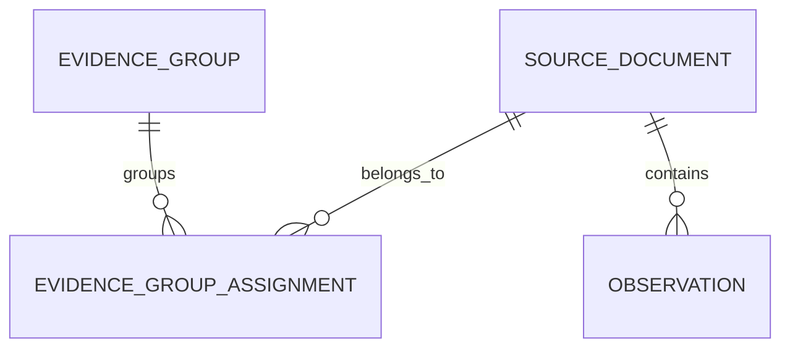
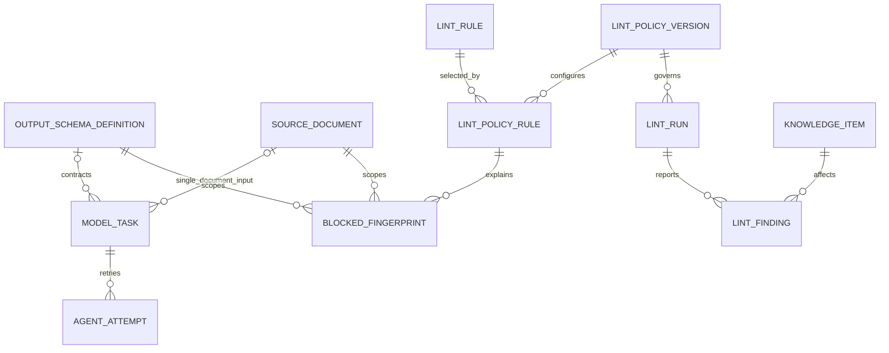
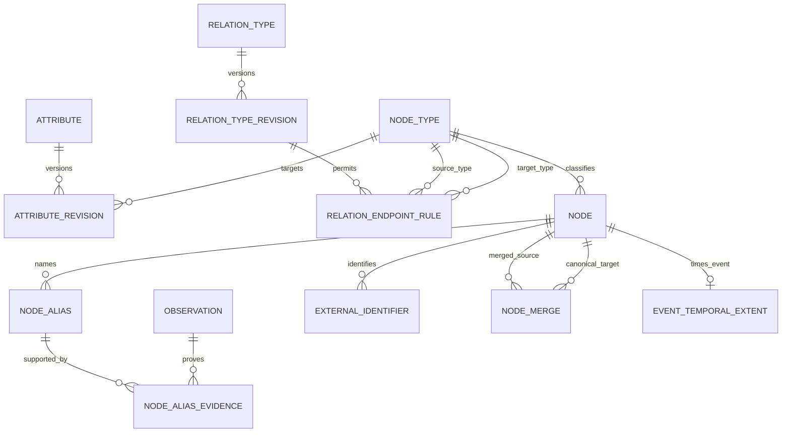
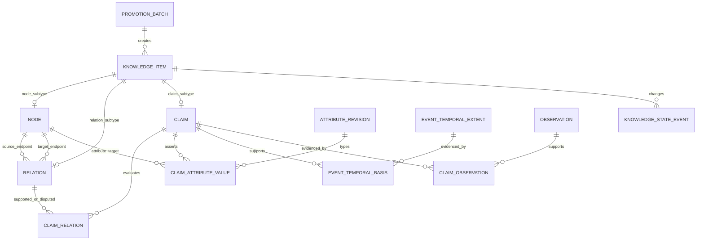
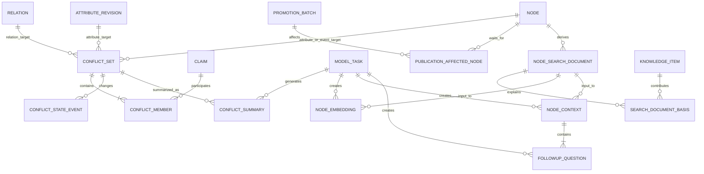

# ontology-map 논리 데이터 스키마

> 상태: Logical Schema v1.1 — Frozen
>
> 변경 기준일: 2026-09-02
>
> 관련 변경: Issue #69
>
> 제품 기준: 공개 자료를 근거와 시간축이 있는 지식그래프로 축적하고, 검색한 노드를 중심으로 탐색하는 HBF POC

## 1. 목적과 경계

이 문서는 제품 의미, 논리 엔터티, 참조 관계, 카디널리티, 수명주기와 무결성 책임을 정의한다. PostgreSQL 자료형·DDL·migration·인덱스 표현식과 API는 `physical-data-schema.md`와 후속 구현 Issue에서 정한다.

Logical Schema v1.1은 다음 원칙을 고정한다.

- 제품 DB는 발견·크롤링 과정이 아니라 **미리 준비된 불변 정규화 문서**부터 관리한다.
- Agent 출력 JSON과 후보 payload는 DB에 저장하지 않는다. Agent는 후보만 제안하고 일반 코드와 DB가 승격 여부를 결정한다.
- 노드·관계·Claim의 의미를 덮어쓰지 않는다. 의미가 바뀌면 새 행이나 새 revision을 만든다.
- 모든 공개 지식은 Claim과 정확한 observation을 거쳐 `source_document`까지 추적할 수 있어야 한다.
- 기준 지식그래프와 화면용 지식맵을 분리한다. 지도 구성원·좌표·카메라·표시 단계는 기준 데이터로 저장하지 않는다.
- 단일 `confidence`를 만들지 않는다. 모델 실행 성공, 원문 충실성, 지식 상태와 독립 근거 수를 서로 다른 축으로 유지한다.
- 공개 준비 실패는 기준 지식을 되돌리지 않는다. 이전 `READY` 결과를 계속 제공한다.
- 거절된 지식과 이력은 삭제하지 않되 지도와 일반 검색에서는 즉시 제외한다.

## 2. 전체 흐름

```text
자료 준비 레이어의 정규화 문서
→ 불변 문서 버전 저장
→ 버전이 고정된 Structured Output 계약으로 모델 작업 실행
→ 메모리에서 계약·원문 위치·온톨로지·동일 대상·중복·lint 검사
→ 통과한 결과만 짧은 트랜잭션으로 기준 지식그래프에 승격
→ 검색 문서·임베딩·한국어 맥락·후속 질문 생성
→ 영향받은 노드의 공개 준비를 원자적으로 READY 전환
→ 검색·클릭·시간 범위 변경 시 동적 부분 그래프 조회
```

## 3. 논리 ER 구조

### 3.1 준비 문서와 독립 근거



### 3.2 모델 작업과 lint



### 3.3 온톨로지와 노드 정체성



### 3.4 기준 지식과 Evidence Trace



### 3.5 충돌과 공개 파생 결과



## 4. 공통 표준

### 4.1 식별자와 이력

- 모든 기준 엔터티는 이름과 무관한 변경 불가능한 내부 식별자를 가진다.
- 병합된 노드의 ID를 재사용하거나 삭제하지 않는다.
- `knowledge_item`이 `node`, `relation`, `claim`의 공통 식별자를 발급하며 하위 테이블은 공유 기본 키를 사용한다.
- 버전·revision 행은 참조된 뒤 의미 필드를 수정하지 않는다.
- POC 동안 기준 지식, Evidence Trace, 검토·lint·작업 이력과 파생 결과를 자동 삭제하지 않는다.

### 4.2 텍스트와 observation

- 정규화 본문은 UTF-8, Unicode NFC, LF 줄바꿈을 사용한다.
- observation 범위는 Unicode 문자 기준 반열린 구간 `[start_char, end_char)`다.
- 저장 범위에서 잘라낸 문자열, `quote_text`, `quote_hash`가 일치해야 한다.
- 문서 버전이 달라져도 기존 observation을 새 본문 위치로 자동 이동하지 않는다.

### 4.3 시간

| 시간 | 의미 | 활동량 계산 |
|---|---|---|
| `source_document.published_at` | 출처의 최초 게시 시점 | 사용 |
| `source_modified_at` | 출처가 표시한 수정 시점 | 사용하지 않음 |
| `last_checked_at` | 준비 레이어의 마지막 동일성 확인 시점 | 사용하지 않음 |
| `observation.observed_at` | 시스템이 원문 위치를 근거로 식별한 시점 | 사용하지 않음 |
| 사건 시간 | 실제 사건의 시점·기간 | 별도 표시 |
| Claim 주장 시간 | 원문이 Claim에서 명시한 시점·기간 | 별도 표시 |

부분 날짜는 `INSTANT`, `DAY`, `MONTH`, `YEAR`, `UNKNOWN` 정밀도를 함께 가진다. 월·연도는 저장용 시작점으로 정규화할 수 있지만 정확한 날짜로 표시하지 않는다.

## 5. 데이터 사전

### 5.1 `source_document`

제품 밖에서 준비한 정규화 문서 한 버전이다.

| 필드 | 의미 |
|---|---|
| `source_document_id` | 불변 문서 버전 ID |
| `source_key` | 같은 논리 자료의 버전을 묶는 안정된 키 |
| `version_no` | `source_key` 안에서 1부터 증가하는 버전 |
| `canonical_url` | 사용자에게 연결할 대표 URL |
| `publisher_name`, `title`, `author_text` | 출처 메타데이터 |
| `original_language` | 본문 언어 |
| `normalized_body`, `body_hash` | 불변 본문과 SHA-256 비교값 |
| `published_at`, `published_precision` | 최초 게시 시점과 정밀도 |
| `source_modified_at`, `modified_precision` | 출처 수정 시점과 정밀도 |
| `last_checked_at`, `last_check_status` | 같은 자료의 마지막 확인 정보 |
| `created_at` | 이 버전 행의 생성 시점 |

`source_key + version_no`는 고유하다. 본문 또는 버전 메타데이터가 바뀌면 새 행을 만들고, 같으면 마지막 확인 정보만 갱신한다. 수집 방법·GDELT 응답·HTTP 시도는 저장하지 않는다.

### 5.2 `evidence_group`, `evidence_group_assignment`

`evidence_group`은 복제·재게시·확인된 번역 자료를 하나의 독립 근거 계보로 세기 위한 단위다. `evidence_group_assignment`는 문서가 어느 묶음에 속한다는 판단과 적용 기간을 보존한다.

| `evidence_group_assignment` 필드 | 의미 |
|---|---|
| `evidence_group_assignment_id` | 배정 이력 ID |
| `source_document_id`, `evidence_group_id` | 문서와 묶음 |
| `assignment_method`, `assignment_reason` | 판정 방식과 이유 |
| `assigned_by_kind` | 시스템 또는 사람 |
| `valid_from`, `valid_to` | 이 판정의 적용 기간 |

문서에는 현재 assignment가 최대 하나다. 재분류 시 기존 행의 `valid_to`를 닫고 새 행을 추가한다. 관계선 굵기와 노드 활동량은 문서 수가 아니라 서로 다른 `evidence_group_id` 수를 센다.

### 5.3 모델 실행

#### `output_schema_definition`

모델이 반환해야 할 JSON Schema 계약을 `task_kind + version_no`로 보존한다. 참조된 계약은 수정하지 않고 새 버전을 추가한다. `schema_json`은 계약 정의이며 응답 인스턴스가 아니다.

#### `model_task`

하나의 결정적 모델 작업과 실행 제어를 관리한다.

| 필드 | 의미 |
|---|---|
| `model_task_id`, `task_kind` | 작업 ID와 종류 |
| `source_document_id` | 단일 문서 작업의 선택적 입력 |
| `input_hash` | 실제 전체 입력의 결정적 해시 |
| `output_schema_definition_id` | 정확한 출력 계약. `EMBEDDING`만 비움 |
| `model_version`, `prompt_version` | 실행 계보 |
| `cache_key` | 작업 종류·입력·계약·모델·프롬프트의 결정적 키 |
| `status` | `PENDING`, `RUNNING`, `SUCCESS`, `RETRY_WAIT`, `VALIDATION_BLOCKED`, `FINAL_FAILED` |
| `attempt_count`, `next_attempt_at` | 실제 호출 수와 다음 실행 시점 |
| `lease_owner`, `lease_expires_at` | 동시 실행 방지 lease |
| `created_at`, `finished_at` | 생성·종료 시각 |

캐시 적중은 호출 횟수를 늘리지 않는다. `SUCCESS`는 결과가 영속 저장소에 연결되었거나 유효 응답에 관련 후보가 없다는 뜻이다.

#### `agent_attempt`

실제 모델 호출 한 번의 최소 이력이다. `model_task_id + attempt_no`가 고유하며 `outcome`, 정형 `failure_reason`, `attempted_at`만 보존한다. 토큰·비용·원시 응답·응답 ID와 중복 모델·프롬프트 필드는 저장하지 않는다.

#### `blocked_fingerprint`

계약 유효 후보가 `BLOCKING` 승격 전 규칙에 실패했을 때 payload 없이 반복 차단 범위만 기록한다.

```text
fingerprint
+ source_document_id
+ output_schema_definition_id
+ lint_policy_rule_id
```

위 조합이 고유하다. 경고, 계약 위반과 모델 장애는 이 테이블에 넣지 않는다.

### 5.4 lint

- `lint_rule`: 안정된 규칙 코드, 표시 이름, 설명과 평가 범위 `PRE_PROMOTION | PERSISTED_GRAPH | BOTH`
- `lint_policy_version`: 함께 적용할 규칙 선택의 불변 정책 버전
- `lint_policy_rule`: 정책과 규칙을 연결하고 `BLOCKING | WARNING` 심각도를 정함
- `lint_run`: 저장된 기준 그래프 재검사 실행
- `lint_finding`: 열린 문제 인스턴스. `finding_key`, 대상 지식, 최초·최근 run과 시점, 횟수, 메시지·정형 상세, 해결 run·시점·이유를 보존

실패한 run은 finding을 해결하지 않는다. 해결된 문제가 재발하면 새 finding을 만든다. 열린 `BLOCKING` finding은 사람의 지식 상태를 바꾸지 않고 공개 조회에서만 즉시 제외한다.

### 5.5 온톨로지 코드와 revision

POC는 전체 활성 규칙 집합을 `ontology_version`과 `ontology_member` manifest로 저장하지 않는다. 새 지식 생성 가능 여부를 실제 유형·revision 행이 직접 나타낸다.

#### `node_type`

| 필드 | 의미 |
|---|---|
| `node_type_id`, `node_type_code` | 불변 내부 ID와 안정된 코드 |
| `display_name` | 화면 표시 이름 |
| `creation_rule` | 노드 생성 근거 기준 |
| `is_active` | 새 노드 생성에 사용할 수 있는지 여부 |

초기 코드는 `PERSON`, `COMPANY`, `TECHNOLOGY`, `TOPIC`, `EVENT`다. 비활성화는 기존 노드를 삭제·거절·숨김 처리하지 않는다. 의미가 다른 유형은 새 코드 행으로 만든다.

#### `relation_type`, `relation_type_revision`, `relation_endpoint_rule`

`relation_type`은 불변 `relation_code`를 관리한다. `relation_type_revision`은 `relation_type_id`, `version_no`, 표시 이름, `DIRECTED | SYMMETRIC`, 선택적 역관계 revision과 `is_active`를 가진다. 같은 관계 코드에는 활성 revision이 최대 하나다.

`relation_endpoint_rule`은 revision마다 허용되는 `source_node_type_id + target_node_type_id` 조합을 저장한다. `SYMMETRIC` revision에는 역관계를 둘 수 없다. revision이 한 번 사용되면 의미·방향·역관계·endpoint 규칙을 수정하지 않는다.

#### `attribute`, `attribute_revision`

`attribute`는 불변 `attribute_code`를 관리한다. `attribute_revision`은 `attribute_id`, `version_no`, 표시 이름, 정확히 한 `target_node_type_id`, `allowed_value_kind`, `unit_rule`, `is_active`를 가진다. 같은 속성 코드에는 활성 revision이 최대 하나다. 사용된 revision의 대상 유형·값 종류·단위 규칙은 수정하지 않는다.

`is_active = false`는 기존 지식의 의미나 공개 상태를 바꾸지 않는다. 승격 서비스는 사용할 유형·revision의 활성 상태를 트랜잭션 안에서 다시 확인한다.

### 5.6 노드 정체성

#### `node`

`node_id`는 `knowledge_item_id`와 같은 공유 기본 키이며 안정된 `node_type_id`만 직접 가진다. 프로필 전용 열이나 자유 JSON 속성을 두지 않는다.

#### `node_alias`, `node_alias_evidence`

`node_alias`는 `node_alias_id`, `node_id`, `alias_text`, `language`, `is_preferred`를 가진다. 한 노드에 대표 alias는 최대 하나이고 공개 전 검증에서 정확히 하나를 요구한다. 검색은 모든 alias를 대상으로 한 뒤 활성 병합을 따라 최종 노드로 이동하고 대표 alias만 표시한다.

`node_alias_evidence`는 alias와 observation을 다대다로 연결한다. 과거 명칭의 사용 기간은 alias 컬럼이 아니라 시간 근거가 있는 Claim으로 표현한다.

#### `external_identifier`

신뢰된 자료 준비 레이어가 제공한 KRX·Wikidata·ORCID·LEI 같은 구조화 식별자를 노드에 연결한다. 동일한 `identifier_system + identifier_value`는 서로 다른 노드에 연결할 수 없다. 일반 기사 문장에서 Agent가 추출한 문자열을 검증 없이 저장하지 않으며 observation 근거 연결은 요구하지 않는다.

#### `node_merge`

원본 노드에서 기준 노드로 가는 리디렉션 이력을 보존한다.

| 필드 | 의미 |
|---|---|
| `node_merge_id` | 병합 이력 ID |
| `source_node_id`, `canonical_node_id` | 원본과 기준 노드 |
| `merge_reason`, `merged_at` | 병합 이유와 시각 |
| `reversed_reason`, `reversed_at` | 취소 이유와 시각. 활성 병합은 `NULL` |

원본당 활성 병합은 최대 하나이며 자기 참조와 순환을 허용하지 않는다. 취소된 행을 다시 활성화하지 않고 재병합 시 새 행을 만든다. 실제 사람 처리자 FK는 관리자·인증 기능과 함께 후속 결정한다.

#### `event_temporal_extent`

사건 노드에 최대 한 행을 두며 `event_node_id`를 공유 기본 키로 사용한다. `start_at`, `end_at`, 각 precision을 저장한다. 미상 경계는 `NULL + UNKNOWN`, 알려진 경계는 값 + 비UNKNOWN precision으로 표현한다. 월·연도 anchor를 정확한 날짜로 표시하지 않는다.

### 5.7 기준 지식

#### `promotion_batch`

검증된 결과를 짧은 트랜잭션으로 기준 그래프에 원자 저장하고 이후 공개 준비 상태를 관리한다. 전체 활성 온톨로지 snapshot ID는 저장하지 않는다.

| 필드 | 의미 |
|---|---|
| `promotion_batch_id` | 묶음 ID |
| `lint_policy_version_id` | 승격 전 검증 정책 |
| `promotion_status` | `PENDING | COMMITTED | FAILED` |
| `publication_status` | `NOT_STARTED | PREPARING | READY | FAILED` |
| `started_at`, `committed_at`, `ready_at` | 단계별 시각 |
| `promotion_failure_reason`, `publication_failure_reason` | 서로 분리된 실패 이유 |

성공한 지식은 각자 실제 사용한 `node_type_id`, `relation_type_revision_id`, `attribute_revision_id`를 보존한다. 당시 활성화되어 있었지만 사용하지 않은 전체 규칙 목록은 snapshot하지 않는 trade-off를 수용한다.

#### `knowledge_item`, `knowledge_state_event`

`knowledge_item`은 `knowledge_item_id`, `item_kind`, `current_state`, `promotion_batch_id`, `created_at`을 가진다. 정확히 하나의 `node`, `relation`, `claim` 하위 행과 대응한다.

초기 `근거 확인됨`은 시스템 생성 상태이며 사람 이벤트를 만들지 않는다. `knowledge_state_event`는 사람의 상태 변경만 append-only로 기록하고 `from_state`, `to_state`, 필수 이유, 논리적 처리자 참조와 시각을 가진다. 처리자 물리 계약은 관리자 기능까지 보류한다.

#### `relation`

| 필드 | 의미 |
|---|---|
| `relation_id` | 공유 기본 키 |
| `source_node_id`, `target_node_id` | endpoint |
| `relation_type_revision_id` | 생성 당시의 정확한 불변 규칙 |
| `relation_identity_key` | 정규화 endpoint와 revision의 결정적 고유 키 |

사건 맥락은 숨은 컬럼이 아니라 사건 노드를 명시적 endpoint로 사용하는 경로로 저장한다. 관계 유효 기간은 POC 컬럼으로 두지 않는다. 사건 시간은 `event_temporal_extent`, 출처 주장 시간은 Claim에 저장한다. 관계 승격에는 observation이 있는 지지 Claim이 최소 하나 필요하다.

#### `claim`, `claim_relation`, `claim_observation`

`claim`은 공유 ID, 원자적 `statement_text`, 언어, modality, 주장 시간의 양쪽 값과 precision을 가진다. 모든 Claim은 observation을 최소 하나 가지며 관계·속성값·사건 시간 중 최소 한 의미 대상과 연결된다.

`claim_relation`은 `(claim_id, relation_id)`와 `SUPPORT | DISPUTE` stance를 가진다. 반박 근거는 관계선 굵기에서 빼지 않는다.

`claim_observation`은 Claim과 observation의 다대다 연결이다. 같은 문장 범위를 여러 원자적 Claim이 공유할 수 있다.

#### `claim_attribute_value`

Claim이 노드의 구조화 속성을 주장하는 tagged union이다.

| 공통 필드 | 값 필드 |
|---|---|
| `claim_attribute_value_id`, `claim_id`, `target_node_id`, `attribute_revision_id`, `value_kind` | `string_value`; `number_value + unit_code`; `date_from/to + precision`; `boolean_value` |

허용 종류는 `STRING`, `NUMBER`, `DATE`, `PERIOD`, `BOOLEAN`이다. 선택한 값 묶음만 채우고 나머지는 비운다. `(attribute_revision_id, value_kind)`는 revision의 허용 종류와 일치해야 한다. `false`는 명시적 부정이며 값 행 부재와 다르다.

#### `event_temporal_basis`

`(event_node_id, claim_id)`로 채택 사건 시간과 이를 직접 뒷받침하는 Claim을 연결한다. 다른 시간을 주장하는 Claim은 별도 충돌 묶음으로 보존한다.

#### `observation`

`observation_id`, `source_document_id`, 문자 범위, `quote_text`, `quote_hash`, 선택적 문단 번호, `observed_at`을 가진다. 이 행은 출처가 해당 내용을 말했다는 점을 입증하지만 객관적 진실을 입증하지 않는다.

### 5.8 충돌

- `conflict_set`: 관계, `(target_node_id + attribute_revision_id)`, 사건 시간 중 정확히 한 대상 형태와 modality, 현재 상태, 생성 시각
- `conflict_member`: `(conflict_set_id, claim_id)`와 `position_key`
- `conflict_state_event`: 사람의 확인·거절 이력. 처리자 물리 계약은 후속 보류
- `conflict_summary`: set, 성공한 `CONFLICT_SUMMARY` 작업, 공통점·관점 요약, 생성 시각

대상·modality·구성 Claim·position은 불변이다. 구성 변경은 새 snapshot을 만들고, 같은 구성에서 모델·프롬프트만 바뀌면 새 summary만 추가한다. Agent 제안은 일반 코드의 비교 가능성 검사를 통과하면 사람 확인 전에도 호박색 점선으로 표시할 수 있다.

### 5.9 검색과 공개 파생 결과

#### `publication_affected_node`

`(promotion_batch_id, node_id)`로 공개 준비 범위를 식별하고 선택한 검색 문서·임베딩·맥락 설명을 참조한다. 모든 영향 노드의 필수 결과와 질문 두 개가 준비되고 공개 조건을 통과해야 batch를 `READY`로 바꿀 수 있다.

#### `node_search_document`, `search_document_basis`

검색 문서는 `node_id`, `identity_text`, `knowledge_text`, `input_hash`, `generator_version`, `created_at`을 가진 불변 버전이다. `(node_id, input_hash, generator_version)`가 고유하다. `search_document_basis`는 사용한 공개 `knowledge_item`을 다대다로 추적한다.

#### `node_embedding`

정확한 검색 문서와 성공한 `EMBEDDING` 작업에서 만든 불변 벡터다. 검색 문서와 노드가 일치해야 하며 새 입력·모델은 새 행을 만든다.

#### `node_context`, `followup_question`

`node_context`는 검색 문서에서 만든 한국어 설명의 불변 버전이다. 설명은 검색 문서 입력으로 되돌아가지 않는다.

`followup_question`은 한 context에 slot 1과 2를 정확히 하나씩 가지며 질문, 필수 `target_node_id`, 성공한 작업과 생성 시각을 저장한다. 후보 목록은 모델 입력에만 사용하고 별도 테이블로 저장하지 않는다.

## 6. 수명주기

### 6.1 모델 작업

```text
PENDING → RUNNING → SUCCESS
                  ├→ VALIDATION_BLOCKED
                  ├→ RETRY_WAIT → RUNNING
                  └→ FINAL_FAILED
```

최대 호출은 최초·즉시 재시도·1시간·2시간·4시간 뒤 시도까지 다섯 번이다. 일시 장애만 재시도한다.

### 6.2 기준 지식

```text
근거 확인됨 → 사람 확인됨 | 보류 | 거절
사람 확인됨 → 보류 | 거절
보류 → 근거 확인됨 | 사람 확인됨 | 거절
거절 → 종료
```

`근거 확인됨`은 사실 확정이 아니라 원문과 구조 검사가 완료되었다는 뜻이다. 사람 확인은 선택 사항이며 초기 POC 공개의 선행 조건이 아니다.

### 6.3 승격과 공개

```text
promotion_status:   PENDING → COMMITTED | FAILED
publication_status: NOT_STARTED → PREPARING → READY
                                          └→ FAILED → PREPARING
```

승격 실패는 지식 쓰기를 모두 롤백한다. 공개 실패는 기준 지식을 유지하고 이전 `READY` 결과를 제공한다.

## 7. 무결성 책임

### 7.1 DB가 직접 보장할 규칙

- PK·FK와 코드·revision·버전의 고유성
- 허용된 닫힌 상태·modality·값 종류·정밀도
- 각 nullable 값 묶음의 일치
- 한 코드당 활성 관계·속성 revision 최대 하나
- 대표 alias 최대 하나, 원본 노드당 활성 병합 최대 하나
- relation identity, cache key, finding key와 차단 fingerprint 중복 방지
- Claim 속성값의 tagged-union 로컬 CHECK
- 충돌 대상 형태의 배타적 조합
- 공개·승격 상태와 필수 시각·실패 이유의 행 내부 일치

### 7.2 서비스 트랜잭션이 보장할 규칙

- 활성 유형·revision의 전체 규칙 검증과 원자적 교체
- 관계 endpoint 유형과 revision 규칙 일치
- 대칭 endpoint 정규화와 node merge 순환 차단
- 문서 범위와 실제 본문·인용문·해시 일치
- Claim의 의미 대상·observation 최소 개수
- 관계의 관측 가능한 지지 Claim, 노드·사건의 최소 근거
- 서로 다른 시간 정밀도의 기간 비교
- 상태 이벤트와 현재 상태의 동시 갱신
- 충돌 구성의 비교 가능성·불변 snapshot 생성
- READY 전 모든 영향 노드의 결과·질문·Evidence Trace·lint 완결성

같은 교차 행 규칙을 DB custom trigger와 서비스 양쪽에 중복 구현하지 않는다.

## 8. 동적 지도와 검색 계약

- 지도 입력: `center_node_id`, `recent_90_days | full_1_year`
- 중심 1개, 직접 이웃 최대 12개, 중요한 2단계 이웃 최대 18개, 관계선 최대 60개
- 이웃 정렬: 지지 독립 근거 수 내림차순 → 선택 기간 활동량 내림차순 → 내부 ID 오름차순
- node 크기: 선택 기간의 독립 근거 묶음 수
- relation 굵기: 지지 독립 근거 묶음 수
- 충돌 관계: 호박색 점선
- 중심 강조·active/peripheral 밝기와 opacity: UI 상태이며 DB 비영속
- 오래됨: 지도 감쇠로 표현하지 않고 상세 패널의 마지막 근거 게시일과 Evidence Trace에서 확인
- 좌표·카메라·viewport·지도 snapshot은 저장하지 않음

검색은 alias 정확 일치를 먼저 반환하고 전문 검색·벡터 검색 결과를 각각 최대 50개 구한 뒤 `k = 60` RRF로 결합한다. 한 branch 실패 시 다른 결과를 제공한다. 벡터 유사도는 검색 순위에만 사용하며 동일 대상·관계·지식 상태 판정에 사용하지 않는다.

## 9. HBF 검증 흐름

```text
source_document
→ observation
→ 원자적 Claim
→ 사건 endpoint 관계 / 구조화 목표 날짜 / 사건 시간
→ promotion_batch COMMITTED
→ 검색 문서·embedding·context·질문
→ publication READY
→ SK하이닉스 또는 HBF 발표 사건 중심의 동적 지도
```

다음 조건을 검증한다.

1. 같은 문서 내용은 마지막 확인 정보만 갱신하고 변경된 버전은 새 행으로 보존한다.
2. 잘못된 문자 범위와 허용되지 않은 관계는 payload 없이 차단 fingerprint만 남긴다.
3. 복제 기사 여러 건도 독립 근거 수는 한 번만 센다.
4. 모델 실패는 원문과 작업 이력만 남기고 기준 그래프를 바꾸지 않는다.
5. 승격 뒤 파생 결과 실패는 기준 지식을 유지하고 이전 READY 결과를 제공한다.
6. 사건 경로만으로 회사와 기술의 직접 관계를 추론하지 않는다.
7. 관계 없는 노드도 필수 파생 결과와 상세 자료가 완전하면 공개한다.
8. 병합과 취소 뒤에도 이전 ID·alias·Claim·근거를 추적할 수 있다.
9. 비활성화된 유형·revision을 참조하는 기존 지식은 계속 해석 가능하고 새 승격에만 사용하지 않는다.
10. 90일과 1년 조회는 출처 게시 시점을 기준으로 포함 범위만 달라진다.

## 10. 제외 범위

- 원본 HTML, GDELT 질의·응답, 발견 결과와 HTTP 수집 과정
- Agent 응답 JSON, 후보 payload, 제공자 원시 응답과 비용 원장
- `ontology_version`, `ontology_member`와 전체 활성 규칙 snapshot
- user·actor·principal·인증·권한 테이블
- node 참조 속성값과 관계로 표현 가능한 사실의 Boolean 우회
- relation 유효 기간 컬럼과 별도 날짜값 테이블
- 지도 좌표·구성원·전역 graph/map version·`display_rule_version`
- 클릭 시 LLM 호출, 별도 검색 DB와 조기 근사 벡터 인덱스
- POC 자동 삭제·retention 작업
- PostgreSQL DDL, migration, API와 UI 구현

## 11. Issue #69의 trade-off와 되돌리기

전체 규칙 manifest를 제거하여 단순해졌지만, 한 `promotion_batch`가 실행될 당시 **사용되지 않았으나 활성 상태였던 모든 규칙의 목록**은 하나의 FK로 재현할 수 없다. 성공한 각 지식이 실제로 사용한 유형·revision은 계속 정확히 추적된다.

이 결정을 되돌리려면 별도 Issue에서 다음을 함께 복원해야 한다.

1. `ontology_version`
2. `ontology_member`의 node type / relation revision / attribute revision 배타 참조
3. `promotion_batch.ontology_version_id`
4. 활성 manifest 생성·동결·승격 검증 수명주기
5. 물리 스키마와 요구사항 추적표의 해당 참조
