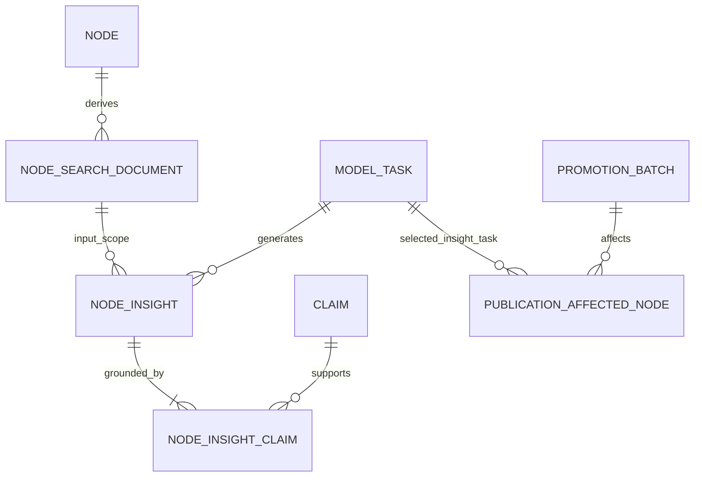

# #91 node 인사이트 논리 모델 확장

## 문서 상태

- 관련 Issue: #91
- 제품 기능: #68
- 기준 논리 모델: [`logical-data-schema.md`](../logical-data-schema.md)
- 상태: Logical Schema v1.2에 추가되는 승인 확장
- 범위: `node_insight`, `node_insight_claim`, 모델 작업과 공개 선택의 논리 계약

이 문서는 #68의 인사이트 탭을 현재 논리 스키마에 추가한다. 기존 `node_context`를 대체하지 않고, 여러 분석 리포트와 각 리포트가 사용한 정확한 Claim을 별도 불변 산출물로 보존한다.

## 1. 왜 `node` 컬럼으로 저장하지 않는가

`node`는 사람·회사·기술·주제·사건의 불변 정체성과 유형만 저장한다. 인사이트 문장을 `node`의 컬럼이나 JSON으로 붙이면 다음 문제가 생긴다.

- 한 노드에 여러 인사이트를 표현하기 어렵다.
- 90일과 1년 결과를 구분하기 어렵다.
- 모델·프롬프트·입력 지식이 바뀔 때 기존 결과를 덮어쓰게 된다.
- 어떤 Claim을 근거로 생성했는지 추적하기 어렵다.
- 공개 준비가 끝난 결과와 생성 중인 결과가 섞일 수 있다.

따라서 인사이트는 `node`의 속성이 아니라, 한 노드의 공개 지식에서 생성한 버전 있는 모델 산출물로 취급한다.

## 2. 기존 `node_context`와의 차이

| 대상 | 역할 |
|---|---|
| `node_context` | 선택한 노드를 처음 이해하기 위한 한 개의 일반 맥락 설명 |
| `node_insight` | 여러 Claim·Relation·근거를 묶어 해석한 제목 있는 분석 리포트 여러 개 |
| `followup_question` | 다음 지도 중심으로 이동할 질문 두 개와 대상 node |

`node_context` 한 행에 인사이트 목록을 JSON으로 넣지 않는다. 인사이트는 독립적인 제목·순서·시간 범위·Claim 근거를 가지며, 하나의 Claim이 여러 인사이트에 사용될 수 있기 때문이다.

## 3. 논리 ER



`node_insight_claim`에서 원문까지는 기존 Evidence Trace를 그대로 사용한다.

```text
node_insight
→ node_insight_claim
→ claim
→ claim_observation
→ observation
→ source_document
→ evidence_group
```

Relation은 별도 사본 없이 다음 경로로 조회한다.

```text
node_insight_claim
→ claim
→ claim_relation
→ relation
```

## 4. `node_insight`

한 노드의 한 공개 검색 문서와 한 모델 작업에서 생성된 분석 리포트 한 건이다.

| 필드 | 의미 |
|---|---|
| `node_insight_id` | 불변 인사이트 ID |
| `node_id` | 인사이트의 중심 node |
| `node_search_document_id` | 생성 입력의 공개 지식 범위를 고정하는 검색 문서 |
| `model_task_id` | 여러 인사이트를 함께 생성한 정확한 `NODE_INSIGHT` 작업 |
| `time_window` | `RECENT_90_DAYS` 또는 `RECENT_1_YEAR` |
| `as_of_at` | 상대 기간을 계산한 기준 시각 |
| `slot` | 같은 작업·시간 범위 안의 표시 순서 1~3 |
| `title` | 목록에 표시할 모델 생성 제목 |
| `summary_text` | 인사이트 내용을 짧게 요약한 모델 생성 문장 |
| `synthesis_text` | 여러 Claim과 Relation을 종합한 모델의 해석 |
| `caveat_text` | 근거 한계·확인되지 않은 추론·주의점을 밝히는 모델 생성 문장 |
| `created_at` | 불변 결과 행 생성 시각 |

### 4.1 시간 범위

두 범위는 `source_document.published_at`을 기준으로 한다.

```text
RECENT_90_DAYS
→ [as_of_at - 90일, as_of_at)

RECENT_1_YEAR
→ [as_of_at - 1년, as_of_at)
```

게시 시점이 `UNKNOWN`인 문서는 범위별 인사이트 입력에서 제외한다. 같은 Claim에 여러 observation이 연결되어 있으면 선택 범위 안의 문서 근거만 해당 범위의 근거 수에 포함한다.

한 `NODE_INSIGHT` 작업은 한 node와 한 `node_search_document`를 대상으로 두 시간 범위를 함께 처리한다. 각 범위에는 최대 세 개의 인사이트를 생성한다.

### 4.2 결과 없음

근거가 부족해 의미 있는 인사이트를 만들 수 없는 범위는 억지 문장을 생성하지 않는다.

```text
model_task.status = SUCCESS
+ publication이 해당 model_task를 선택함
+ 해당 time_window의 node_insight 행이 0개
= 검증을 완료했지만 표시할 인사이트가 없음
```

이 경우 UI는 일반적인 결과 없음 안내를 보여준다. `node_insight`에 빈 문자열이나 `NO_RESULT` 가짜 행을 만들지 않는다.

## 5. `node_insight_claim`

한 인사이트가 실제로 사용한 기존 Claim과 화면 역할을 연결한다.

| 필드 | 의미 |
|---|---|
| `node_insight_id` | 대상 인사이트 |
| `claim_id` | 근거로 사용한 기존 Claim |
| `role` | `KEY_CLAIM`, `SUPPORTING_CLAIM`, `CONTRASTING_CLAIM` |
| `display_order` | 인사이트 상세 안의 Claim 표시 순서 |

### 5.1 역할

```text
KEY_CLAIM
→ 화면의 `근거로 확인된 내용`

SUPPORTING_CLAIM
→ 핵심 내용을 보강하는 근거

CONTRASTING_CLAIM
→ 엇갈리는 관점이나 caveat를 이해하는 근거
```

`CORE_FACT`나 `VERIFIED_FACT`라는 코드는 사용하지 않는다. `knowledge_item.current_state = EVIDENCE_VERIFIED`는 출처가 Claim을 뒷받침한다는 뜻이지 객관적인 진실이 확정됐다는 뜻이 아니기 때문이다.

한 Claim은 같은 인사이트에서 역할 하나만 가진다. 같은 Claim은 서로 다른 인사이트에서 재사용할 수 있다.

## 6. 모델 작업 계약

`model_task.task_kind`와 `output_schema_definition.task_kind`에 `NODE_INSIGHT`를 추가한다.

모델 입력에는 다음 내용을 결정적인 순서로 포함한다.

- `node_id`
- `node_search_document_id`
- `as_of_at`
- 90일·1년 범위 정의
- 공개 가능한 Claim ID와 문장·modality·주장 시간
- Claim에 연결된 Relation ID와 유형·endpoint
- Claim별 범위 안의 Evidence Trace 식별자와 독립 `evidence_group_id`
- 비교 가능한 conflict set과 position

Claim·Relation·Observation ID는 오름차순의 고정 순서로 정렬한다. 실제 전체 입력은 `model_task.input_hash`에 반영하고, 모델·프롬프트·출력 계약은 기존 `cache_key` 계약을 재사용한다.

모델 출력은 90일과 1년의 인사이트 목록을 분리하고, 각 인사이트에 기존 입력 Claim ID와 역할을 반환한다. 서비스는 다음을 검사한 뒤에만 결과를 저장한다.

1. 작업 종류가 `NODE_INSIGHT`다.
2. 출력의 Claim ID가 모두 입력 후보 집합에 포함된다.
3. 모든 Claim이 현재 공개 가능하고 선택한 검색 문서의 basis에 포함된다.
4. 각 Claim이 중심 node의 속성, 관계, 사건 시간 또는 인접 관계와 실제로 연결된다.
5. 한 범위의 slot은 1~3이며 중복되지 않는다.
6. 각 인사이트에는 Claim이 최소 한 건 있고 `KEY_CLAIM`이 최소 한 건 있다.
7. 제목·요약·종합 해석·유의점은 모두 비어 있지 않다.
8. 동일 작업의 모든 행은 같은 node, 검색 문서와 `as_of_at`을 사용한다.
9. 두 범위를 모두 검증했으며 결과가 없는 범위는 빈 목록으로 명시됐다.
10. 모든 인사이트와 Claim 연결을 저장한 뒤에만 작업을 `SUCCESS`로 바꾼다.

## 7. 공개 선택

`publication_affected_node`는 nullable `node_insight_model_task_id`로 이번 공개 묶음이 선택한 정확한 인사이트 작업을 가리킨다.

```text
PREPARING
→ 인사이트 작업 선택 전에는 NULL 가능

READY
→ 성공한 NODE_INSIGHT 작업을 반드시 선택
```

READY 전환 서비스는 선택 작업이 다음 조건을 만족하는지 검사한다.

- 해당 `publication_affected_node.node_id`와 같은 중심 node다.
- 선택된 `node_search_document_id`와 같은 공개 검색 문서를 사용한다.
- 모델 작업이 `SUCCESS`다.
- 90일과 1년 입력 범위를 모두 처리했다.
- 존재하는 인사이트의 Claim과 role이 모두 유효하다.
- 결과 없음도 성공 작업으로 명시적으로 처리됐다.

인사이트 작업 실패는 이미 커밋된 기준 지식을 되돌리지 않는다. 해당 batch를 `publication_status = FAILED`로 두고 이전 READY 인사이트를 계속 제공한다.

## 8. 목록과 상세 조회

목록에는 저장된 count 컬럼을 사용하지 않는다. 선택한 시간 범위 안의 실제 원문 계보를 계산한다.

```text
COUNT(DISTINCT source_document.evidence_group_id)
```

경로:

```text
node_insight
→ node_insight_claim
→ claim_observation
→ observation
→ source_document
```

팝업의 `근거로 확인된 내용`은 `KEY_CLAIM`의 기존 `claim.statement_text`와 modality·주장 시간을 읽는다. 원문 인용·발행처·게시일·URL은 Evidence Trace를 따라 조회한다.

`summary_text`, `synthesis_text`, `caveat_text`만 모델 생성 문장으로 표시한다. 사용한 Claim이나 Relation을 모델 문장으로 복사해 별도의 사실 사본을 만들지 않는다.

## 9. 거절·lint와 재생성

연결 Claim 하나가 거절되거나 열린 `BLOCKING` lint finding을 가지면, 기존 모델 문장의 전제가 달라질 수 있다.

따라서 일부 Claim만 화면에서 제거하고 기존 요약을 계속 사용하지 않는다.

```text
basis Claim 비공개 전환
→ 해당 Claim을 사용하는 node_insight 전체를 read-time에서 즉시 제외
→ 관련 node를 publication affected 대상으로 등록
→ 새 검색 문서와 NODE_INSIGHT 작업 생성
→ 새 공개 묶음 READY 뒤 교체
```

WARNING finding은 자동으로 인사이트를 숨기지 않지만 새 생성 입력과 caveat에 반영할 수 있다.

## 10. 수명주기

| 대상 | 분류 | 허용 변경 |
|---|---|---|
| `node_insight` | 불변 모델 산출물 | 없음 |
| `node_insight_claim` | 불변 근거 연결 | 없음 |
| `publication_affected_node.node_insight_model_task_id` | 공개 준비 선택 | READY 전 선택 가능, READY 뒤 불변 |

입력 지식·모델·프롬프트·출력 계약·시간 기준이 바뀌면 기존 인사이트를 UPDATE하지 않고 새 `model_task`와 새 인사이트 전체를 만든다.

## 11. HBF 예시

```text
중심 node: SK하이닉스
시간 범위: RECENT_90_DAYS

Insight 1
- 제목: HBF 표준화 참여가 AI 메모리 협상 범위를 넓힐 수 있다
- KEY_CLAIM: SK하이닉스와 HBF 발표 사건의 근거 Claim
- SUPPORTING_CLAIM: HBF 표준화 착수의 근거 Claim
- synthesis: 두 공개 활동을 연결한 모델 해석
- caveat: 실제 계약·매출로 이어졌다는 근거는 없음
```

`실제 계약·매출로 이어졌다`는 Claim이 없으므로 이를 `근거로 확인된 내용`에 만들지 않는다. caveat는 모델의 분석 한계를 설명한다.

## 12. 제외 범위

- 인사이트 문장을 `node` 컬럼이나 JSON에 저장
- `verified_fact` 문자열 사본
- 인사이트 전용 Relation·Observation·Source Document 사본
- 저장된 `evidence_count`
- 클릭 시 모델 호출
- 개인화된 인사이트
- 실제 모델 prompt·API·repository·UI fixture 교체
